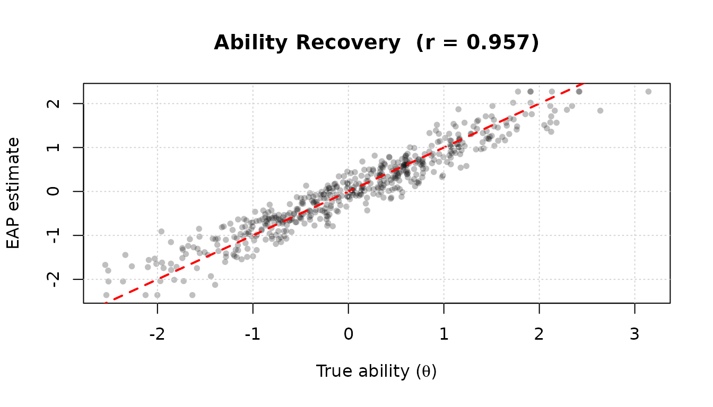

# Getting Started with irtQ

## What is irtQ?

**irtQ** is an R package for unidimensional **Item Response Theory
(IRT)** analyses. It supports mixed-format tests containing both
dichotomous and polytomous items, and provides a unified interface for
the most common psychometric tasks in educational and psychological
measurement.

### Why IRT? A Brief Motivation

Before using **irtQ**, it helps to understand *why* IRT is preferred
over Classical Test Theory (CTT) for many measurement tasks.

**Classical Test Theory (CTT)** summarizes examinees by their total (or
proportion) correct score and items by their observed difficulty
(p-value) and point-biserial correlation. While straightforward, CTT has
well-known limitations:

- **Sample dependence**: item statistics (difficulty, discrimination)
  change with the examinee group, and person scores change with the item
  set
- **No item-level probability model**: CTT does not tell us the
  *probability* that a specific person answers a specific item correctly
- **Limited equating**: comparing scores across different test forms
  requires strong assumptions

**Item Response Theory (IRT)** addresses these limitations by modeling
the probability of each response as a function of a latent trait
$`\theta`$ (ability, proficiency, or attitude) and item parameters. Key
advantages are:

- **Invariance**: item parameters do not depend on the ability
  distribution of the calibration sample; person parameters do not
  depend on which particular items were administered
- **Item-level modeling**: each item has its own characteristic curve
  describing how response probability changes with $`\theta`$
- **Common scale**: items and persons are placed on the *same*
  $`\theta`$ continuum, enabling equating, adaptive testing, and
  longitudinal measurement

### Core Capabilities of irtQ

**irtQ** covers the full IRT workflow:

**Primary functions:**

- Estimating item parameters — fixed-form calibration, pretest
  calibration using Fixed Item Parameter Calibration (FIPC) and Fixed
  Ability Parameter Calibration (FAPC) approaches, and multiple-group
  calibration
  ([`est_irt()`](https://hwangQ.github.io/irtQ/reference/est_irt.md),
  [`est_mg()`](https://hwangQ.github.io/irtQ/reference/est_mg.md),
  [`est_item()`](https://hwangQ.github.io/irtQ/reference/est_item.md))
- Estimating examinee abilities — maximum likelihood (ML), weighted
  likelihood (WLE), maximum a posteriori (MAP), expected a posteriori
  (EAP), EAP summed scoring, and inverse test characteristic curve (TCC)
  scoring
  ([`est_score()`](https://hwangQ.github.io/irtQ/reference/est_score.md))
- Evaluating item-level model–data fit — $`\chi^2`$, $`G^2`$,
  infit/outfit, $`S`$-$`X^2`$
  ([`irtfit()`](https://hwangQ.github.io/irtQ/reference/irtfit.md),
  [`sx2_fit()`](https://hwangQ.github.io/irtQ/reference/sx2_fit.md))
- Detecting differential item functioning (DIF) — residual-based DIF
  (RDIF), generalized residual-based DIF (GRDIF), and simultaneous item
  bias test modified for CAT (CATSIB)
  ([`rdif()`](https://hwangQ.github.io/irtQ/reference/rdif.md),
  [`grdif()`](https://hwangQ.github.io/irtQ/reference/grdif.md),
  [`catsib()`](https://hwangQ.github.io/irtQ/reference/catsib.md))
- Computing classification accuracy and consistency indices
  ([`cac_lee()`](https://hwangQ.github.io/irtQ/reference/cac_lee.md),
  [`cac_rud()`](https://hwangQ.github.io/irtQ/reference/cac_rud.md))

**Utilities:**

| Function | Purpose |
|----|----|
| [`simdat()`](https://hwangQ.github.io/irtQ/reference/simdat.md) | Simulate IRT item response data |
| [`info()`](https://hwangQ.github.io/irtQ/reference/info.md) | Item and test information functions |
| [`traceline()`](https://hwangQ.github.io/irtQ/reference/traceline.md) | Item and test characteristic curves |
| [`lwrc()`](https://hwangQ.github.io/irtQ/reference/lwrc.md) | Lord–Wingersky recursion (summed-score distributions) |
| [`gen.weight()`](https://hwangQ.github.io/irtQ/reference/gen.weight.md) | Generate quadrature weights from a distribution |
| [`covirt()`](https://hwangQ.github.io/irtQ/reference/covirt.md) | IRT-based covariance between items |
| [`run_flexmirt()`](https://hwangQ.github.io/irtQ/reference/run_flexmirt.md) | Run flexMIRT directly from R |

This vignette introduces the **IRT models** supported by **irtQ** and
the **item metadata** data structure that connects all functions. At the
end, a minimal end-to-end workflow ties everything together.

------------------------------------------------------------------------

## Installation

Install the released version from CRAN:

``` r

install.packages("irtQ")
```

Install the development version from GitHub:

``` r

# install.packages("devtools")
devtools::install_github("hwangQ/irtQ")
```

Load the package:

``` r

library(irtQ)
```

------------------------------------------------------------------------

## Supported IRT Models

**irtQ** supports the following unidimensional IRT models for
dichotomous and polytomous items.

### Dichotomous Models: 1PLM, 2PLM, and 3PLM

For a binary response $`Y \in \{0, 1\}`$ from an examinee with latent
ability $`\theta`$, the probability of a correct response ($`Y = 1`$)
under the three-parameter logistic model (3PLM) is:

``` math
P(Y = 1 \mid \theta) = g + \frac{1 - g}{1 + \exp(-D\,a\,(\theta - b))}
```

The four quantities in this equation each have a concrete
interpretation:

**$`\theta`$ — Latent ability (person parameter)**  
The unobserved trait being measured. The $`\theta`$ scale is typically
standardized so that $`\theta \sim N(0, 1)`$ in the reference
population: $`\theta = 0`$ is average ability, $`\theta = 1`$ is one
standard deviation above average, and so on.

**$`a`$ — Discrimination (item parameter)**  
Controls how steeply the item characteristic curve (ICC) rises. A highly
discriminating item (large $`a`$) sharply separates examinees just below
and just above the item’s difficulty; a weakly discriminating item
(small $`a`$) produces a nearly flat ICC and provides little information
about $`\theta`$. In practice, $`a`$ typically ranges from about 0.5 to
2.5.

**$`b`$ — Difficulty (item parameter)**  
The point on the $`\theta`$ scale where the probability of a correct
response is halfway between $`g`$ and 1, i.e. $`P = g + (1-g)/2`$. For
the 2PLM (where $`g = 0`$), this simplifies to the $`\theta`$ value
where $`P = 0.5`$. Items with $`b < 0`$ are easy (most examinees answer
correctly); items with $`b > 0`$ are hard. Values typically range from
about $`-3`$ to $`+3`$.

**$`g`$ — Pseudo-guessing (item parameter)**  
The lower asymptote of the ICC — the probability of a correct response
as $`\theta \to -\infty`$. For a 5-option multiple-choice item with pure
random guessing, $`g = 0.2`$. When $`g = 0`$ the ICC passes through the
origin and the model reduces to the 2PLM or 1PLM.

**$`D`$ — Scaling constant**  
$`D = 1.702`$ is a constant that makes the logistic function closely
approximate the normal ogive used in the original IRT formulation. Using
$`D = 1.702`$ is conventional when working with logistic models; set
$`D = 1`$ to work on the purely logistic scale. All irtQ functions
accept `D` as an argument with default `1.702`.

#### Special cases: 1PLM and 2PLM

| Model | Discrimination | Guessing | Free parameters |
|----|----|----|----|
| **1PLM** | Fixed to 1 *or* constrained equal across items | $`g = 0`$ | $`b`$ only |
| **2PLM** | Freely estimated, varies across items | $`g = 0`$ | $`a`$, $`b`$ |
| **3PLM** | Freely estimated, varies across items | Freely estimated | $`a`$, $`b`$, $`g`$ |

> **Note on 1PLM in irtQ.** When `fix.a.1pl = TRUE` (in
> [`est_irt()`](https://hwangQ.github.io/irtQ/reference/est_irt.md)),
> the discrimination is *fixed* to the value `a.val.1pl` (default 1) —
> this is the strict **Rasch model**. When `fix.a.1pl = FALSE` (the
> default), the common discrimination is *estimated* from the data but
> constrained to be equal across all 1PLM items. Both specifications
> produce only $`b`$ as the item-differentiating parameter, but the
> second is more flexible when the Rasch assumption of $`a = 1`$ does
> not exactly hold.

------------------------------------------------------------------------

### Polytomous Models: GRM and GPCM

For items with $`K`$**ordered** response categories scored
$`0, 1, \ldots, K-1`$ (e.g., a 4-point rating scale scored 0–3), irtQ
supports two models.

#### Graded Response Model (GRM)

The GRM (Samejima, 1969) models $`K - 1`$**cumulative boundary response
functions**, one for each adjacent pair of categories. The cumulative
probability of responding in category $`k`$*or higher* is:

``` math
P^*(Y \ge k \mid \theta) = \frac{1}{1 + \exp(-D\,a\,(\theta - b_k))}, \quad k = 1, \ldots, K-1
```

with the conventions $`P^*(Y \ge 0) = 1`$ and $`P^*(Y \ge K) = 0`$.

The probability of responding in exactly category $`k`$ is then:

``` math
P(Y = k \mid \theta) = P^*(Y \ge k \mid \theta) - P^*(Y \ge k+1 \mid \theta)
```

**Parameters:**

- $`a`$: a single discrimination parameter shared across all category
  boundaries
- $`b_1 < b_2 < \cdots < b_{K-1}`$: ordered threshold parameters, where
  $`b_k`$ is the $`\theta`$ value at which the probability of responding
  above category $`k-1`$ equals 0.5. The ordering constraint ensures
  that the response probabilities are non-negative for all $`\theta`$.

**Intuition:** Think of the GRM as applying a 2PLM-like curve to each of
the $`K-1`$ adjacent-category boundaries. $`b_1`$ marks the easy end of
the scale (where most examinees move from category 0 to category 1), and
$`b_{K-1}`$ marks the hard end (where examinees move into the top
category).

**Example (4-category GRM item, $`K = 4`$):**

- $`b_1 = -1.5`$: Examinees with $`\theta \approx -1.5`$ have a 50%
  chance of scoring 1 or higher
- $`b_2 = 0.0`$: Examinees with $`\theta \approx 0`$ have a 50% chance
  of scoring 2 or higher
- $`b_3 = 1.2`$: Examinees with $`\theta \approx 1.2`$ have a 50% chance
  of scoring 3 (the top category)

------------------------------------------------------------------------

#### Generalized Partial Credit Model (GPCM)

The GPCM (Muraki, 1992) generalizes the Partial Credit Model \[PCM;
Masters (1982)\] by allowing items to have different discrimination
parameters. The probability of responding in category $`k`$ is:

``` math
P(Y = k \mid \theta) =
\frac{\exp\!\left(\displaystyle\sum_{v=0}^{k} D\,a\,(\theta - b_v)\right)}
     {\displaystyle\sum_{h=0}^{K-1} \exp\!\left(\displaystyle\sum_{v=0}^{h} D\,a\,(\theta - b_v)\right)}
```

where the convention $`b_0 = 0`$ is used so that the numerator for
$`k = 0`$ simplifies to $`\exp(0) = 1`$.

**Parameters:**

- $`a`$: a single discrimination parameter for the item
- $`b_1, b_2, \ldots, b_{K-1}`$: **step parameters** (also called
  threshold parameters), where $`b_v`$ governs the transition from
  category $`v-1`$ to category $`v`$. Unlike GRM thresholds, GPCM step
  parameters need *not* be ordered.

**Relationship to other models:**

- Setting $`a = 1`$ for all items gives the **Partial Credit Model
  (PCM)** (Masters, 1982)
- The GPCM is therefore a generalization of the PCM that allows
  item-varying discrimination

**How to specify in irtQ:** For an item with $`K`$ categories, provide a
vector of $`K - 1`$ step parameters as the `d` argument in
[`shape_df()`](https://hwangQ.github.io/irtQ/reference/shape_df.md). The
convention $`b_0 = 0`$ is handled internally; you do not supply $`b_0`$.

------------------------------------------------------------------------

### Summary: All Supported Models

| Model | Item type | Parameters | Notes |
|----|----|----|----|
| **1PLM** | Dichotomous | $`b`$ | $`a`$ fixed or equal-constrained; $`g = 0`$ |
| **2PLM** | Dichotomous | $`a,\, b`$ | $`g = 0`$ |
| **3PLM** | Dichotomous | $`a,\, b,\, g`$ | All three parameters free |
| **GRM** | Polytomous | $`a,\, b_1, \ldots, b_{K-1}`$ | Thresholds must be ordered |
| **GPCM** | Polytomous | $`a,\, b_1, \ldots, b_{K-1}`$ | Step params need not be ordered |
| **PCM** | Polytomous | $`b_1, \ldots, b_{K-1}`$ | GPCM with $`a = 1`$ |

> **Alias:** `"DRM"` is accepted as a model string for any dichotomous
> item (1PLM, 2PLM, or 3PLM) in contexts where the model is already
> encoded in the metadata.

------------------------------------------------------------------------

## Item Metadata: The Central Data Structure

Nearly every **irtQ** function accepts a data frame `x` as its first
argument. This **item metadata** frame is a standardized, row-per-item
table that encodes the IRT model and parameter values for each item in a
test form. It serves as the single input format shared across all
analyses — calibration, scoring, fit evaluation, DIF detection, and more
— so you only need to build it once.

### Column Structure

| Column | Type | Description |
|----|----|----|
| `id` | character | Unique item identifier |
| `cats` | integer | Number of response categories (2 for dichotomous) |
| `model` | character | IRT model: `"1PLM"`, `"2PLM"`, `"3PLM"`, `"GRM"`, `"GPCM"` |
| `par.1` | numeric | Discrimination parameter ($`a`$) |
| `par.2` | numeric | Difficulty ($`b`$) for dichotomous; first threshold ($`b_1`$) for polytomous |
| `par.3` | numeric | Guessing ($`g`$) for 3PLM; second threshold ($`b_2`$) for polytomous; `NA` otherwise |
| `par.4`, … | numeric | Additional thresholds for polytomous items; `NA` for dichotomous |

The number of `par.*` columns grows with the maximum number of
categories across items. For example, a test containing a GRM item with
5 categories will have columns `par.1` through `par.5`, with `NA`
filling unused slots for dichotomous items.

### A Concrete Example

``` r

# 3 dichotomous items (2PLM) + 2 polytomous items (GRM, 4 categories)
meta_demo <- shape_df(
  par.drm = list(
    a = c(1.2, 0.9, 1.5),
    b = c(-0.5, 0.0, 1.0),
    g = c(NA, NA, NA)         # NA: no guessing for 2PLM
  ),
  par.prm = list(
    a = c(1.8, 1.3),
    d = list(
      c(-1.2, 0.0, 1.2),      # 3 thresholds for item 4 (4 categories)
      c(-0.8, 0.3, 1.5)       # 3 thresholds for item 5 (4 categories)
    )
  ),
  item.id = paste0("I", 1:5),
  cats    = c(2, 2, 2, 4, 4),
  model   = c("2PLM", "2PLM", "2PLM", "GRM", "GRM")
)
meta_demo
#>   id cats model par.1 par.2 par.3 par.4
#> 1 I1    2  2PLM   1.2  -0.5    NA    NA
#> 2 I2    2  2PLM   0.9   0.0    NA    NA
#> 3 I3    2  2PLM   1.5   1.0    NA    NA
#> 4 I4    4   GRM   1.8  -1.2   0.0   1.2
#> 5 I5    4   GRM   1.3  -0.8   0.3   1.5
```

Reading across the columns:

- Items I1–I3 are 2PLM: `par.1` = $`a`$, `par.2` = $`b`$, `par.3` = `NA`
  (no guessing), `par.4` = `NA` (no third threshold)
- Items I4–I5 are GRM with 4 categories: `par.1` = $`a`$,
  `par.2`–`par.4` = $`b_1, b_2, b_3`$

------------------------------------------------------------------------

## Creating Item Metadata with `shape_df()`

[`shape_df()`](https://hwangQ.github.io/irtQ/reference/shape_df.md) is
the primary tool for building item metadata from scratch. It takes
parameter values as named lists and returns a correctly formatted
metadata data frame.

### Example 1: Six dichotomous items (1PLM, 2PLM, 3PLM mixed)

``` r

meta_ex1 <- shape_df(
  par.drm = list(
    a = c(1.0, 1.0, 0.9, 1.2, 0.8, 2.1),     # discrimination
    b = c(0.2, 2.3, -0.4, -2.5, 0.9, 1.2),   # difficulty
    g = c(NA,  NA,   NA,   NA,  0.2, 0.1)     # guessing: NA for 1PLM/2PLM
  ),
  item.id = paste0("ITEM", 1:6),
  cats  = 2,
  model = c("1PLM", "1PLM", "2PLM", "2PLM", "3PLM", "3PLM")
)
meta_ex1
#>      id cats model par.1 par.2 par.3
#> 1 ITEM1    2  1PLM   1.0   0.2    NA
#> 2 ITEM2    2  1PLM   1.0   2.3    NA
#> 3 ITEM3    2  2PLM   0.9  -0.4    NA
#> 4 ITEM4    2  2PLM   1.2  -2.5    NA
#> 5 ITEM5    2  3PLM   0.8   0.9   0.2
#> 6 ITEM6    2  3PLM   2.1   1.2   0.1
```

**Key points:**

- `par.drm` takes a named list with three vectors: `a` (discrimination),
  `b` (difficulty), and `g` (guessing). Set `g = NA` for 1PLM and 2PLM
  items.
- Items 1 and 2 are 1PLM: their `a` values are provided in `par.drm` but
  will be handled according to the `fix.a.1pl` argument in estimation
  functions. The `par.3` column in the output is `NA` because there is
  no guessing for 1PLM items.
- Items 5 and 6 are 3PLM: their guessing parameters are `0.2` and `0.1`
  respectively.

### Example 2: Mixed-format test (dichotomous + polytomous)

``` r

meta_ex2 <- shape_df(
  par.drm = list(
    a = c(0.8, 2.1),
    b = c(0.9, 1.2),
    g = c(0.2, 0.1)
  ),
  par.prm = list(
    a = c(1.9, 1.3, 0.7),
    d = list(
      c(-1.20, -0.52,  0.25),       # GRM  item: 4 categories → 3 thresholds
      c(-2.20, -1.50, -0.55),       # GPCM item: 4 categories → 3 step params
      c(-0.92, -0.43,  0.49, 1.11)  # GPCM item: 5 categories → 4 step params
    )
  ),
  item.id = paste0("ITEM", 1:5),
  cats  = c(2, 2, 4, 4, 5),
  model = c("3PLM", "3PLM", "GRM", "GPCM", "GPCM")
)
meta_ex2
#>      id cats model par.1 par.2 par.3 par.4 par.5
#> 1 ITEM1    2  3PLM   0.8  0.90  0.20    NA    NA
#> 2 ITEM2    2  3PLM   2.1  1.20  0.10    NA    NA
#> 3 ITEM3    4   GRM   1.9 -1.20 -0.52  0.25    NA
#> 4 ITEM4    4  GPCM   1.3 -2.20 -1.50 -0.55    NA
#> 5 ITEM5    5  GPCM   0.7 -0.92 -0.43  0.49  1.11
```

**Key points:**

- `par.prm` takes a named list with `a` (discrimination for polytomous
  items) and `d` (a *list* of threshold/step parameter vectors, one per
  polytomous item).
- Each vector in `d` must have length $`K - 1`$ where $`K`$ is `cats`
  for that item: 4-category items need 3 values; 5-category items need 4
  values.
- For a **GRM** item, the values in `d` are thresholds
  $`b_1, \ldots, b_{K-1}`$, which must be in increasing order.
- For a **GPCM** item, the values in `d` are step parameters
  $`b_1, \ldots, b_{K-1}`$, which need *not* be ordered.
- The `d` vectors for GRM and GPCM items can be mixed within the same
  `par.prm` list — the `model` argument determines which model applies
  to each item.

### Example 3: Uniform model, auto-assigned IDs

When all items share the same model, a single model string is recycled.
If `item.id` is omitted, IDs are auto-assigned as `V1`, `V2`, …

``` r

meta_ex3 <- shape_df(
  par.drm = list(
    a = c(1.0, 1.0, 0.9, 1.2, 0.8, 2.1),
    b = c(0.2, 2.3, -0.4, -2.5, 0.9, 1.2),
    g = c(0.1, 0.3, 0.1, 0.2, 0.2, 0.1)
  ),
  cats  = 2,
  model = "3PLM"   # recycled for all six items
)
meta_ex3
#>   id cats model par.1 par.2 par.3
#> 1 V1    2  3PLM   1.0   0.2   0.1
#> 2 V2    2  3PLM   1.0   2.3   0.3
#> 3 V3    2  3PLM   0.9  -0.4   0.1
#> 4 V4    2  3PLM   1.2  -2.5   0.2
#> 5 V5    2  3PLM   0.8   0.9   0.2
#> 6 V6    2  3PLM   2.1   1.2   0.1
```

### Example 4: Default parameters (`default.par = TRUE`)

Set `default.par = TRUE` to create a metadata frame with placeholder
parameters without specifying values explicitly. This is useful when you
want to calibrate items from scratch and only need the structure, or as
a starting point for editing. Default values are $`a = 1`$, $`b = 0`$,
$`g = 0.2`$ for 3PLM and `NA` for 1PLM/2PLM; polytomous thresholds
default to all zeros.

``` r

meta_ex4 <- shape_df(
  cats        = 2,
  model       = c("1PLM", "2PLM", "2PLM", "3PLM", "3PLM"),
  default.par = TRUE
)
meta_ex4
#>   id cats model par.1 par.2 par.3
#> 1 V1    2  1PLM     1     0    NA
#> 2 V1    2  2PLM     1     0    NA
#> 3 V1    2  2PLM     1     0    NA
#> 4 V1    2  3PLM     1     0     0
#> 5 V1    2  3PLM     1     0     0
```

### `shape_df()` Argument Summary

| Argument | Description |
|----|----|
| `par.drm` | Named list with `a`, `b`, `g` vectors for dichotomous items |
| `par.prm` | Named list with `a` and `d` (list of threshold vectors) for polytomous items |
| `item.id` | Character vector of item IDs; auto-assigned as `V1`, `V2`, … if omitted |
| `cats` | Integer vector of category counts per item (scalar if all equal) |
| `model` | Character vector of model strings (scalar if all equal) |
| `default.par` | If `TRUE`, fill parameters with built-in defaults (default `FALSE`) |

------------------------------------------------------------------------

## Importing Item Metadata from External IRT Software

The `bring.*()` family of functions converts output files from external
IRT programs into **irtQ**’s item metadata format. This makes it easy to
use parameters calibrated in another program as the starting point for
downstream **irtQ** analyses.

Each function returns a list; the `$full_df` component contains the
complete standardized metadata data frame.

### Importing from flexMIRT

``` r

# Locate the sample flexMIRT -prm.txt file bundled with irtQ
flex_file <- system.file("extdata", "flexmirt_sample-prm.txt", package = "irtQ")

# Import: returns a list keyed by group (e.g., Group1, Group2, ...)
meta_flex <- bring.flexmirt(file = flex_file, type = "par")$Group1$full_df
meta_flex
#>       id cats model     par.1       par.2        par.3      par.4      par.5
#> 1   CMC1    2  3PLM 0.7627842  1.46195307  0.261505353         NA         NA
#> 2   CMC2    2  3PLM 1.9212842 -1.04997761  0.175294361         NA         NA
#> 3   CMC3    2  3PLM 0.9266599  0.39475508  0.099746565         NA         NA
#> 4   CMC4    2  3PLM 1.0526419 -0.40704222  0.201193373         NA         NA
#> 5   CMC5    2  3PLM 0.8663350 -0.12481696  0.160420403         NA         NA
#> 6   CMC6    2  3PLM 1.6956204  0.62610659  0.072168572         NA         NA
#> 7   CMC7    2  3PLM 0.9061455  1.01573864  0.119458135         NA         NA
#> 8   CMC8    2  3PLM 0.8442812  0.80047702  0.114479251         NA         NA
#> 9   CMC9    2  3PLM 0.8541021  0.85236906  0.255248657         NA         NA
#> 10 CMC10    2  3PLM 1.5320152  0.09036640  0.135385451         NA         NA
#> 11 CMC11    2  3PLM 1.0018535 -0.46145320  0.132401405         NA         NA
#> 12 CMC12    2  3PLM 0.8784359  1.18144944  0.087687982         NA         NA
#> 13 CMC13    2  3PLM 1.4566944  1.40553715  0.181275480         NA         NA
#> 14 CMC14    2  3PLM 1.5142828  0.18435004  0.248064790         NA         NA
#> 15 CMC15    2  3PLM 1.2965707 -0.22914423  0.111920040         NA         NA
#> 16 CMC16    2  3PLM 2.0469491 -0.08536470  0.050890225         NA         NA
#> 17 CMC17    2  3PLM 1.3978190 -0.13421645  0.178526460         NA         NA
#> 18 CMC18    2  3PLM 1.6957073  1.24709400  0.273106846         NA         NA
#> 19 CMC19    2  3PLM 2.3117795 -1.01102523  0.179638721         NA         NA
#> 20 CMC20    2  3PLM 1.4489340 -1.65436976  0.190693574         NA         NA
#> 21 CMC21    2  3PLM 1.6281382 -1.19437963  0.121929251         NA         NA
#> 22 CMC22    2  3PLM 0.8320715 -0.67723050  0.197432042         NA         NA
#> 23 CMC23    2  3PLM 0.9768588 -0.25632988  0.130014303         NA         NA
#> 24 CMC24    2  3PLM 1.1418671  1.67963811  0.254011205         NA         NA
#> 25 CMC25    2  3PLM 0.7944843 -1.39426607  0.264555718         NA         NA
#> 26 CMC26    2  3PLM 1.0923706 -1.84806805  0.166491117         NA         NA
#> 27 CMC27    2  3PLM 1.1730201  0.07444365  0.131922668         NA         NA
#> 28 CMC28    2  3PLM 2.1546851 -0.08787145  0.208148649         NA         NA
#> 29 CMC29    2  3PLM 1.2810740 -1.38040199  0.201295671         NA         NA
#> 30 CMC30    2  3PLM 1.3505976  0.82351324  0.323145357         NA         NA
#> 31 CMC31    2  3PLM 0.8203985  0.70908638  0.082856907         NA         NA
#> 32 CMC32    2  3PLM 1.5235060 -0.88999000  0.257420730         NA         NA
#> 33 CMC33    2  3PLM 1.2711786 -1.31320312  0.186172388         NA         NA
#> 34 CMC34    2  3PLM 1.3107828  0.18690381  0.158109796         NA         NA
#> 35 CMC35    2  3PLM 1.4665995 -0.13801287  0.226328899         NA         NA
#> 36 CMC36    2  3PLM 0.8918806  1.09548554  0.126283949         NA         NA
#> 37 CMC37    2  3PLM 1.7287653 -0.40939097  0.104544594         NA         NA
#> 38 CMC38    2  3PLM 0.7327085 -0.37360246  0.218883035         NA         NA
#> 39  CFR1    5   GRM 1.9134815 -1.86983653 -1.238979525 -0.7140496 -0.2301269
#> 40  CFR2    5   GRM 1.2784658 -0.72406919 -0.068767894  0.5689640  1.0726913
#> 41  AMC1    2  3PLM 1.4655489  0.64088029  0.225388960         NA         NA
#> 42  AMC2    2  3PLM 1.7609502 -1.52832130  0.158898368         NA         NA
#> 43  AMC3    2  3PLM 1.4430127  0.54078083  0.138825943         NA         NA
#> 44  AMC4    2  3PLM 0.9784240 -0.36582964  0.126958991         NA         NA
#> 45  AMC5    2  3PLM 0.9915383  2.37079859  0.164822203         NA         NA
#> 46  AMC6    2  3PLM 2.2732723  1.62427761  0.178409401         NA         NA
#> 47  AMC7    2  3PLM 1.2256893 -0.07172021  0.131317231         NA         NA
#> 48  AMC8    2  3PLM 1.6399644  0.16526401  0.182665802         NA         NA
#> 49  AMC9    2  3PLM 1.2090633  0.23974948  0.081366545         NA         NA
#> 50 AMC10    2  3PLM 1.3201851  1.33993665  0.079323850         NA         NA
#> 51 AMC11    2  3PLM 1.7372043 -0.99805101  0.246773029         NA         NA
#> 52 AMC12    2  3PLM 0.9746876 -0.72824708  0.223540392         NA         NA
#> 53  AFR1    5   GRM 1.1378595 -0.37401164  0.215487852  0.8485578  1.3826066
#> 54  AFR2    5   GRM 1.2333756 -2.07872217 -1.347637330 -0.7054699 -0.1163185
#> 55  AFR3    5   GRM 0.8762246 -0.75520683 -0.005929073  0.6650100  1.2474287
```

[`bring.flexmirt()`](https://hwangQ.github.io/irtQ/reference/bring.flexmirt.md)
returns a **nested list** keyed by group name. Use `$Group1$full_df`,
`$Group2$full_df`, etc. to access each group’s metadata.

### Importing from PARSCALE

``` r

# Locate the sample PARSCALE .PAR file bundled with irtQ
pscale_file <- system.file("extdata", "parscale_sample.PAR", package = "irtQ")

# Import item parameters
meta_pscale <- bring.parscale(file = pscale_file, type = "par")$full_df
meta_pscale
#>      id cats model   par.1    par.2    par.3    par.4    par.5
#> 1  0001    2   DRM 0.78668  1.45392  0.26424       NA       NA
#> 2  0002    2   DRM 1.95256 -1.03590  0.16790       NA       NA
#> 3  0003    2   DRM 0.92423  0.36744  0.08911       NA       NA
#> 4  0004    2   DRM 1.06017 -0.41665  0.19257       NA       NA
#> 5  0005    2   DRM 0.86593 -0.15680  0.14700       NA       NA
#> 6  0006    2   DRM 1.70781  0.62067  0.06983       NA       NA
#> 7  0007    2   DRM 0.91006  0.99884  0.11532       NA       NA
#> 8  0008    2   DRM 0.84174  0.77277  0.10594       NA       NA
#> 9  0009    2   DRM 0.86645  0.84402  0.25407       NA       NA
#> 10 0010    2   DRM 1.54383  0.08762  0.13141       NA       NA
#> 11 0011    2   DRM 1.00673 -0.47776  0.12047       NA       NA
#> 12 0012    2   DRM 0.87475  1.15744  0.08077       NA       NA
#> 13 0013    2   DRM 1.48901  1.39467  0.18195       NA       NA
#> 14 0014    2   DRM 1.53152  0.18416  0.24621       NA       NA
#> 15 0015    2   DRM 1.30079 -0.24027  0.10225       NA       NA
#> 16 0016    2   DRM 2.06064 -0.08604  0.04616       NA       NA
#> 17 0017    2   DRM 1.41035 -0.13591  0.17396       NA       NA
#> 18 0018    2   DRM 1.73702  1.23955  0.27421       NA       NA
#> 19 0019    2   DRM 2.35588 -0.99336  0.17489       NA       NA
#> 20 0020    2   DRM 1.47074 -1.64613  0.17122       NA       NA
#> 21 0021    2   DRM 1.65023 -1.18579  0.10906       NA       NA
#> 22 0022    2   DRM 0.83234 -0.71780  0.17873       NA       NA
#> 23 0023    2   DRM 0.97745 -0.28252  0.11614       NA       NA
#> 24 0024    2   DRM 1.19351  1.66222  0.25751       NA       NA
#> 25 0025    2   DRM 0.80015 -1.42399  0.24565       NA       NA
#> 26 0026    2   DRM 1.10754 -1.84767  0.14416       NA       NA
#> 27 0027    2   DRM 1.17525  0.06034  0.12368       NA       NA
#> 28 0028    2   DRM 2.17855 -0.08451  0.20623       NA       NA
#> 29 0029    2   DRM 1.29244 -1.39057  0.17961       NA       NA
#> 30 0030    2   DRM 1.37376  0.82118  0.32351       NA       NA
#> 31 0031    2   DRM 0.81518  0.67339  0.07125       NA       NA
#> 32 0032    2   DRM 1.54708 -0.87791  0.25249       NA       NA
#> 33 0033    2   DRM 1.28305 -1.32022  0.16690       NA       NA
#> 34 0034    2   DRM 1.31798  0.17924  0.15299       NA       NA
#> 35 0035    2   DRM 1.48301 -0.13656  0.22323       NA       NA
#> 36 0036    2   DRM 0.89426  1.07673  0.12151       NA       NA
#> 37 0037    2   DRM 1.74214 -0.40933  0.09754       NA       NA
#> 38 0038    2   DRM 0.73472 -0.40711  0.20611       NA       NA
#> 39 0039    5   GRM 1.94931 -1.82855 -1.21040 -0.69548 -0.22021
#> 40 0040    5   GRM 1.30020 -0.70553 -0.06094  0.56671  1.06264
#> 41 0041    2   DRM 1.48353  0.63767  0.22449       NA       NA
#> 42 0042    2   DRM 1.79481 -1.50864  0.14541       NA       NA
#> 43 0043    2   DRM 1.45567  0.53570  0.13648       NA       NA
#> 44 0044    2   DRM 0.98254 -0.38343  0.11552       NA       NA
#> 45 0045    2   DRM 1.05231  2.31660  0.16867       NA       NA
#> 46 0046    2   DRM 2.41144  1.60547  0.18062       NA       NA
#> 47 0047    2   DRM 1.23217 -0.08089  0.12396       NA       NA
#> 48 0048    2   DRM 1.65413  0.16364  0.17983       NA       NA
#> 49 0049    2   DRM 1.21099  0.22634  0.07378       NA       NA
#> 50 0050    2   DRM 1.33178  1.32871  0.07789       NA       NA
#> 51 0051    2   DRM 1.76740 -0.98230  0.24200       NA       NA
#> 52 0052    2   DRM 0.97768 -0.75322  0.20821       NA       NA
#> 53 0053    5   GRM 1.15715 -0.36099  0.21902  0.84214  1.36791
#> 54 0054    5   GRM 1.25620 -2.03425 -1.31648 -0.68590 -0.10716
#> 55 0055    5   GRM 0.89213 -0.73461  0.00167  0.66112  1.23362
```

### Importing from BILOG-MG

``` r

# Import from a BILOG-MG .PAR output file (not run — replace with your path)
meta_bilog <- bring.bilog(file = "output/mytest.PAR", type = "par")$full_df
```

### Importing from the mirt package

``` r

# Fit a model with mirt (not run)
# mirt_mod <- mirt::mirt(data = my_data, model = 1, itemtype = "2PL")

# Convert to irtQ metadata
# meta_mirt <- bring.mirt(x = mirt_mod)$full_df
```

### Common Arguments for `bring.*()` Functions

All `bring.*()` functions share two main arguments:

| Argument | Description |
|----|----|
| `file` | Path to the external software output file |
| `type` | `"par"` for item parameter estimates; `"sco"` for ability score estimates |

In practice, replace `system.file(...)` with the actual path to your
file:

``` r

meta <- bring.flexmirt(file = "output/my_calibration-prm.txt",
                       type = "par")$Group1$full_df
```

------------------------------------------------------------------------

## Reading Item Metadata from a CSV File

You can also prepare item metadata in a spreadsheet and read it into R
as a CSV file, as long as the column structure matches the **irtQ**
specification.

``` r

# Read item metadata from a CSV file (not run — replace with your path)
meta_csv <- read.csv("my_item_parameters.csv", stringsAsFactors = FALSE)

# Verify the structure
str(meta_csv)
head(meta_csv)
```

Ensure that:

- Column names are exactly `id`, `cats`, `model`, `par.1`, `par.2`,
  `par.3`, …
- `id` is character, `cats` is integer, `model` is character, `par.*`
  are numeric
- Missing threshold or guessing parameters are coded as `NA`
- GRM threshold columns (`par.2`, `par.3`, …) are in increasing order
  within each row

------------------------------------------------------------------------

## A Complete End-to-End Workflow

This vignette has focused on **item metadata** — the central data
structure that connects all **irtQ** functions. To show how metadata
fits into the broader analysis pipeline, the example below walks through
a minimal end-to-end workflow: define item metadata → simulate responses
→ estimate item parameters → estimate abilities → check recovery. Each
step beyond metadata creation is covered in depth in its own dedicated
vignette (see **What’s Next?** at the end of this page).

The following example walks through the core **irtQ** workflow from
start to finish: define item metadata → simulate responses → **estimate
item parameters** → estimate abilities → check recovery.

``` r

set.seed(2026)

# ---- Step 1: Define item metadata (20-item mixed test) ----
# 15 dichotomous 2PLM items + 5 polytomous GRM items (4 categories)
meta_wf <- shape_df(
  par.drm = list(
    a = c(0.8, 1.2, 1.5, 0.9, 1.1, 1.3, 0.7, 1.0, 1.4, 0.85,
          1.1, 0.9, 1.2, 1.0, 1.3),
    b = c(-1.5, -1.0, -0.5, -0.2, 0.0, 0.2, 0.5, 0.8, 1.0, 1.5,
          -1.2, -0.8, -0.3, 0.1, 0.4),
    g = rep(NA, 15)
  ),
  par.prm = list(
    a = c(1.4, 1.1, 0.9, 1.2, 1.0),
    d = list(
      c(-1.5, -0.2,  0.9),
      c(-1.2,  0.1,  1.2),
      c(-0.9,  0.4,  1.5),
      c(-1.1, -0.1,  1.0),
      c(-1.3,  0.3,  1.3)
    )
  ),
  item.id = c(paste0("D", 1:15), paste0("P", 1:5)),
  cats    = c(rep(2, 15), rep(4, 5)),
  model   = c(rep("2PLM", 15), rep("GRM", 5))
)

# ---- Step 2: Simulate response data (500 examinees, N(0,1)) ----
theta_true <- rnorm(500, mean = 0, sd = 1)
resp <- simdat(x = meta_wf, theta = theta_true, D = 1.702)

cat("Response matrix dimensions:", dim(resp), "\n")  # 500 examinees × 20 items
#> Response matrix dimensions: 500 20
```

``` r

# ---- Step 3: Estimate item parameters with est_irt() ----
mod <- est_irt(
  data    = resp,
  D       = 1.702,
  model   = c(rep("2PLM", 15), rep("GRM", 5)),
  cats    = c(rep(2, 15), rep(4, 5)),
  item.id = c(paste0("D", 1:15), paste0("P", 1:5)),
  EmpHist = FALSE,
  Etol    = 0.001,
  MaxE    = 300,
  se      = TRUE,
  verbose = FALSE
)

# Summarize calibration results
summary(mod)
#> 
#> Call:
#> est_irt(data = resp, D = 1.702, model = c(rep("2PLM", 15), rep("GRM", 
#>     5)), cats = c(rep(2, 15), rep(4, 5)), item.id = c(paste0("D", 
#>     1:15), paste0("P", 1:5)), EmpHist = FALSE, Etol = 0.001, 
#>     MaxE = 300, se = TRUE, verbose = FALSE)
#> 
#> Summary of the Data 
#>  Number of Items: 20
#>  Number of Cases: 500
#> 
#> Summary of Estimation Process 
#>  Maximum number of EM cycles: 300
#>  Convergence criterion of E-step: 0.001
#>  Number of rectangular quadrature points: 49
#>  Minimum & Maximum quadrature points: -6, 6
#>  Number of free parameters: 50
#>  Number of fixed items: 0
#>  Number of E-step cycles completed: 14
#>  Maximum parameter change: 0.000805268
#> 
#> Processing time (in seconds) 
#>  EM algorithm: 0.47
#>  Standard error computation: 0.02
#>  Total computation: 0.52
#> 
#> Convergence and Stability of Solution 
#>  First-order test: Convergence criteria are satisfied.
#>  Second-order test: Solution is a possible local maximum.
#>  Computation of variance-covariance matrix: 
#>   Variance-covariance matrix of item parameter estimates is obtainable.
#> 
#> Summary of Estimation Results 
#>  -2loglikelihood: 12453.76
#>  Akaike Information Criterion (AIC): 12553.76
#>  Bayesian Information Criterion (BIC): 12764.5
#>  Item Parameters: 
#>      id  cats  model  par.1  se.1  par.2  se.2  par.3  se.3  par.4  se.4
#> 1    D1     2   2PLM   1.01  0.12  -1.38  0.13     NA    NA     NA    NA
#> 2    D2     2   2PLM   1.33  0.17  -1.02  0.09     NA    NA     NA    NA
#> 3    D3     2   2PLM   1.64  0.19  -0.37  0.06     NA    NA     NA    NA
#> 4    D4     2   2PLM   0.95  0.10  -0.19  0.08     NA    NA     NA    NA
#> 5    D5     2   2PLM   1.10  0.12   0.05  0.07     NA    NA     NA    NA
#> 6    D6     2   2PLM   1.60  0.17   0.05  0.06     NA    NA     NA    NA
#> 7    D7     2   2PLM   0.64  0.08   0.49  0.11     NA    NA     NA    NA
#> 8    D8     2   2PLM   1.14  0.14   0.72  0.08     NA    NA     NA    NA
#> 9    D9     2   2PLM   1.69  0.23   0.83  0.07     NA    NA     NA    NA
#> 10  D10     2   2PLM   0.85  0.12   1.43  0.15     NA    NA     NA    NA
#> 11  D11     2   2PLM   1.12  0.16  -1.24  0.12     NA    NA     NA    NA
#> 12  D12     2   2PLM   0.87  0.10  -0.82  0.10     NA    NA     NA    NA
#> 13  D13     2   2PLM   1.46  0.16  -0.30  0.06     NA    NA     NA    NA
#> 14  D14     2   2PLM   1.00  0.11   0.14  0.07     NA    NA     NA    NA
#> 15  D15     2   2PLM   1.32  0.14   0.40  0.07     NA    NA     NA    NA
#> 16   P1     4    GRM   1.44  0.20  -1.39  0.18  -0.20  0.10   0.83  0.13
#> 17   P2     4    GRM   1.33  0.19  -1.07  0.15   0.09  0.10   1.00  0.14
#> 18   P3     4    GRM   0.93  0.15  -0.93  0.18   0.43  0.14   1.61  0.25
#> 19   P4     4    GRM   1.23  0.17  -1.04  0.16  -0.01  0.11   1.02  0.15
#> 20   P5     4    GRM   0.92  0.14  -1.48  0.25   0.24  0.13   1.28  0.20
#>  Group Parameters: 
#>            mu  sigma2  sigma
#> estimates   0       1      1
#> se         NA      NA     NA

# Extract estimated item parameters
est_par <- getirt(mod, what = "par.est")
head(est_par)
#>   id cats model     par.1       par.2 par.3 par.4
#> 1 D1    2  2PLM 1.0123517 -1.37784253    NA    NA
#> 2 D2    2  2PLM 1.3299712 -1.02270411    NA    NA
#> 3 D3    2  2PLM 1.6403799 -0.37121257    NA    NA
#> 4 D4    2  2PLM 0.9498437 -0.18544536    NA    NA
#> 5 D5    2  2PLM 1.1028978  0.04530653    NA    NA
#> 6 D6    2  2PLM 1.5957104  0.04913832    NA    NA
```

``` r

# ---- Step 4: Estimate examinee abilities with EAP ----
scores <- est_score(
  x      = est_par,      # use calibrated parameters
  data   = resp,
  D      = 1.702,
  method = "EAP"
)

head(scores$est.theta)   # EAP point estimates
#> [1]  0.34463246 -0.79829815  0.01201060  0.02605644 -0.65820040 -1.80059559
head(scores$se.theta)    # posterior standard deviations
#> [1] 0.2593798 0.2654566 0.2129144 0.2252718 0.2551288 0.3670970
```

``` r

# ---- Step 5: Evaluate ability recovery ----
r <- cor(scores$est.theta, theta_true)

plot(theta_true, scores$est.theta,
     xlab  = expression("True ability (" * theta * ")"),
     ylab  = "EAP estimate",
     main  = paste0("Ability Recovery  (r = ", round(r, 3), ")"),
     pch   = 16, col = rgb(0, 0, 0, 0.25), cex = 0.8)
abline(0, 1, col = "red", lwd = 2, lty = 2)
grid()
```



High correlation ($`r > 0.9`$) between EAP estimates and the true
simulated abilities confirms that the item calibration and scoring steps
are working correctly.

------------------------------------------------------------------------

## What’s Next?

Now that you understand irtQ’s item metadata structure and the supported
IRT models, you are ready to explore each analysis in depth:

| Topic | Vignette | Key Functions |
|----|----|----|
| Item parameter estimation | `vignette("item-parameter-estimation")` | [`est_irt()`](https://hwangQ.github.io/irtQ/reference/est_irt.md), [`est_mg()`](https://hwangQ.github.io/irtQ/reference/est_mg.md), [`est_item()`](https://hwangQ.github.io/irtQ/reference/est_item.md) |
| Ability estimation | `vignette("ability-estimation")` | [`est_score()`](https://hwangQ.github.io/irtQ/reference/est_score.md) |
| Model–data fit | `vignette("model-fit-evaluation")` | [`irtfit()`](https://hwangQ.github.io/irtQ/reference/irtfit.md), [`sx2_fit()`](https://hwangQ.github.io/irtQ/reference/sx2_fit.md) |
| DIF detection | `vignette("dif-detection")` | [`rdif()`](https://hwangQ.github.io/irtQ/reference/rdif.md), [`grdif()`](https://hwangQ.github.io/irtQ/reference/grdif.md), [`catsib()`](https://hwangQ.github.io/irtQ/reference/catsib.md) |
| Classification accuracy | `vignette("classification-analysis")` | [`cac_lee()`](https://hwangQ.github.io/irtQ/reference/cac_lee.md), [`cac_rud()`](https://hwangQ.github.io/irtQ/reference/cac_rud.md) |
| Utilities | `vignette("utilities")` | [`simdat()`](https://hwangQ.github.io/irtQ/reference/simdat.md), [`drm()`](https://hwangQ.github.io/irtQ/reference/drm.md), [`prm()`](https://hwangQ.github.io/irtQ/reference/prm.md), [`info()`](https://hwangQ.github.io/irtQ/reference/info.md), [`traceline()`](https://hwangQ.github.io/irtQ/reference/traceline.md), [`lwrc()`](https://hwangQ.github.io/irtQ/reference/lwrc.md), [`gen.weight()`](https://hwangQ.github.io/irtQ/reference/gen.weight.md), [`covirt()`](https://hwangQ.github.io/irtQ/reference/covirt.md) |
| MST panel evaluation | `vignette("mst-panel-evaluation")` | [`reval_mst()`](https://hwangQ.github.io/irtQ/reference/reval_mst.md) |

------------------------------------------------------------------------

## References

Masters, G. N. (1982). A Rasch model for partial credit scoring.
*Psychometrika*, *47*(2), 149–174. <https://doi.org/10.1007/BF02296272>

Muraki, E. (1992). A generalized partial credit model: Application of an
EM algorithm. *Applied Psychological Measurement*, *16*(2), 159–176.
<https://doi.org/10.1177/014662169201600206>

Samejima, F. (1969). Estimation of latent ability using a response
pattern of graded scores. *Psychometrika Monograph Supplement*, *34*(4,
Pt. 2), 1–97. <https://doi.org/10.1007/BF03372160>
