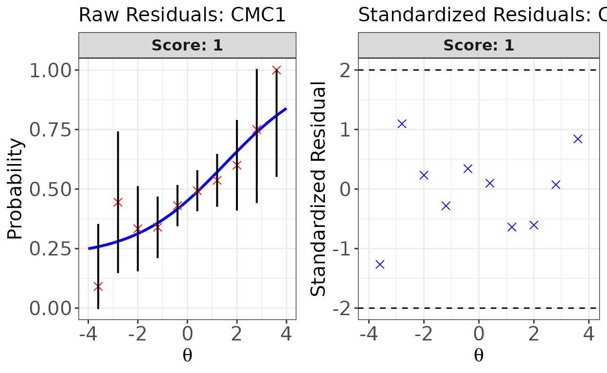
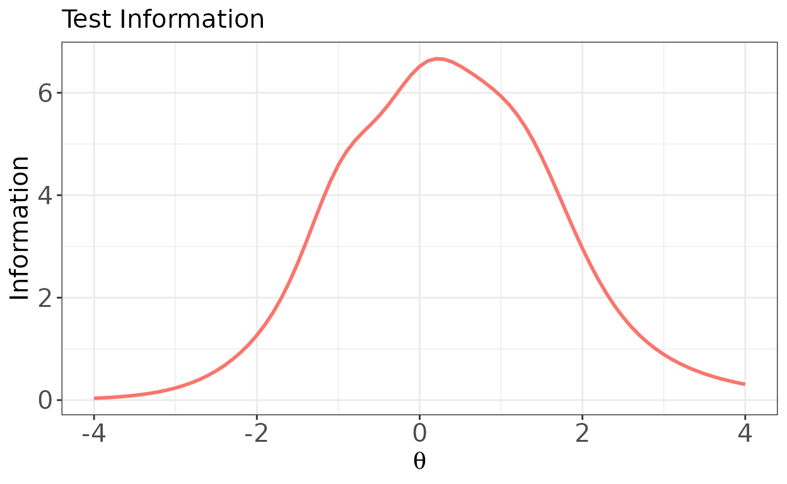

# Introduction to irtQ

## Overview

The **irtQ** package fits unidimensional item response theory (IRT)
models to test data that may contain both dichotomous and polytomous
items. The dichotomous models are the one-, two-, and three-parameter
logistic models (1PLM, 2PLM, and 3PLM), and the polytomous models are
the graded response model (GRM) and the generalized partial credit model
(GPCM). A single test can mix these models.

The package covers the steps of a typical IRT analysis: estimating item
parameters by marginal maximum likelihood with the EM algorithm
([`est_irt()`](https://hwangQ.github.io/irtQ/reference/est_irt.md),
[`est_mg()`](https://hwangQ.github.io/irtQ/reference/est_mg.md)),
calibrating pretest items with fixed item parameters or fixed abilities
([`est_irt()`](https://hwangQ.github.io/irtQ/reference/est_irt.md),
[`est_item()`](https://hwangQ.github.io/irtQ/reference/est_item.md)),
estimating examinees’ abilities
([`est_score()`](https://hwangQ.github.io/irtQ/reference/est_score.md)),
evaluating model-data fit
([`irtfit()`](https://hwangQ.github.io/irtQ/reference/irtfit.md),
[`sx2_fit()`](https://hwangQ.github.io/irtQ/reference/sx2_fit.md)), and
detecting differential item functioning
([`rdif()`](https://hwangQ.github.io/irtQ/reference/rdif.md),
[`crdif()`](https://hwangQ.github.io/irtQ/reference/crdif.md),
[`grdif()`](https://hwangQ.github.io/irtQ/reference/grdif.md),
[`catsib()`](https://hwangQ.github.io/irtQ/reference/catsib.md)) and
item parameter drift
([`ripd()`](https://hwangQ.github.io/irtQ/reference/ripd.md),
[`pcd2()`](https://hwangQ.github.io/irtQ/reference/pcd2.md)). It also
provides functions for item and test information
([`info()`](https://hwangQ.github.io/irtQ/reference/info.md)), item
response curves
([`traceline()`](https://hwangQ.github.io/irtQ/reference/traceline.md)),
classification accuracy and consistency
([`cac_lee()`](https://hwangQ.github.io/irtQ/reference/cac_lee.md),
[`cac_rud()`](https://hwangQ.github.io/irtQ/reference/cac_rud.md)),
multistage test panels
([`panel_info()`](https://hwangQ.github.io/irtQ/reference/panel_info.md),
[`find_cut()`](https://hwangQ.github.io/irtQ/reference/find_cut.md),
[`reval_mst()`](https://hwangQ.github.io/irtQ/reference/reval_mst.md),
[`run_mst()`](https://hwangQ.github.io/irtQ/reference/run_mst.md)), and
classical test theory
([`ctt()`](https://hwangQ.github.io/irtQ/reference/ctt.md),
[`freq_score()`](https://hwangQ.github.io/irtQ/reference/freq_score.md),
[`ctt_distr()`](https://hwangQ.github.io/irtQ/reference/ctt_distr.md),
[`score_resp()`](https://hwangQ.github.io/irtQ/reference/score_resp.md)).

This vignette walks through a short workflow: read item parameters,
simulate responses, calibrate the items, estimate abilities, check fit,
and compute test information. Every example uses the scaling constant
`D = 1`.

## Item metadata

Most irtQ functions take a data frame of item metadata as their first
argument, or a fitted object that contains one. Each row describes one
item.

| Column | Meaning |
|----|----|
| `id` | Item identifier |
| `cats` | Number of score categories (2 for a dichotomous item) |
| `model` | IRT model of the item: `"1PLM"`, `"2PLM"`, `"3PLM"`, `"GRM"`, or `"GPCM"` |
| `par.1` | Slope (discrimination) parameter |
| `par.2` | Difficulty for a dichotomous item, or the first threshold for a polytomous item |
| `par.3` | Guessing parameter for a 3PLM item, or the second threshold for a polytomous item; `NA` for 1PLM and 2PLM items |
| `par.4`, … | Further thresholds of a polytomous item; `NA` for dichotomous items |

Item metadata can be read from the output of other IRT software with the
`bring.*()` functions
([`bring.flexmirt()`](https://hwangQ.github.io/irtQ/reference/bring.flexmirt.md),
[`bring.bilog()`](https://hwangQ.github.io/irtQ/reference/bring.flexmirt.md),
[`bring.parscale()`](https://hwangQ.github.io/irtQ/reference/bring.flexmirt.md),
and
[`bring.mirt()`](https://hwangQ.github.io/irtQ/reference/bring.flexmirt.md),
which requires the suggested **mirt** package) or created with
[`shape_df()`](https://hwangQ.github.io/irtQ/reference/shape_df.md). The
example below reads the flexMIRT parameter file that ships with the
package and keeps the first 25 items, all of which follow the 3PLM.

``` r

library(irtQ)

flex_file <- system.file("extdata", "flexmirt_sample-prm.txt", package = "irtQ")
x <- bring.flexmirt(file = flex_file, type = "par")$Group1$full_df
x <- x[1:25, ]
head(x)
#>     id cats model     par.1      par.2      par.3 par.4 par.5
#> 1 CMC1    2  3PLM 0.7627842  1.4619531 0.26150535    NA    NA
#> 2 CMC2    2  3PLM 1.9212842 -1.0499776 0.17529436    NA    NA
#> 3 CMC3    2  3PLM 0.9266599  0.3947551 0.09974656    NA    NA
#> 4 CMC4    2  3PLM 1.0526419 -0.4070422 0.20119337    NA    NA
#> 5 CMC5    2  3PLM 0.8663350 -0.1248170 0.16042040    NA    NA
#> 6 CMC6    2  3PLM 1.6956204  0.6261066 0.07216857    NA    NA
```

A small metadata frame can also be written directly with
[`shape_df()`](https://hwangQ.github.io/irtQ/reference/shape_df.md).

``` r

shape_df(
  par.drm = list(a = c(1.0, 1.2), b = c(-0.5, 0.5), g = c(0.2, 0.2)),
  cats = 2, model = "3PLM"
)
#>   id cats model par.1 par.2 par.3
#> 1 V1    2  3PLM   1.0  -0.5   0.2
#> 2 V2    2  3PLM   1.2   0.5   0.2
```

## Simulating item responses

[`simdat()`](https://hwangQ.github.io/irtQ/reference/simdat.md)
generates item responses from item metadata and a vector of abilities.
Here 500 examinees are drawn from a standard normal distribution.

``` r

set.seed(2026)
theta <- rnorm(500, mean = 0, sd = 1)
resp <- simdat(x = x, theta = theta, D = 1)
dim(resp)
#> [1] 500  25
```

## Estimating item parameters

[`est_irt()`](https://hwangQ.github.io/irtQ/reference/est_irt.md)
calibrates the items. The model and the number of score categories are
given for all items at once. A Beta(5, 16) prior on the guessing
parameters, which is the default, stabilizes the 3PLM estimates; it is
written out here for clarity.

``` r

fit <- est_irt(
  data = resp, D = 1, model = "3PLM", cats = 2, item.id = x$id,
  use.gprior = TRUE, gprior = list(dist = "beta", params = c(5, 16)),
  verbose = FALSE
)
fit
#> 
#> Call:
#> est_irt(data = resp, D = 1, model = "3PLM", cats = 2, item.id = x$id, 
#>     use.gprior = TRUE, gprior = list(dist = "beta", params = c(5, 
#>         16)), verbose = FALSE)
#> 
#> Item parameter estimation using MMLE-EM. 
#> 29 E-step cycles were completed using 49 quadrature points.
#> First-order test: Convergence criteria are satisfied.
#> Second-order test: Solution is a possible local maximum.
#> Computation of variance-covariance matrix: 
#>   Variance-covariance matrix of item parameter estimates is obtainable.
#> 
#> Log-likelihood: -7122.816
```

Printing the fitted object reports the number of EM cycles, the number
of quadrature points, the first- and second-order convergence checks,
and the log-likelihood. A fuller estimation summary is available from
`summary(fit)`.

[`getirt()`](https://hwangQ.github.io/irtQ/reference/getirt.md) extracts
parts of the fitted object, such as the item parameter estimates.

``` r

par_est <- getirt(fit, what = "par.est")
head(par_est)
#>     id cats model    par.1       par.2      par.3
#> 1 CMC1    2  3PLM 0.548348  1.52622329 0.21322043
#> 2 CMC2    2  3PLM 1.834283 -1.18009847 0.18392144
#> 3 CMC3    2  3PLM 1.194246  0.80370044 0.21057443
#> 4 CMC4    2  3PLM 1.104963 -0.40524060 0.25026086
#> 5 CMC5    2  3PLM 1.184828 -0.02633171 0.14063801
#> 6 CMC6    2  3PLM 1.580076  0.53583179 0.08719593
```

## Estimating abilities

[`est_score()`](https://hwangQ.github.io/irtQ/reference/est_score.md)
estimates the abilities of the examinees. A fitted `est_irt` object can
be passed directly, and the response data stored in the object are used.
The code below uses maximum likelihood estimation (ML) and compares the
estimates with the abilities used to simulate the data. The `range`
argument keeps the ML estimates within \[-4, 4\], which matters for
examinees who answer all items correctly or all incorrectly.

``` r

scores <- est_score(fit, method = "ML", range = c(-4, 4))
head(scores$est.theta)
#> [1]  0.08603911 -1.30225167  0.08313340  0.08013606 -0.28721183 -4.00000000
cor(scores$est.theta, theta)
#> [1] 0.8777982
```

## Model-data fit

[`sx2_fit()`](https://hwangQ.github.io/irtQ/reference/sx2_fit.md)
computes the S-X2 item fit statistic, and
[`irtfit()`](https://hwangQ.github.io/irtQ/reference/irtfit.md) computes
chi-square and likelihood-ratio statistics, infit and outfit, and the
contingency tables behind the residual plots.

``` r

sx2 <- sx2_fit(fit)
head(sx2$fit_stat)
#>     id  chisq df crit.val     p
#> 1 CMC1 11.342 16   26.296 0.788
#> 2 CMC2  6.096 11   19.675 0.867
#> 3 CMC3 19.788 16   26.296 0.230
#> 4 CMC4 15.647 15   24.996 0.406
#> 5 CMC5 19.984 15   24.996 0.173
#> 6 CMC6 13.013 15   24.996 0.601
```

[`irtfit()`](https://hwangQ.github.io/irtQ/reference/irtfit.md) groups
the examinees by the ML estimates from the previous section, and the
plot shows the raw and standardized residuals of the first item.

``` r

fit_irt <- irtfit(
  x = fit, score = scores$est.theta, group.method = "equal.width",
  n.width = 10, loc.theta = "middle"
)
plot(fit_irt, item.loc = 1, type = "both", ci.method = "wald",
     show.table = FALSE, ylim.sr.adjust = TRUE)
```



## Test information

[`info()`](https://hwangQ.github.io/irtQ/reference/info.md) computes
item and test information functions on a grid of ability values, and its
[`plot()`](https://rdrr.io/r/graphics/plot.default.html) method draws
them. Without `item.loc`, the plot shows the test information function.

``` r

theta_grid <- seq(-4, 4, 0.1)
tif <- info(x = fit, theta = theta_grid, tif = TRUE)
plot(tif)
```



## Where to go next

The package website at <https://hwangQ.github.io/irtQ/> has articles
that cover each topic in more detail:

- [Getting Started: A Detailed
  Guide](https://hwangQ.github.io/irtQ/articles/getting-started.html)
- [Item Parameter
  Estimation](https://hwangQ.github.io/irtQ/articles/item-parameter-estimation.html)
- [Ability
  Estimation](https://hwangQ.github.io/irtQ/articles/ability-estimation.html)
- [Model-Data Fit
  Evaluation](https://hwangQ.github.io/irtQ/articles/model-fit-evaluation.html)
- [DIF
  Detection](https://hwangQ.github.io/irtQ/articles/dif-detection.html)
- [Classification Accuracy and
  Consistency](https://hwangQ.github.io/irtQ/articles/classification-analysis.html)
- [Utility
  Functions](https://hwangQ.github.io/irtQ/articles/utilities.html)
- [Classical Test Theory (CTT)
  Analysis](https://hwangQ.github.io/irtQ/articles/ctt-analysis.html)
- [MST Panel Evaluation and
  Simulation](https://hwangQ.github.io/irtQ/articles/mst-panel-evaluation.html)
