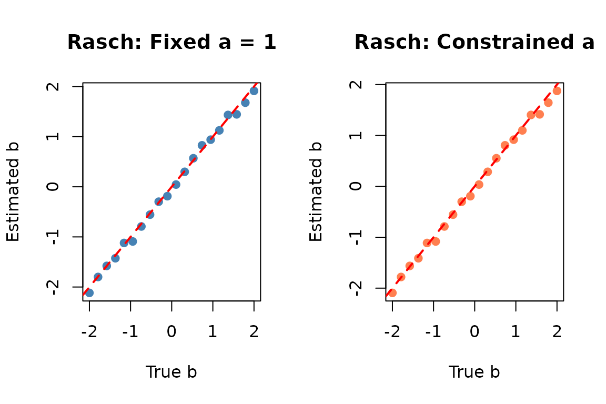
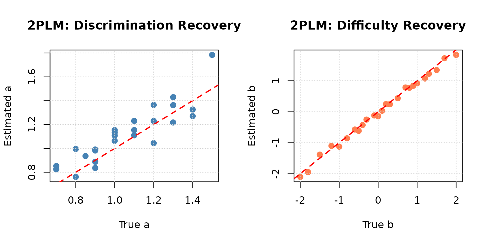
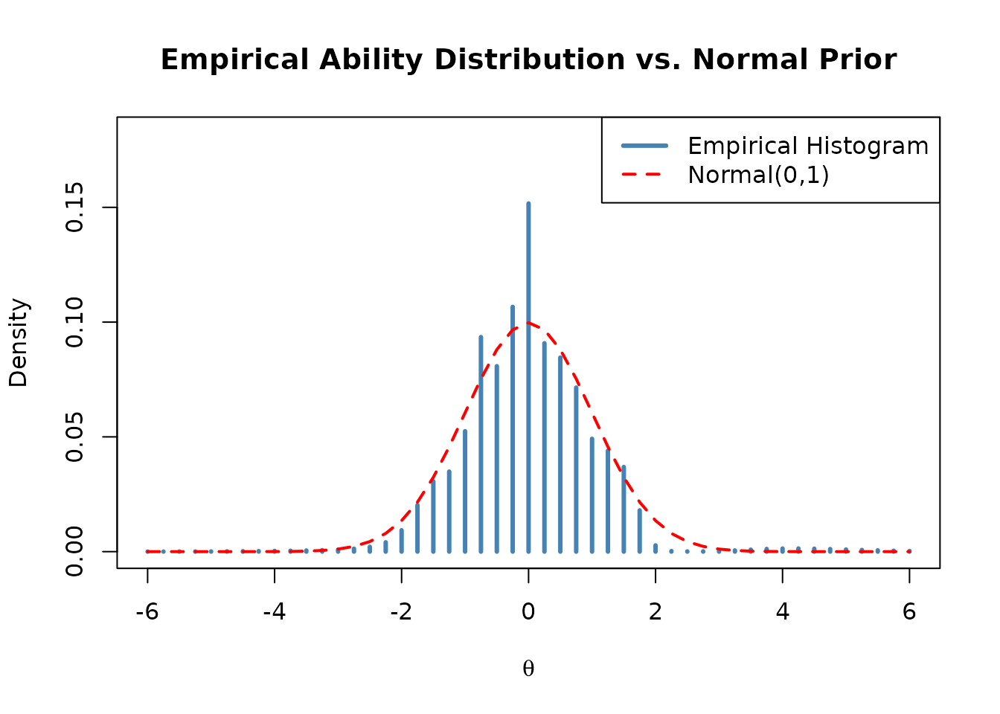
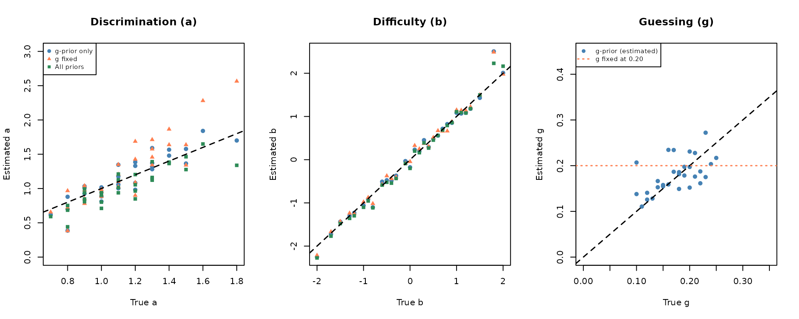
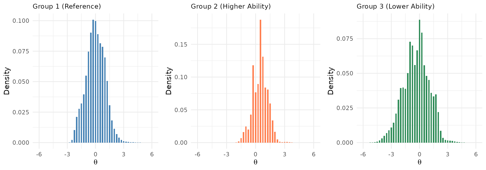

# Item Parameter Estimation

## Overview

**irtQ** provides three functions for item parameter estimation, each
suited to different testing scenarios:

### Estimation Methods at a Glance

| Function | Method | Use Case | Typical Scenario |
|----|----|----|----|
| [`est_irt()`](https://hwangQ.github.io/irtQ/reference/est_irt.md) | MMLE-EM | Fixed-form (i.e., linear test form) calibration | Calibrate a linear test form from scratch |
| [`est_irt()`](https://hwangQ.github.io/irtQ/reference/est_irt.md) + `fipc=TRUE` | MMLE-EM | Pretest calibration (Fixed item parameter calibration, FIPC) | Pre-equate new items using anchor items |
| [`est_item()`](https://hwangQ.github.io/irtQ/reference/est_item.md) | MLE | Pretest calibration (Fixed ability parameter calibration, FAPC) | Calibrate items using known examinee abilities |
| [`est_mg()`](https://hwangQ.github.io/irtQ/reference/est_mg.md) | MMLE-EM | Multiple-group calibration | Link different forms across groups/grades |

All functions support **mixed-format tests** with dichotomous and
polytomous items. After estimation, use
[`getirt()`](https://hwangQ.github.io/irtQ/reference/getirt.md) to
extract results, and
[`summary()`](https://hwangQ.github.io/irtQ/reference/summary.md) for a
compact overview.

``` r

library(irtQ)
set.seed(2026)
```

------------------------------------------------------------------------

## Part 1: Fixed-Form Calibration with `est_irt()`

### What is Fixed-Form Calibration?

**Fixed-form calibration** refers to estimating item parameters for a
fixed test form (i.e., linear test form) administered to a single group
of examinees. This is the foundation of IRT-based test development.

**Key characteristics:**

- All items are **simultaneously calibrated** using the same examinee
  sample
- The latent ability distribution ($`\theta`$) is estimated from the
  data
- Results in a **single, unified measurement scale** for all items
- Used for developing new test forms or establishing an initial item
  bank

**When to use fixed-form calibration:**

✅ Developing a new test from scratch  
✅ Establishing the initial item bank for a testing program  
✅ Calibrating a complete operational test form  
✅ Validating a newly developed assessment

------------------------------------------------------------------------

### How `est_irt()` Works: MMLE-EM Algorithm

The [`est_irt()`](https://hwangQ.github.io/irtQ/reference/est_irt.md)
function implements the **Marginal Maximum Likelihood Estimation via the
Expectation-Maximization (MMLE-EM)** algorithm (Bock & Aitkin, 1981).

To avoid the incidental parameter problem (where estimating individual
ability $`\theta`$ leads to inconsistent item parameter estimates as the
sample size grows), the algorithm treats $`\theta`$ as a random variable
following a specific prior distribution, typically
$`g(\theta) \sim N(0, 1)`$.

> Note on Item Types: For clarity and simplicity, the mathematical
> formulation and explanations below are presented using dichotomous
> (binary) items, although the underlying logic seamlessly extends to
> polytomous item response models.

By integrating the latent variable $`\theta`$ out of the joint
likelihood, we obtain the **marginal log-likelihood** of the observed
data, where the item parameters ($`\boldsymbol{\Delta}`$) are the only
parameters to be estimated:

``` math
\log L(\boldsymbol{\Delta} \mid \mathbf{U}) = \sum_{i=1}^{N} \log \int_{-\infty}^{\infty} L(\mathbf{u}_i \mid \theta)\, g(\theta) d\theta
```

where $`L(\mathbf{u}_i \mid \theta)`$ is the likelihood of observing
examinee $`i`$’s response pattern $`\mathbf{u}_i`$ given ability
$`\theta`$, and $`g(\theta)`$ is the prior density function of the
latent ability.

Using $`K`$-point quadrature, this continuous integral is approximated
by a discrete summation over $`K`$ quadrature points $`\theta_k`$ with
prior weights $`w_k`$ (such as weights from a standard normal
distribution):

``` math
\log L_{marginal}(\boldsymbol{\Delta} \mid \mathbf{U}) \approx \sum_{i=1}^{N} \log \sum_{k=1}^{K} L(\mathbf{u}_i \mid \theta_k)\, w_k
```

To maximize this marginal log-likelihood, which is analytically
intractable due to the summation inside the logarithm,
[`est_irt()`](https://hwangQ.github.io/irtQ/reference/est_irt.md)
iteratively executes the following E-step and M-step until convergence:

**E-step (Expectation): Computing Artificial Sufficient Statistics**

For each examinee response pattern $`\mathbf{u}_i`$, the algorithm first
computes the **posterior probability** of $`\theta`$ at each quadrature
point $`\theta_k`$:

``` math
P(\theta_k \mid \mathbf{u}_i) = \frac{L(\mathbf{u}_i \mid \theta_k)\, w_k}{\sum_{m=1}^{K} L(\mathbf{u}_i \mid \theta_m)\, w_m}
```

Using these individual posteriors, the algorithm aggregates data across
all $`N`$ examinees to construct the **artificial sufficient
statistics** for each quadrature point:

- **Expected number of examinees ($`n_k`$)** at $`\theta_k`$:
  ``` math
  n_k = \sum_{i=1}^{N} P(\theta_k \mid \mathbf{u}_i)
  ```

- **Expected number of correct responses ($`r_{jk}`$)** for item $`j`$
  at $`\theta_k`$:
  ``` math
  r_{jk} = \sum_{i=1}^{N} u_{ij} P(\theta_k \mid \mathbf{u}_i)
  ```

**M-step (Maximization): Item-by-Item Parameter Optimization**

In the M-step, the algorithm treats $`n_k`$ and $`r_{jk}`$ as fixed
constants. By decoupling the joint likelihood, the parameters of each
item $`j`$ can be updated **independently (item-by-item)** by maximizing
the expected complete-data log-likelihood (the $`Q`$-function):

``` math
\ell_j(\boldsymbol{\delta}_j) = \sum_{k=1}^{K} \left[ r_{jk} \ln P_j(\theta_k) + (n_k - r_{jk}) \ln (1 - P_j(\theta_k)) \right]
```

where $`\boldsymbol{\delta}_j`$ denotes the item parameter vector (e.g.,
slope $`a_j`$ and difficulty $`b_j`$ for the 2PL model) and
$`P_j(\theta_k)`$ is the item response function.
[`est_irt()`](https://hwangQ.github.io/irtQ/reference/est_irt.md)
numerically optimizes this function for each item using Newton-Raphson
or other root-finding techniques.

> Extension to Polytomous Items: While the formulation above uses
> dichotomous items for ease of illustration, the same underlying
> MMLE-EM framework generalizes to polytomous item response models
> (e.g., Graded Response Model, Generalized Partial Credit Model). For
> polytomous items, the expected complete-data log-likelihood
> incorporates multinomial category response probabilities
> $`P_{jv}(\theta_k)`$ and corresponding expected category frequencies
> $`r_{jvk}`$ for each category $`v`$, maintaining the identical
> decoupling optimization structure.

**Convergence**

This two-step cycle (E and M) repeats. The algorithm terminates when the
maximum absolute change in item parameter estimates between consecutive
iterations is smaller than the convergence threshold specified by the
`Etol` argument.

**Key advantages of MMLE-EM:**

- Does not require individual ability estimates ($`\theta`$ is
  “integrated out”)
- Handles missing data naturally
- Allows prior distributions on item parameters for numerical stability

------------------------------------------------------------------------

### Essential `est_irt()` Arguments

**Data and Model Specification:**

| Argument | Description |
|----|----|
| `data` | Response matrix (examinees × items); rows = examinees, columns = items |
| `model` | IRT model per item: `"1PLM"`, `"2PLM"`, `"3PLM"`, `"GRM"`, `"GPCM"` |
| `cats` | Number of response categories per item (2 for dichotomous) |
| `D` | Scaling constant (`1` for logistic metric; `1.702` to approximate normal-ogive) |
| `item.id` | Optional character vector of item identifiers |

**Prior Distribution for Ability (θ):**

| Argument | Description |
|----|----|
| `group.mean` | Mean of the prior distribution (default = `0`) |
| `group.var` | Variance of the prior distribution (default = `1`) |
| `EmpHist` | If `TRUE`, estimate the empirical histogram of θ (non-parametric prior) |
| `Quadrature` | Number and range of quadrature points: e.g., `c(49, 6)` = 49 points from −6 to 6 |

**Model Constraints:**

| Argument | Description |
|----|----|
| `fix.a.1pl` | If `TRUE`, fix 1PLM discrimination to `a.val.1pl`; if `FALSE` (default), constrain equal across items but estimate |
| `a.val.1pl` | Fixed value for 1PLM discrimination (default = `1`) |
| `fix.g` | If `TRUE`, fix guessing parameter to `g.val` for all 3PLM items |
| `g.val` | Fixed guessing value (default = `0.2`) |
| `fix.a.gpcm` | If `TRUE`, GPCM becomes PCM (discrimination fixed to `a.val.gpcm`) |
| `a.val.gpcm` | Fixed discrimination for PCM (default = `1`) |

**Priors on Item Parameters:**

| Argument | Description |
|----|----|
| `use.aprior` | Apply log-normal prior to discrimination parameters |
| `use.bprior` | Apply normal prior to difficulty parameters |
| `use.gprior` | Apply beta prior to guessing parameters (recommended for 3PLM) |
| `aprior` | e.g., `list(dist = "lnorm", params = c(0, 0.5))` |
| `bprior` | e.g., `list(dist = "norm", params = c(0, 1))` |
| `gprior` | e.g., `list(dist = "beta", params = c(4, 16))` — mean = 4/(4+16) = 0.2 |

**Convergence Settings:**

| Argument | Description |
|----|----|
| `Etol` | Convergence threshold (default = `1e-4`). Use `0.001` for faster, slightly looser convergence |
| `MaxE` | Maximum number of EM iterations (default = `500`) |
| `se` | If `TRUE`, compute item parameter standard errors |

------------------------------------------------------------------------

### Example 1: Rasch Model (1PLM) Calibration

The **1-parameter logistic model (1PLM)**, also known as the **Rasch
model**, is the simplest IRT model for dichotomous items. It assumes:

- All items have **equal discrimination** (slopes)
- Items differ only in **difficulty** (location)
- **No guessing** (lower asymptote = 0)

**Mathematical form:**

``` math
P(Y = 1 \mid \theta) = \frac{1}{1 + \exp(-D \cdot a \cdot (\theta - b))}
```

where $`a`$ is constrained to be equal across all items (or fixed to 1).

**Two ways to fit the Rasch model in irtQ:**

1.  **`fix.a.1pl = TRUE`**: Fix $`a = 1`$ for all 1PLM items (strict
    Rasch)
2.  **`fix.a.1pl = FALSE`** (default): Constrain $`a`$ to be equal
    across 1PLM items but estimate the common value from the data

We demonstrate both approaches:

``` r

# ---- Step 1: Define item metadata for 20-item 1PLM test ----
# Difficulty parameters range from easy (−2) to hard (2)
meta_1pl <- shape_df(
  par.drm = list(
    a = rep(1, 20),               # Discriminations set to 1 (for simulation)
    b = seq(-2, 2, length.out = 20),  # Difficulty from −2 to 2
    g = rep(NA, 20)               # No guessing (1PLM / 2PLM)
  ),
  item.id = paste0("I", 1:20),
  cats    = 2,
  model   = "1PLM"
)

# ---- Step 2: Simulate 500 examinees from N(0, 1) ----
theta_1pl <- rnorm(500, mean = 0, sd = 1)
resp_1pl  <- simdat(x = meta_1pl, theta = theta_1pl, D = 1.702)

# ---- Step 3a: Estimate with FIXED discrimination (a = 1) ----
# Strict Rasch: D×a×(θ−b) = 1.702×1×(θ−b)
mod_1pl_fixed <- est_irt(
  data       = resp_1pl,
  D          = 1.702,
  model      = "1PLM",
  cats       = 2,
  item.id    = paste0("I", 1:20),
  fix.a.1pl  = TRUE,       # ← Fix discrimination to a.val.1pl (= 1)
  a.val.1pl  = 1,          # ← a = 1 (strict Rasch parameterization)
  EmpHist    = FALSE,      # Use fixed N(0,1) prior
  Etol       = 0.001,
  MaxE       = 200,
  se         = TRUE,
  verbose    = FALSE
)

summary(mod_1pl_fixed)
#> 
#> Call:
#> est_irt(data = resp_1pl, D = 1.702, model = "1PLM", cats = 2, 
#>     item.id = paste0("I", 1:20), fix.a.1pl = TRUE, a.val.1pl = 1, 
#>     EmpHist = FALSE, Etol = 0.001, MaxE = 200, se = TRUE, verbose = FALSE)
#> 
#> Summary of the Data 
#>  Number of Items: 20
#>  Number of Cases: 500
#> 
#> Summary of Estimation Process 
#>  Maximum number of EM cycles: 200
#>  Convergence criterion of E-step: 0.001
#>  Number of rectangular quadrature points: 49
#>  Minimum & Maximum quadrature points: -6, 6
#>  Number of free parameters: 20
#>  Number of fixed items: 0
#>  Number of E-step cycles completed: 6
#>  Maximum parameter change: 6.362554e-06
#> 
#> Processing time (in seconds) 
#>  EM algorithm: 0.15
#>  Standard error computation: 0.02
#>  Total computation: 0.2
#> 
#> Convergence and Stability of Solution 
#>  First-order test: Convergence criteria are satisfied.
#>  Second-order test: Solution is a possible local maximum.
#>  Computation of variance-covariance matrix: 
#>   Variance-covariance matrix of item parameter estimates is obtainable.
#> 
#> Summary of Estimation Results 
#>  -2loglikelihood: 8479.304
#>  Akaike Information Criterion (AIC): 8519.304
#>  Bayesian Information Criterion (BIC): 8603.597
#>  Item Parameters: 
#>      id  cats  model  par.1  se.1  par.2  se.2  par.3  se.3
#> 1    I1     2   1PLM      1    NA  -2.12  0.13     NA    NA
#> 2    I2     2   1PLM      1    NA  -1.80  0.11     NA    NA
#> 3    I3     2   1PLM      1    NA  -1.58  0.10     NA    NA
#> 4    I4     2   1PLM      1    NA  -1.43  0.10     NA    NA
#> 5    I5     2   1PLM      1    NA  -1.12  0.09     NA    NA
#> 6    I6     2   1PLM      1    NA  -1.09  0.09     NA    NA
#> 7    I7     2   1PLM      1    NA  -0.79  0.09     NA    NA
#> 8    I8     2   1PLM      1    NA  -0.56  0.08     NA    NA
#> 9    I9     2   1PLM      1    NA  -0.30  0.08     NA    NA
#> 10  I10     2   1PLM      1    NA  -0.19  0.08     NA    NA
#> 11  I11     2   1PLM      1    NA   0.04  0.08     NA    NA
#> 12  I12     2   1PLM      1    NA   0.30  0.08     NA    NA
#> 13  I13     2   1PLM      1    NA   0.57  0.08     NA    NA
#> 14  I14     2   1PLM      1    NA   0.83  0.09     NA    NA
#> 15  I15     2   1PLM      1    NA   0.94  0.09     NA    NA
#> 16  I16     2   1PLM      1    NA   1.13  0.09     NA    NA
#> 17  I17     2   1PLM      1    NA   1.43  0.10     NA    NA
#> 18  I18     2   1PLM      1    NA   1.45  0.10     NA    NA
#> 19  I19     2   1PLM      1    NA   1.68  0.10     NA    NA
#> 20  I20     2   1PLM      1    NA   1.91  0.11     NA    NA
#>  Group Parameters: 
#>            mu  sigma2  sigma
#> estimates   0       1      1
#> se         NA      NA     NA

# Extract difficulty estimates
par_fixed <- getirt(mod_1pl_fixed, what = "par.est")
head(par_fixed)
#>   id cats model par.1     par.2 par.3
#> 1 I1    2  1PLM     1 -2.117258    NA
#> 2 I2    2  1PLM     1 -1.799535    NA
#> 3 I3    2  1PLM     1 -1.578528    NA
#> 4 I4    2  1PLM     1 -1.425732    NA
#> 5 I5    2  1PLM     1 -1.120830    NA
#> 6 I6    2  1PLM     1 -1.091244    NA

# ---- Step 3b: Estimate with CONSTRAINED discrimination ----
# Discrimination is constrained equal across items but freely estimated
mod_1pl_constrained <- est_irt(
  data       = resp_1pl,
  D          = 1.702,
  model      = "1PLM",
  cats       = 2,
  item.id    = paste0("I", 1:20),
  fix.a.1pl  = FALSE,      # ← Equal constraint, but a is estimated
  EmpHist    = FALSE,
  Etol       = 0.001,
  MaxE       = 200,
  se         = TRUE,
  verbose    = FALSE
)

summary(mod_1pl_constrained)
#> 
#> Call:
#> est_irt(data = resp_1pl, D = 1.702, model = "1PLM", cats = 2, 
#>     item.id = paste0("I", 1:20), fix.a.1pl = FALSE, EmpHist = FALSE, 
#>     Etol = 0.001, MaxE = 200, se = TRUE, verbose = FALSE)
#> 
#> Summary of the Data 
#>  Number of Items: 20
#>  Number of Cases: 500
#> 
#> Summary of Estimation Process 
#>  Maximum number of EM cycles: 200
#>  Convergence criterion of E-step: 0.001
#>  Number of rectangular quadrature points: 49
#>  Minimum & Maximum quadrature points: -6, 6
#>  Number of free parameters: 21
#>  Number of fixed items: 0
#>  Number of E-step cycles completed: 21
#>  Maximum parameter change: 0.0007782085
#> 
#> Processing time (in seconds) 
#>  EM algorithm: 0.13
#>  Standard error computation: 0.09
#>  Total computation: 0.24
#> 
#> Convergence and Stability of Solution 
#>  First-order test: Convergence criteria are satisfied.
#>  Second-order test: Solution is a possible local maximum.
#>  Computation of variance-covariance matrix: 
#>   Variance-covariance matrix of item parameter estimates is obtainable.
#> 
#> Summary of Estimation Results 
#>  -2loglikelihood: 8479.074
#>  Akaike Information Criterion (AIC): 8521.074
#>  Bayesian Information Criterion (BIC): 8609.581
#>  Item Parameters: 
#>      id  cats  model  par.1  se.1  par.2  se.2  par.3  se.3
#> 1    I1     2   1PLM   1.02  0.05  -2.09  0.15     NA    NA
#> 2    I2     2   1PLM   1.02    NA  -1.78  0.13     NA    NA
#> 3    I3     2   1PLM   1.02    NA  -1.56  0.12     NA    NA
#> 4    I4     2   1PLM   1.02    NA  -1.41  0.11     NA    NA
#> 5    I5     2   1PLM   1.02    NA  -1.11  0.10     NA    NA
#> 6    I6     2   1PLM   1.02    NA  -1.08  0.10     NA    NA
#> 7    I7     2   1PLM   1.02    NA  -0.79  0.09     NA    NA
#> 8    I8     2   1PLM   1.02    NA  -0.56  0.08     NA    NA
#> 9    I9     2   1PLM   1.02    NA  -0.30  0.08     NA    NA
#> 10  I10     2   1PLM   1.02    NA  -0.19  0.08     NA    NA
#> 11  I11     2   1PLM   1.02    NA   0.04  0.08     NA    NA
#> 12  I12     2   1PLM   1.02    NA   0.29  0.08     NA    NA
#> 13  I13     2   1PLM   1.02    NA   0.55  0.08     NA    NA
#> 14  I14     2   1PLM   1.02    NA   0.81  0.09     NA    NA
#> 15  I15     2   1PLM   1.02    NA   0.92  0.09     NA    NA
#> 16  I16     2   1PLM   1.02    NA   1.10  0.10     NA    NA
#> 17  I17     2   1PLM   1.02    NA   1.40  0.11     NA    NA
#> 18  I18     2   1PLM   1.02    NA   1.41  0.11     NA    NA
#> 19  I19     2   1PLM   1.02    NA   1.64  0.12     NA    NA
#> 20  I20     2   1PLM   1.02    NA   1.88  0.13     NA    NA
#>  Group Parameters: 
#>            mu  sigma2  sigma
#> estimates   0       1      1
#> se         NA      NA     NA

par_constrained <- getirt(mod_1pl_constrained, what = "par.est")
head(par_constrained)
#>   id cats model    par.1     par.2 par.3
#> 1 I1    2  1PLM 1.019657 -2.093318    NA
#> 2 I2    2  1PLM 1.019657 -1.780631    NA
#> 3 I3    2  1PLM 1.019657 -1.563083    NA
#> 4 I4    2  1PLM 1.019657 -1.412665    NA
#> 5 I5    2  1PLM 1.019657 -1.112475    NA
#> 6 I6    2  1PLM 1.019657 -1.083345    NA

# Note: par.1 (discrimination) is the same for all items, but its value
# is estimated from the data and may differ from 1
cat("Common discrimination estimate:", unique(par_constrained$par.1), "\n")
#> Common discrimination estimate: 1.019657

# ---- Compare difficulty recovery ----
par(mfrow = c(1, 2))

plot(meta_1pl$par.2, par_fixed$par.2,
     xlab = "True b", ylab = "Estimated b",
     main = "Rasch: Fixed a = 1",
     pch = 19, col = "steelblue")
abline(0, 1, col = "red", lty = 2, lwd = 2)

plot(meta_1pl$par.2, par_constrained$par.2,
     xlab = "True b", ylab = "Estimated b",
     main = "Rasch: Constrained a",
     pch = 19, col = "coral")
abline(0, 1, col = "red", lty = 2, lwd = 2)
```



------------------------------------------------------------------------

### Example 2: 2PLM Calibration with Parameter Recovery Analysis

We simulate a 25-item 2PLM test and examine how well
[`est_irt()`](https://hwangQ.github.io/irtQ/reference/est_irt.md)
recovers the true item parameters.

``` r

# ---- Step 1: Define item metadata ----
meta_bin <- shape_df(
  par.drm = list(
    a = c(0.8, 1.0, 1.2, 0.9, 1.4, 1.1, 0.7, 1.3, 1.0, 0.9,
          1.2, 0.8, 1.5, 1.1, 0.9, 1.3, 0.7, 1.0, 1.2, 0.85,
          1.0, 1.3, 0.9, 1.1, 1.4),
    b = c(-2.0, -1.5, -1.0, -0.8, -0.5, -0.3, -0.1,  0.0,  0.2,  0.5,
           0.8,  1.0,  1.2,  1.5,  2.0, -1.8, -0.6,  0.3,  0.9,  1.3,
          -0.4,  0.1,  0.7, -1.2,  1.7),
    g = rep(NA, 25)   # No guessing (2PLM)
  ),
  item.id = paste0("ITEM", 1:25),
  cats    = 2,
  model   = "2PLM"
)

# ---- Step 2: Simulate 600 examinees from N(0, 1) ----
theta_true <- rnorm(600, mean = 0, sd = 1)
resp_bin   <- simdat(x = meta_bin, theta = theta_true, D = 1.702)

# ---- Step 3: Estimate item parameters ----
mod_bin <- est_irt(
  data    = resp_bin,
  D       = 1.702,
  model   = "2PLM",
  cats    = 2,
  item.id = paste0("ITEM", 1:25),
  EmpHist = FALSE,    # Fix prior to N(0,1)
  Etol    = 0.001,
  MaxE    = 200,
  se      = TRUE,
  verbose = FALSE
)

summary(mod_bin)
#> 
#> Call:
#> est_irt(data = resp_bin, D = 1.702, model = "2PLM", cats = 2, 
#>     item.id = paste0("ITEM", 1:25), EmpHist = FALSE, Etol = 0.001, 
#>     MaxE = 200, se = TRUE, verbose = FALSE)
#> 
#> Summary of the Data 
#>  Number of Items: 25
#>  Number of Cases: 600
#> 
#> Summary of Estimation Process 
#>  Maximum number of EM cycles: 200
#>  Convergence criterion of E-step: 0.001
#>  Number of rectangular quadrature points: 49
#>  Minimum & Maximum quadrature points: -6, 6
#>  Number of free parameters: 50
#>  Number of fixed items: 0
#>  Number of E-step cycles completed: 29
#>  Maximum parameter change: 0.0009961947
#> 
#> Processing time (in seconds) 
#>  EM algorithm: 0.71
#>  Standard error computation: 0.02
#>  Total computation: 0.74
#> 
#> Convergence and Stability of Solution 
#>  First-order test: Convergence criteria are satisfied.
#>  Second-order test: Solution is a possible local maximum.
#>  Computation of variance-covariance matrix: 
#>   Variance-covariance matrix of item parameter estimates is obtainable.
#> 
#> Summary of Estimation Results 
#>  -2loglikelihood: 12831.29
#>  Akaike Information Criterion (AIC): 12931.29
#>  Bayesian Information Criterion (BIC): 13151.13
#>  Item Parameters: 
#>         id  cats  model  par.1  se.1  par.2  se.2  par.3  se.3
#> 1    ITEM1     2   2PLM   0.76  0.11  -2.10  0.23     NA    NA
#> 2    ITEM2     2   2PLM   1.11  0.14  -1.38  0.12     NA    NA
#> 3    ITEM3     2   2PLM   1.04  0.12  -1.13  0.11     NA    NA
#> 4    ITEM4     2   2PLM   0.99  0.12  -0.85  0.09     NA    NA
#> 5    ITEM5     2   2PLM   1.33  0.14  -0.62  0.07     NA    NA
#> 6    ITEM6     2   2PLM   1.11  0.11  -0.25  0.07     NA    NA
#> 7    ITEM7     2   2PLM   0.85  0.09  -0.12  0.08     NA    NA
#> 8    ITEM8     2   2PLM   1.36  0.14  -0.15  0.06     NA    NA
#> 9    ITEM9     2   2PLM   1.06  0.12   0.25  0.07     NA    NA
#> 10  ITEM10     2   2PLM   0.84  0.09   0.43  0.09     NA    NA
#> 11  ITEM11     2   2PLM   1.23  0.13   0.77  0.08     NA    NA
#> 12  ITEM12     2   2PLM   1.00  0.11   0.92  0.10     NA    NA
#> 13  ITEM13     2   2PLM   1.78  0.23   1.07  0.08     NA    NA
#> 14  ITEM14     2   2PLM   1.23  0.15   1.35  0.11     NA    NA
#> 15  ITEM15     2   2PLM   0.98  0.15   1.83  0.18     NA    NA
#> 16  ITEM16     2   2PLM   1.22  0.17  -1.95  0.17     NA    NA
#> 17  ITEM17     2   2PLM   0.83  0.09  -0.57  0.09     NA    NA
#> 18  ITEM18     2   2PLM   1.13  0.11   0.25  0.07     NA    NA
#> 19  ITEM19     2   2PLM   1.36  0.15   0.84  0.08     NA    NA
#> 20  ITEM20     2   2PLM   0.94  0.11   1.22  0.12     NA    NA
#> 21  ITEM21     2   2PLM   1.15  0.12  -0.43  0.07     NA    NA
#> 22  ITEM22     2   2PLM   1.43  0.15   0.03  0.06     NA    NA
#> 23  ITEM23     2   2PLM   0.89  0.10   0.78  0.10     NA    NA
#> 24  ITEM24     2   2PLM   1.15  0.13  -1.10  0.10     NA    NA
#> 25  ITEM25     2   2PLM   1.27  0.21   1.73  0.15     NA    NA
#>  Group Parameters: 
#>            mu  sigma2  sigma
#> estimates   0       1      1
#> se         NA      NA     NA
```

**Extract estimated parameters and standard errors:**

``` r

# Parameter estimates
est_par <- getirt(mod_bin, what = "par.est")
head(est_par)
#>      id cats model     par.1      par.2 par.3
#> 1 ITEM1    2  2PLM 0.7610749 -2.1024453    NA
#> 2 ITEM2    2  2PLM 1.1076322 -1.3823297    NA
#> 3 ITEM3    2  2PLM 1.0442989 -1.1251569    NA
#> 4 ITEM4    2  2PLM 0.9906667 -0.8549354    NA
#> 5 ITEM5    2  2PLM 1.3257440 -0.6162470    NA
#> 6 ITEM6    2  2PLM 1.1097074 -0.2519402    NA

# Standard errors
est_se <- getirt(mod_bin, what = "se.est")
head(est_se)
#>      id cats model     par.1      par.2 par.3
#> 1 ITEM1    2  2PLM 0.1092573 0.23149728    NA
#> 2 ITEM2    2  2PLM 0.1369576 0.11975584    NA
#> 3 ITEM3    2  2PLM 0.1235171 0.10566949    NA
#> 4 ITEM4    2  2PLM 0.1166167 0.09492443    NA
#> 5 ITEM5    2  2PLM 0.1395448 0.07349193    NA
#> 6 ITEM6    2  2PLM 0.1121319 0.07131893    NA

# Estimated latent distribution parameters (mean and variance)
getirt(mod_bin, what = "group.par")
#>           mu sigma2 sigma
#> estimates  0      1     1
#> se        NA     NA    NA
```

**Parameter Recovery Analysis:**

``` r

par(mfrow = c(1, 2))

# Discrimination recovery
plot(meta_bin$par.1, est_par$par.1,
     xlab = "True a", ylab = "Estimated a",
     main = "2PLM: Discrimination Recovery",
     pch = 19, col = "steelblue", cex = 1.2)
abline(0, 1, col = "red", lty = 2, lwd = 2)
grid()

# Difficulty recovery
plot(meta_bin$par.2, est_par$par.2,
     xlab = "True b", ylab = "Estimated b",
     main = "2PLM: Difficulty Recovery",
     pch = 19, col = "coral", cex = 1.2)
abline(0, 1, col = "red", lty = 2, lwd = 2)
grid()
```



``` r


cat("\n=== Parameter Recovery Statistics ===\n")
#> 
#> === Parameter Recovery Statistics ===
cat("Discrimination RMSE:",
    round(sqrt(mean((meta_bin$par.1 - est_par$par.1)^2)), 4), "\n")
#> Discrimination RMSE: 0.1208
cat("Difficulty RMSE:",
    round(sqrt(mean((meta_bin$par.2 - est_par$par.2)^2)), 4), "\n")
#> Difficulty RMSE: 0.0937
cat("Discrimination r:", round(cor(meta_bin$par.1, est_par$par.1), 4), "\n")
#> Discrimination r: 0.8897
cat("Difficulty r:",     round(cor(meta_bin$par.2, est_par$par.2), 4), "\n")
#> Difficulty r: 0.9972
```

------------------------------------------------------------------------

### Example 3: Empirical Histogram Estimation

**What does `EmpHist = TRUE` do?**

Instead of assuming θ ~ N(μ, σ²), the EM algorithm estimates the
**empirical density** at each quadrature point using the Woods (2007)
method. The mean and variance are still constrained to `group.mean` and
`group.var` for scale identification, but the **shape** of the
distribution is estimated freely from the data.

**When to use `EmpHist = TRUE`:**

✅ Sample size is sufficiently **large** ✅ You suspect the ability
distribution is **non-normal** (e.g., bimodal, skewed)  
✅ You want to **avoid strong distributional assumptions** \`

``` r

# Estimate with empirical histogram
mod_bin_emp <- est_irt(
  data       = resp_bin,
  D          = 1.702,
  model      = "2PLM",
  cats       = 2,
  item.id    = paste0("ITEM", 1:25),
  EmpHist    = TRUE,     # ← Estimate empirical distribution
  group.mean = 0,        # ← Mean constrained to 0 for identification
  group.var  = 1,        # ← Variance constrained to 1 for identification
  Etol       = 0.001,
  MaxE       = 200,
  se         = TRUE,
  verbose    = FALSE
)

# Extract the estimated empirical distribution
emp_hist <- mod_bin_emp$weights

# Compare empirical estimate with the N(0,1) reference curve
theta_seq  <- emp_hist$theta
norm_dens  <- dnorm(theta_seq, mean = 0, sd = 1)
norm_dens  <- norm_dens / sum(norm_dens)   # Rescale to match histogram units

plot(emp_hist$theta, emp_hist$weight,
     type = "h", lwd = 3, col = "steelblue",
     xlab = expression(theta),
     ylab = "Density",
     main = "Empirical Ability Distribution vs. Normal Prior",
     ylim = c(0, max(emp_hist$weight) * 1.2))
lines(theta_seq, norm_dens, col = "red", lty = 2, lwd = 2)
legend("topright",
       legend = c("Empirical Histogram", "Normal(0,1)"),
       col = c("steelblue", "red"),
       lty = c(1, 2), lwd = c(3, 2))
```



**Interpretation:**

- A **close match** to the normal curve suggests the normality
  assumption is reasonable; `EmpHist = FALSE` is sufficient.
- **Notable deviations** (e.g., skewness, multimodality) suggest that
  the empirical histogram captures real population structure and
  `EmpHist = TRUE` is preferred.

In this example, because the data were generated from N(0, 1), the
empirical estimate closely follows the normal overlay.

------------------------------------------------------------------------

### Example 4: 3PLM Calibration — Priors and Guessing Parameter Options

The **3-parameter logistic model (3PLM)** adds a lower-asymptote
(guessing) parameter $`g`$ to the 2PLM:

``` math
P(Y = 1 \mid \theta) = g + \frac{(1 - g)}{1 + \exp(-D \cdot a \cdot (\theta - b))}
```

where $`g \in [0, 1)`$ is the **pseudo-guessing parameter**, the
probability of a correct response even at very low ability levels.
Because $`g`$ can be poorly identified with small samples (sometimes
even with large samples), there are two primary options for handling
$`g`$ in
[`est_irt()`](https://hwangQ.github.io/irtQ/reference/est_irt.md):

1.  **Estimate $`g`$ with a Beta prior** (`use.gprior = TRUE`) —
    regularizes $`g`$ toward a plausible range (e.g., $`1/K`$ for a
    $`K`$-option MC item), or
2.  **Fix $`g`$ at a constant value** (`fix.g = TRUE`, `g.val = ...`) —
    appropriate when the number of response options is known and
    guessing is assumed uniform.

In addition, **priors on discrimination ($`a`$) and difficulty ($`b`$)**
can be applied via `use.aprior` and `use.bprior`. These are especially
useful when:

- The item discrimination estimates may be unstable
- Items with extreme difficulty values ($`|b| > 3`$) pull $`b`$ toward
  unreasonable values
- You want to incorporate substantive prior knowledge (e.g.,
  discriminations typically follow a log-normal distribution with
  certain parameters)

#### Priors for the item parameters of the 3PLM

| Parameter            | Argument | Default Prior   |
|:---------------------|:---------|:----------------|
| Discrimination $`a`$ | `aprior` | `lnorm(0, 0.5)` |
| Difficulty $`b`$     | `bprior` | `norm(0, 1)`    |
| Guessing $`g`$       | `gprior` | `beta(5, 16)`   |

We demonstrate three estimation strategies using the same simulated
dataset:

- **Strategy A**: Estimate $`g`$ with `use.gprior = TRUE` (standard
  approach)
- **Strategy B**: Fix $`g`$ at a constant with `fix.g = TRUE` and
  `g.val = 0.2`
- **Strategy C**: Estimate $`g`$ with full priors on $`a`$, $`b`$, and
  $`g`$ via `use.aprior`, `use.bprior`, and `use.gprior`

``` r

# ---- Define 30-item 3PLM metadata ----
# Discriminations in [0.7, 1.8], difficulties in [-2, 2], guessing in [0.10, 0.25]
set.seed(2026)
meta_3pl <- shape_df(
  par.drm = list(
    a = c(1.2, 0.9, 1.5, 1.1, 0.8, 1.4, 1.0, 1.3, 0.7, 1.2,
          1.1, 1.6, 0.9, 1.3, 1.0, 1.8, 0.8, 1.2, 1.1, 0.9,
          1.4, 1.0, 1.3, 0.8, 1.5, 1.1, 0.9, 1.2, 1.3, 1.0),
    b = c(-2.0, -1.5, -1.2, -1.0, -0.8, -0.5, -0.3, -0.1,  0.0,  0.2,
           0.4,  0.6,  0.8,  1.0,  1.2,  1.5,  1.8,  2.0, -1.7, -0.6,
           0.1,  0.5,  0.9,  1.3, -1.3, -0.4,  0.3,  0.7,  1.1, -0.9),
    g = c(0.15, 0.20, 0.10, 0.18, 0.22, 0.12, 0.25, 0.17, 0.20, 0.14,
          0.19, 0.11, 0.23, 0.16, 0.21, 0.13, 0.24, 0.18, 0.15, 0.20,
          0.10, 0.22, 0.17, 0.19, 0.12, 0.23, 0.16, 0.21, 0.14, 0.18)
  ),
  item.id = paste0("ITEM", 1:30),
  cats    = 2,
  model   = "3PLM"
)

# Simulate 1000 examinees from N(0, 1)
theta_3pl <- rnorm(1000, mean = 0, sd = 1)
resp_3pl  <- simdat(x = meta_3pl, theta = theta_3pl, D = 1.702)
```

#### Strategy A: Estimate $`g`$ with Beta Prior (`use.gprior = TRUE`)

This is the **standard approach** for 3PLM calibration in operational
testing. The Beta(4, 16) prior assumes items have 5 response options
(mean guessing = 0.2) and gently pulls extreme $`g`$ estimates back
toward plausible values.

``` r

# Standard 3PLM calibration with Beta prior on guessing
# - Ability distribution fixed to N(0, 1)
# - Guessing parameter estimated with Beta(4, 16) prior
#   (mean = 4/(4+16) = 0.2, appropriate for 5-option MC items)
mod_3pl_gprior <- est_irt(
  data       = resp_3pl,
  D          = 1.702,
  model      = "3PLM",
  cats       = 2,
  item.id    = paste0("ITEM", 1:30),
  use.gprior = TRUE,                               # ← Apply prior to g
  gprior     = list(dist = "beta",
                    params = c(4, 16)),            # ← Beta(4, 16): mean = 0.2
  EmpHist    = FALSE,
  Etol       = 0.001,
  MaxE       = 500,
  se         = TRUE,
  verbose    = FALSE
)

summary(mod_3pl_gprior)
#> 
#> Call:
#> est_irt(data = resp_3pl, D = 1.702, model = "3PLM", cats = 2, 
#>     item.id = paste0("ITEM", 1:30), use.gprior = TRUE, gprior = list(dist = "beta", 
#>         params = c(4, 16)), EmpHist = FALSE, Etol = 0.001, MaxE = 500, 
#>     se = TRUE, verbose = FALSE)
#> 
#> Summary of the Data 
#>  Number of Items: 30
#>  Number of Cases: 1000
#> 
#> Summary of Estimation Process 
#>  Maximum number of EM cycles: 500
#>  Convergence criterion of E-step: 0.001
#>  Number of rectangular quadrature points: 49
#>  Minimum & Maximum quadrature points: -6, 6
#>  Number of free parameters: 90
#>  Number of fixed items: 0
#>  Number of E-step cycles completed: 30
#>  Maximum parameter change: 0.0009130637
#> 
#> Processing time (in seconds) 
#>  EM algorithm: 1.45
#>  Standard error computation: 0.02
#>  Total computation: 1.5
#> 
#> Convergence and Stability of Solution 
#>  First-order test: Convergence criteria are satisfied.
#>  Second-order test: Solution is a possible local maximum.
#>  Computation of variance-covariance matrix: 
#>   Variance-covariance matrix of item parameter estimates is obtainable.
#> 
#> Summary of Estimation Results 
#>  -2loglikelihood: 30383.49
#>  Akaike Information Criterion (AIC): 30563.49
#>  Bayesian Information Criterion (BIC): 31005.19
#>  Item Parameters: 
#>         id  cats  model  par.1  se.1  par.2  se.2  par.3  se.3
#> 1    ITEM1     2   3PLM   1.08  0.17  -2.25  0.23   0.16  0.08
#> 2    ITEM2     2   3PLM   1.03  0.15  -1.44  0.19   0.20  0.09
#> 3    ITEM3     2   3PLM   1.36  0.19  -1.23  0.15   0.21  0.09
#> 4    ITEM4     2   3PLM   1.06  0.13  -1.06  0.15   0.15  0.07
#> 5    ITEM5     2   3PLM   0.70  0.09  -1.10  0.21   0.16  0.08
#> 6    ITEM6     2   3PLM   1.48  0.17  -0.48  0.09   0.13  0.05
#> 7    ITEM7     2   3PLM   1.02  0.16  -0.37  0.16   0.22  0.07
#> 8    ITEM8     2   3PLM   1.59  0.25  -0.03  0.09   0.23  0.04
#> 9    ITEM9     2   3PLM   0.62  0.09  -0.18  0.21   0.15  0.07
#> 10  ITEM10     2   3PLM   1.33  0.19   0.19  0.09   0.17  0.04
#> 11  ITEM11     2   3PLM   1.35  0.18   0.29  0.09   0.20  0.04
#> 12  ITEM12     2   3PLM   1.84  0.26   0.56  0.06   0.11  0.02
#> 13  ITEM13     2   3PLM   1.01  0.21   0.82  0.13   0.27  0.04
#> 14  ITEM14     2   3PLM   1.32  0.24   1.08  0.09   0.16  0.02
#> 15  ITEM15     2   3PLM   0.81  0.17   1.09  0.14   0.18  0.04
#> 16  ITEM16     2   3PLM   1.70  0.38   1.43  0.09   0.13  0.02
#> 17  ITEM17     2   3PLM   0.39  0.18   2.51  0.51   0.20  0.07
#> 18  ITEM18     2   3PLM   1.39  0.52   2.01  0.18   0.19  0.02
#> 19  ITEM19     2   3PLM   1.18  0.15  -1.73  0.16   0.15  0.08
#> 20  ITEM20     2   3PLM   1.02  0.15  -0.51  0.17   0.23  0.08
#> 21  ITEM21     2   3PLM   1.57  0.23   0.23  0.08   0.14  0.03
#> 22  ITEM22     2   3PLM   0.88  0.15   0.48  0.13   0.19  0.05
#> 23  ITEM23     2   3PLM   1.28  0.22   0.85  0.09   0.19  0.03
#> 24  ITEM24     2   3PLM   0.88  0.20   1.18  0.13   0.18  0.04
#> 25  ITEM25     2   3PLM   1.58  0.23  -1.30  0.12   0.14  0.07
#> 26  ITEM26     2   3PLM   1.00  0.13  -0.49  0.15   0.18  0.07
#> 27  ITEM27     2   3PLM   0.93  0.17   0.45  0.14   0.23  0.05
#> 28  ITEM28     2   3PLM   0.98  0.19   0.72  0.12   0.23  0.04
#> 29  ITEM29     2   3PLM   1.37  0.26   1.07  0.09   0.15  0.02
#> 30  ITEM30     2   3PLM   0.94  0.11  -0.91  0.17   0.18  0.08
#>  Group Parameters: 
#>            mu  sigma2  sigma
#> estimates   0       1      1
#> se         NA      NA     NA

# Extract estimates
par_gprior <- getirt(mod_3pl_gprior, what = "par.est")
head(par_gprior)
#>      id cats model     par.1      par.2     par.3
#> 1 ITEM1    2  3PLM 1.0819558 -2.2541943 0.1576872
#> 2 ITEM2    2  3PLM 1.0340616 -1.4368948 0.1971448
#> 3 ITEM3    2  3PLM 1.3647746 -1.2314201 0.2068870
#> 4 ITEM4    2  3PLM 1.0589913 -1.0604277 0.1491037
#> 5 ITEM5    2  3PLM 0.6988575 -1.1031022 0.1614495
#> 6 ITEM6    2  3PLM 1.4798042 -0.4756583 0.1257347

# Guessing parameter estimates
cat("\nGuessing parameter range: [",
    round(min(par_gprior$par.3), 3), ",",
    round(max(par_gprior$par.3), 3), "]\n")
#> 
#> Guessing parameter range: [ 0.111 , 0.272 ]
cat("Guessing parameter mean:", round(mean(par_gprior$par.3), 3), "\n")
#> Guessing parameter mean: 0.18
```

#### Strategy B: Fix $`g`$ at a Constant (`fix.g = TRUE`)

When the number of response options is fixed and uniform guessing is
assumed, fixing $`g`$ simplifies the model and can improve the stability
of $`a`$ and $`b`$ estimates, especially with smaller samples.

``` r

# 3PLM with fixed guessing parameters
# - All items have g fixed at 0.20 (appropriate for 5-option MC items)
# - No guessing parameter is estimated: saves computation and avoids instability
mod_3pl_fixg <- est_irt(
  data      = resp_3pl,
  D         = 1.702,
  model     = "3PLM",
  cats      = 2,
  item.id   = paste0("ITEM", 1:30),
  fix.g     = TRUE,                  # ← Fix all guessing parameters
  g.val     = 0.20,                  # ← Fixed at 0.20 (1/5 for 5-option MC)
  EmpHist   = FALSE,
  Etol      = 0.001,
  MaxE      = 500,
  se        = TRUE,
  verbose   = FALSE
)

summary(mod_3pl_fixg)
#> 
#> Call:
#> est_irt(data = resp_3pl, D = 1.702, model = "3PLM", cats = 2, 
#>     item.id = paste0("ITEM", 1:30), fix.g = TRUE, g.val = 0.2, 
#>     EmpHist = FALSE, Etol = 0.001, MaxE = 500, se = TRUE, verbose = FALSE)
#> 
#> Summary of the Data 
#>  Number of Items: 30
#>  Number of Cases: 1000
#> 
#> Summary of Estimation Process 
#>  Maximum number of EM cycles: 500
#>  Convergence criterion of E-step: 0.001
#>  Number of rectangular quadrature points: 49
#>  Minimum & Maximum quadrature points: -6, 6
#>  Number of free parameters: 60
#>  Number of fixed items: 0
#>  Number of E-step cycles completed: 32
#>  Maximum parameter change: 0.0009903456
#> 
#> Processing time (in seconds) 
#>  EM algorithm: 0.99
#>  Standard error computation: 0.02
#>  Total computation: 1.04
#> 
#> Convergence and Stability of Solution 
#>  First-order test: Convergence criteria are satisfied.
#>  Second-order test: Solution is a possible local maximum.
#>  Computation of variance-covariance matrix: 
#>   Variance-covariance matrix of item parameter estimates is obtainable.
#> 
#> Summary of Estimation Results 
#>  -2loglikelihood: 30444.25
#>  Akaike Information Criterion (AIC): 30564.25
#>  Bayesian Information Criterion (BIC): 30858.72
#>  Item Parameters: 
#>         id  cats  model  par.1  se.1  par.2  se.2  par.3  se.3
#> 1    ITEM1     2   3PLM   1.09  0.16  -2.21  0.20    0.2    NA
#> 2    ITEM2     2   3PLM   1.04  0.13  -1.43  0.12    0.2    NA
#> 3    ITEM3     2   3PLM   1.34  0.17  -1.25  0.09    0.2    NA
#> 4    ITEM4     2   3PLM   1.10  0.12  -0.98  0.09    0.2    NA
#> 5    ITEM5     2   3PLM   0.72  0.08  -1.02  0.12    0.2    NA
#> 6    ITEM6     2   3PLM   1.64  0.17  -0.38  0.06    0.2    NA
#> 7    ITEM7     2   3PLM   0.99  0.11  -0.40  0.07    0.2    NA
#> 8    ITEM8     2   3PLM   1.46  0.17  -0.09  0.06    0.2    NA
#> 9    ITEM9     2   3PLM   0.66  0.08  -0.05  0.09    0.2    NA
#> 10  ITEM10     2   3PLM   1.43  0.16   0.25  0.06    0.2    NA
#> 11  ITEM11     2   3PLM   1.35  0.15   0.30  0.06    0.2    NA
#> 12  ITEM12     2   3PLM   2.28  0.34   0.67  0.06    0.2    NA
#> 13  ITEM13     2   3PLM   0.78  0.10   0.66  0.09    0.2    NA
#> 14  ITEM14     2   3PLM   1.57  0.26   1.15  0.08    0.2    NA
#> 15  ITEM15     2   3PLM   0.88  0.12   1.14  0.11    0.2    NA
#> 16  ITEM16     2   3PLM   2.56  0.78   1.50  0.09    0.2    NA
#> 17  ITEM17     2   3PLM   0.38  0.09   2.49  0.50    0.2    NA
#> 18  ITEM18     2   3PLM   1.69  0.60   1.98  0.17    0.2    NA
#> 19  ITEM19     2   3PLM   1.21  0.14  -1.67  0.12    0.2    NA
#> 20  ITEM20     2   3PLM   0.98  0.11  -0.57  0.08    0.2    NA
#> 21  ITEM21     2   3PLM   1.86  0.24   0.33  0.05    0.2    NA
#> 22  ITEM22     2   3PLM   0.91  0.11   0.51  0.08    0.2    NA
#> 23  ITEM23     2   3PLM   1.34  0.18   0.88  0.07    0.2    NA
#> 24  ITEM24     2   3PLM   0.97  0.15   1.22  0.11    0.2    NA
#> 25  ITEM25     2   3PLM   1.64  0.23  -1.24  0.09    0.2    NA
#> 26  ITEM26     2   3PLM   1.03  0.11  -0.44  0.07    0.2    NA
#> 27  ITEM27     2   3PLM   0.85  0.10   0.37  0.08    0.2    NA
#> 28  ITEM28     2   3PLM   0.90  0.11   0.66  0.08    0.2    NA
#> 29  ITEM29     2   3PLM   1.71  0.31   1.14  0.08    0.2    NA
#> 30  ITEM30     2   3PLM   0.96  0.10  -0.88  0.09    0.2    NA
#>  Group Parameters: 
#>            mu  sigma2  sigma
#> estimates   0       1      1
#> se         NA      NA     NA

par_fixg <- getirt(mod_3pl_fixg, what = "par.est")

# Confirm: all guessing parameters are exactly 0.20
cat("\nAll g values fixed at:", unique(par_fixg$par.3), "\n")
#> 
#> All g values fixed at: 0.2
```

#### Strategy C: Full Item Parameter Priors (`use.aprior` + `use.bprior` + `use.gprior`)

For **moderate sample sizes** or when item parameters are expected to be
extreme, applying priors on all three parameters simultaneously can
improve estimation stability.

``` r

# 3PLM with priors on all three parameters
# Priors used:
#   a ~ LogNormal(0, 0.5): median = exp(0) = 1, ~95% of mass in [0.37, 2.72]
#   b ~ Normal(0, 1): centers difficulties near 0 ± 2
#   g ~ Beta(4, 16): mean = 0.20, for 5-option MC items
mod_3pl_allprior <- est_irt(
  data        = resp_3pl,
  D           = 1.702,
  model       = "3PLM",
  cats        = 2,
  item.id     = paste0("ITEM", 1:30),
  use.aprior  = TRUE,                          # ← Apply prior to a
  aprior      = list(dist = "lnorm",
                     params = c(0, 0.5)),      # ← LogNormal(0, 0.5)
  use.bprior  = TRUE,                          # ← Apply prior to b
  bprior      = list(dist = "norm",
                     params = c(0, 1)),        # ← Normal(0, 1)
  use.gprior  = TRUE,                          # ← Apply prior to g
  gprior      = list(dist = "beta",
                     params = c(4, 16)),       # ← Beta(4, 16)
  EmpHist     = FALSE,
  Etol        = 0.001,
  MaxE        = 500,
  se          = TRUE,
  verbose     = FALSE
)

summary(mod_3pl_allprior)
#> 
#> Call:
#> est_irt(data = resp_3pl, D = 1.702, model = "3PLM", cats = 2, 
#>     item.id = paste0("ITEM", 1:30), use.aprior = TRUE, use.bprior = TRUE, 
#>     use.gprior = TRUE, aprior = list(dist = "lnorm", params = c(0, 
#>         0.5)), bprior = list(dist = "norm", params = c(0, 1)), 
#>     gprior = list(dist = "beta", params = c(4, 16)), EmpHist = FALSE, 
#>     Etol = 0.001, MaxE = 500, se = TRUE, verbose = FALSE)
#> 
#> Summary of the Data 
#>  Number of Items: 30
#>  Number of Cases: 1000
#> 
#> Summary of Estimation Process 
#>  Maximum number of EM cycles: 500
#>  Convergence criterion of E-step: 0.001
#>  Number of rectangular quadrature points: 49
#>  Minimum & Maximum quadrature points: -6, 6
#>  Number of free parameters: 90
#>  Number of fixed items: 0
#>  Number of E-step cycles completed: 26
#>  Maximum parameter change: 0.0008924307
#> 
#> Processing time (in seconds) 
#>  EM algorithm: 2.08
#>  Standard error computation: 0.03
#>  Total computation: 2.13
#> 
#> Convergence and Stability of Solution 
#>  First-order test: Convergence criteria are satisfied.
#>  Second-order test: Solution is a possible local maximum.
#>  Computation of variance-covariance matrix: 
#>   Variance-covariance matrix of item parameter estimates is obtainable.
#> 
#> Summary of Estimation Results 
#>  -2loglikelihood: 30394.46
#>  Akaike Information Criterion (AIC): 30574.46
#>  Bayesian Information Criterion (BIC): 31016.16
#>  Item Parameters: 
#>         id  cats  model  par.1  se.1  par.2  se.2  par.3  se.3
#> 1    ITEM1     2   3PLM   1.05  0.16  -2.27  0.24   0.17  0.09
#> 2    ITEM2     2   3PLM   0.99  0.14  -1.48  0.19   0.20  0.09
#> 3    ITEM3     2   3PLM   1.28  0.18  -1.30  0.15   0.19  0.09
#> 4    ITEM4     2   3PLM   1.01  0.13  -1.10  0.15   0.15  0.07
#> 5    ITEM5     2   3PLM   0.68  0.08  -1.11  0.22   0.17  0.08
#> 6    ITEM6     2   3PLM   1.36  0.16  -0.52  0.09   0.11  0.05
#> 7    ITEM7     2   3PLM   0.94  0.14  -0.44  0.17   0.20  0.07
#> 8    ITEM8     2   3PLM   1.39  0.22  -0.09  0.10   0.21  0.05
#> 9    ITEM9     2   3PLM   0.59  0.08  -0.20  0.21   0.15  0.07
#> 10  ITEM10     2   3PLM   1.20  0.17   0.16  0.09   0.15  0.04
#> 11  ITEM11     2   3PLM   1.21  0.17   0.27  0.10   0.18  0.04
#> 12  ITEM12     2   3PLM   1.65  0.24   0.56  0.06   0.10  0.02
#> 13  ITEM13     2   3PLM   0.85  0.17   0.79  0.15   0.25  0.05
#> 14  ITEM14     2   3PLM   1.14  0.21   1.11  0.10   0.15  0.03
#> 15  ITEM15     2   3PLM   0.71  0.14   1.08  0.15   0.16  0.05
#> 16  ITEM16     2   3PLM   1.34  0.29   1.50  0.10   0.12  0.02
#> 17  ITEM17     2   3PLM   0.44  0.14   2.23  0.34   0.20  0.06
#> 18  ITEM18     2   3PLM   0.96  0.32   2.16  0.23   0.17  0.02
#> 19  ITEM19     2   3PLM   1.13  0.14  -1.77  0.17   0.16  0.08
#> 20  ITEM20     2   3PLM   0.94  0.13  -0.59  0.18   0.21  0.08
#> 21  ITEM21     2   3PLM   1.38  0.20   0.20  0.08   0.12  0.04
#> 22  ITEM22     2   3PLM   0.80  0.13   0.45  0.14   0.17  0.05
#> 23  ITEM23     2   3PLM   1.12  0.19   0.86  0.10   0.17  0.03
#> 24  ITEM24     2   3PLM   0.75  0.16   1.18  0.14   0.16  0.04
#> 25  ITEM25     2   3PLM   1.46  0.21  -1.36  0.13   0.13  0.07
#> 26  ITEM26     2   3PLM   0.94  0.12  -0.54  0.15   0.16  0.07
#> 27  ITEM27     2   3PLM   0.81  0.14   0.39  0.16   0.21  0.06
#> 28  ITEM28     2   3PLM   0.85  0.16   0.69  0.14   0.20  0.05
#> 29  ITEM29     2   3PLM   1.16  0.22   1.09  0.09   0.14  0.03
#> 30  ITEM30     2   3PLM   0.90  0.11  -0.95  0.17   0.17  0.08
#>  Group Parameters: 
#>            mu  sigma2  sigma
#> estimates   0       1      1
#> se         NA      NA     NA

par_allprior <- getirt(mod_3pl_allprior, what = "par.est")
head(par_allprior)
#>      id cats model     par.1     par.2     par.3
#> 1 ITEM1    2  3PLM 1.0548098 -2.273570 0.1703295
#> 2 ITEM2    2  3PLM 0.9933247 -1.477971 0.1980235
#> 3 ITEM3    2  3PLM 1.2765580 -1.297860 0.1913214
#> 4 ITEM4    2  3PLM 1.0147194 -1.101043 0.1453921
#> 5 ITEM5    2  3PLM 0.6841509 -1.113656 0.1681469
#> 6 ITEM6    2  3PLM 1.3644398 -0.522827 0.1112316
```

#### Comparing the Three Strategies

``` r

# Compare parameter recovery across the three strategies
par(mfrow = c(1, 3))

# --- Discrimination (a) ---
plot(meta_3pl$par.1, par_gprior$par.1,
     xlab = "True a", ylab = "Estimated a",
     main = "Discrimination (a)",
     pch = 19, col = "steelblue", cex = 0.9, ylim = c(0, 3))
points(meta_3pl$par.1, par_fixg$par.1,
       pch = 17, col = "coral", cex = 0.9)
points(meta_3pl$par.1, par_allprior$par.1,
       pch = 15, col = "seagreen", cex = 0.9)
abline(0, 1, col = "black", lty = 2, lwd = 1.5)
legend("topleft", cex = 0.75,
       legend = c("g-prior only", "g fixed", "All priors"),
       col = c("steelblue", "coral", "seagreen"),
       pch = c(19, 17, 15))

# --- Difficulty (b) ---
plot(meta_3pl$par.2, par_gprior$par.2,
     xlab = "True b", ylab = "Estimated b",
     main = "Difficulty (b)",
     pch = 19, col = "steelblue", cex = 0.9)
points(meta_3pl$par.2, par_fixg$par.2,
       pch = 17, col = "coral", cex = 0.9)
points(meta_3pl$par.2, par_allprior$par.2,
       pch = 15, col = "seagreen", cex = 0.9)
abline(0, 1, col = "black", lty = 2, lwd = 1.5)

# --- Guessing (g) ---
plot(meta_3pl$par.3, par_gprior$par.3,
     xlab = "True g", ylab = "Estimated g",
     main = "Guessing (g)",
     pch = 19, col = "steelblue", cex = 0.9,
     xlim = c(0, 0.35), ylim = c(0, 0.45))
abline(0, 1, col = "black", lty = 2, lwd = 1.5)
abline(h = 0.20, col = "coral", lty = 3, lwd = 1.5)
legend("topleft", cex = 0.75,
       legend = c("g-prior (estimated)", "g fixed at 0.20"),
       col = c("steelblue", "coral"),
       pch = c(19, NA), lty = c(NA, 3), lwd = c(NA, 1.5))
```



``` r


# Recovery statistics
cat("\n=== 3PLM Recovery Statistics ===\n")
#> 
#> === 3PLM Recovery Statistics ===
cat(sprintf("%-25s %8s %8s %8s\n", "Strategy", "RMSE(a)", "RMSE(b)", "RMSE(g)"))
#> Strategy                   RMSE(a)  RMSE(b)  RMSE(g)
cat(sprintf("%-25s %8.4f %8.4f %8.4f\n", "A: g-prior only",
    sqrt(mean((meta_3pl$par.1 - par_gprior$par.1)^2)),
    sqrt(mean((meta_3pl$par.2 - par_gprior$par.2)^2)),
    sqrt(mean((meta_3pl$par.3 - par_gprior$par.3)^2))))
#> A: g-prior only             0.1526   0.1652   0.0373
cat(sprintf("%-25s %8.4f %8.4f %8s\n", "B: g fixed",
    sqrt(mean((meta_3pl$par.1 - par_fixg$par.1)^2)),
    sqrt(mean((meta_3pl$par.2 - par_fixg$par.2)^2)), "(fixed)"))
#> B: g fixed                  0.2819   0.1571  (fixed)
cat(sprintf("%-25s %8.4f %8.4f %8.4f\n", "C: All priors",
    sqrt(mean((meta_3pl$par.1 - par_allprior$par.1)^2)),
    sqrt(mean((meta_3pl$par.2 - par_allprior$par.2)^2)),
    sqrt(mean((meta_3pl$par.3 - par_allprior$par.3)^2))))
#> C: All priors               0.1744   0.1389   0.0350
```

**Interpretation:**

- **Strategy A** (`use.gprior = TRUE`): The Beta prior on $`g`$ prevents
  implausibly large guessing estimates while allowing item-level
  variation in $`g`$. This is the **recommended default** for 5-option
  multiple-choice tests.
- **Strategy B** (`fix.g = TRUE`): Fixing $`g`$ reduces the number of
  free parameters by 30 (one per item), which can improve $`a`$ and
  $`b`$ recovery when samples are moderate. Use when you are confident
  all items have the same guessing probability.
- **Strategy C** (all priors): Providing priors on $`a`$ and $`b`$ as
  well adds additional regularization. This is most beneficial when item
  parameters are expected to be extreme (e.g., very easy or very hard
  items, or unusually high discrimination). For most operational
  settings with $`N \ge 1000`$, the differences from Strategy A are
  small.

> **Practical guideline:** For multiple-choice tests, start with
> `use.gprior = TRUE` with an appropriate Beta prior. Add `use.aprior`
> and `use.bprior` only if estimates are unstable or extreme. Use
> `fix.g = TRUE` when the test design mandates a known guessing level.

------------------------------------------------------------------------

### Example 5: Mixed-Format Test (3PLM + GRM)

We now calibrate a **mixed-format test** containing:

- **15 dichotomous items** modeled with 3PLM
- **5 polytomous items** modeled with GRM (4 categories each, scored
  0–3)

#### Understanding GRM Parameters

For a GRM item with **K = 4 score categories** (0, 1, 2, 3), the model
uses:

- **a**: Discrimination parameter — shared across all category
  boundaries
- **b₁, b₂, b₃**: Boundary threshold parameters for category boundaries
  1, 2, 3, respectively

Specifically, $`b_k`$ is the point on the θ-scale where the **cumulative
response function** reaches 0.5 for category $`k`$ or higher:

``` math
P^*(Y \ge k \mid \theta) = \frac{1}{1 + \exp(-Da(\theta - b_k))}
```

**Critical requirement:** Thresholds must be **strictly ordered**: b₁ \<
b₂ \< b₃

In [`shape_df()`](https://hwangQ.github.io/irtQ/reference/shape_df.md),
GRM thresholds are specified as a **list of numeric vectors**:

``` r

par.prm = list(
  a = c(1.5, 1.2, ...),  # Discrimination for each GRM item
  d = list(
    c(-1.5, -0.3,  0.8),  # Item 1: b₁, b₂, b₃
    c(-1.2,  0.0,  1.1),  # Item 2
    ...
  )
)
```

> **Note on GPCM parameterization:** For GPCM items, the threshold
> parameters stored in `par.2`, `par.3`, … represent
> $`b_v = \beta - \tau_v`$, where $`\beta`$ is the item location and
> $`\tau_v`$ is the step difficulty for category boundary $`v`$. This
> parameterization differs from the GRM.

#### Full Example

``` r

# ---- Step 1: Define mixed-format metadata ----
meta_mix <- shape_df(
  # 15 dichotomous 3PLM items
  par.drm = list(
    a = c(1.0, 1.2, 0.8, 1.4, 1.1, 0.9, 1.3, 1.0, 0.7, 1.2,
          0.85, 1.1, 1.3, 0.9, 1.0),
    b = c(-1.5, -1.0, -0.5, -0.2,  0.0,  0.3,  0.6,  0.9,  1.2,  1.5,
          -0.8,  0.1,  0.5,  1.0, -1.2),
    g = rep(0.15, 15)   # Guessing parameter for 3PLM
  ),
  # 5 polytomous GRM items (4 categories each)
  par.prm = list(
    a = c(1.5, 1.2, 0.9, 1.3, 1.0),
    d = list(
      c(-1.5, -0.3,  0.8),   # Item 16: b₁ < b₂ < b₃
      c(-1.2,  0.0,  1.1),   # Item 17
      c(-0.8,  0.5,  1.4),   # Item 18
      c(-1.0, -0.2,  0.9),   # Item 19
      c(-1.3,  0.2,  1.2)    # Item 20
    )
  ),
  item.id = c(paste0("DRM", 1:15), paste0("GRM", 1:5)),
  cats    = c(rep(2, 15), rep(4, 5)),
  model   = c(rep("3PLM", 15), rep("GRM", 5))
)

# ---- Step 2: Simulate 1000 examinees ----
theta_mix <- rnorm(1000, mean = 0, sd = 1)
resp_mix  <- simdat(x = meta_mix, theta = theta_mix, D = 1.702)

# ---- Step 3: Estimate parameters ----
mod_mix <- est_irt(
  data       = resp_mix,
  D          = 1.702,
  model      = c(rep("3PLM", 15), rep("GRM", 5)),
  cats       = c(rep(2, 15), rep(4, 5)),
  item.id    = c(paste0("DRM", 1:15), paste0("GRM", 1:5)),
  use.gprior = TRUE,
  gprior     = list(dist = "beta", params = c(4, 16)),
  EmpHist    = FALSE,
  Etol       = 0.001,
  MaxE       = 200,
  se         = TRUE,
  verbose    = FALSE
)

summary(mod_mix)
#> 
#> Call:
#> est_irt(data = resp_mix, D = 1.702, model = c(rep("3PLM", 15), 
#>     rep("GRM", 5)), cats = c(rep(2, 15), rep(4, 5)), item.id = c(paste0("DRM", 
#>     1:15), paste0("GRM", 1:5)), use.gprior = TRUE, gprior = list(dist = "beta", 
#>     params = c(4, 16)), EmpHist = FALSE, Etol = 0.001, MaxE = 200, 
#>     se = TRUE, verbose = FALSE)
#> 
#> Summary of the Data 
#>  Number of Items: 20
#>  Number of Cases: 1000
#> 
#> Summary of Estimation Process 
#>  Maximum number of EM cycles: 200
#>  Convergence criterion of E-step: 0.001
#>  Number of rectangular quadrature points: 49
#>  Minimum & Maximum quadrature points: -6, 6
#>  Number of free parameters: 65
#>  Number of fixed items: 0
#>  Number of E-step cycles completed: 18
#>  Maximum parameter change: 0.0009697275
#> 
#> Processing time (in seconds) 
#>  EM algorithm: 0.69
#>  Standard error computation: 0.02
#>  Total computation: 0.73
#> 
#> Convergence and Stability of Solution 
#>  First-order test: Convergence criteria are satisfied.
#>  Second-order test: Solution is a possible local maximum.
#>  Computation of variance-covariance matrix: 
#>   Variance-covariance matrix of item parameter estimates is obtainable.
#> 
#> Summary of Estimation Results 
#>  -2loglikelihood: 26804.18
#>  Akaike Information Criterion (AIC): 26934.18
#>  Bayesian Information Criterion (BIC): 27253.19
#>  Item Parameters: 
#>        id  cats  model  par.1  se.1  par.2  se.2  par.3  se.3  par.4  se.4
#> 1    DRM1     2   3PLM   0.89  0.10  -1.72  0.19   0.16  0.08     NA    NA
#> 2    DRM2     2   3PLM   1.26  0.17  -0.94  0.15   0.22  0.08     NA    NA
#> 3    DRM3     2   3PLM   0.80  0.12  -0.42  0.20   0.21  0.08     NA    NA
#> 4    DRM4     2   3PLM   1.31  0.14  -0.38  0.08   0.10  0.04     NA    NA
#> 5    DRM5     2   3PLM   1.14  0.14  -0.09  0.10   0.13  0.05     NA    NA
#> 6    DRM6     2   3PLM   0.90  0.12   0.09  0.13   0.14  0.05     NA    NA
#> 7    DRM7     2   3PLM   1.15  0.16   0.53  0.08   0.14  0.03     NA    NA
#> 8    DRM8     2   3PLM   1.31  0.21   0.84  0.07   0.14  0.03     NA    NA
#> 9    DRM9     2   3PLM   0.61  0.11   1.00  0.15   0.11  0.05     NA    NA
#> 10  DRM10     2   3PLM   1.25  0.25   1.28  0.09   0.14  0.02     NA    NA
#> 11  DRM11     2   3PLM   0.98  0.13  -0.70  0.17   0.21  0.08     NA    NA
#> 12  DRM12     2   3PLM   1.08  0.13  -0.03  0.10   0.14  0.05     NA    NA
#> 13  DRM13     2   3PLM   1.34  0.20   0.51  0.08   0.17  0.03     NA    NA
#> 14  DRM14     2   3PLM   0.81  0.16   1.12  0.12   0.14  0.04     NA    NA
#> 15  DRM15     2   3PLM   1.16  0.13  -1.24  0.14   0.16  0.08     NA    NA
#> 16   GRM1     4    GRM   1.50  0.15  -1.60  0.13  -0.38  0.07   0.74  0.08
#> 17   GRM2     4    GRM   1.20  0.12  -1.22  0.12  -0.06  0.08   0.98  0.11
#> 18   GRM3     4    GRM   0.86  0.10  -0.99  0.13   0.32  0.10   1.32  0.16
#> 19   GRM4     4    GRM   1.35  0.14  -1.05  0.10  -0.29  0.07   0.78  0.09
#> 20   GRM5     4    GRM   0.97  0.11  -1.44  0.16   0.21  0.09   1.19  0.14
#>  Group Parameters: 
#>            mu  sigma2  sigma
#> estimates   0       1      1
#> se         NA      NA     NA
```

**Extract and verify GRM estimates:**

``` r

est_mix <- getirt(mod_mix, what = "par.est")

# GRM items are rows 16–20
grm_items <- est_mix[16:20, ]
print(grm_items)
#>      id cats model     par.1      par.2      par.3     par.4
#> 16 GRM1    4   GRM 1.4970445 -1.5990844 -0.3831622 0.7389184
#> 17 GRM2    4   GRM 1.1982492 -1.2189951 -0.0597471 0.9764486
#> 18 GRM3    4   GRM 0.8624778 -0.9863726  0.3220696 1.3210167
#> 19 GRM4    4   GRM 1.3514258 -1.0549108 -0.2851181 0.7755233
#> 20 GRM5    4   GRM 0.9677380 -1.4361120  0.2095088 1.1893979

# For GRM items:
# - par.1: discrimination (a)
# - par.2, par.3, par.4: boundary thresholds (b₁, b₂, b₃)
```

------------------------------------------------------------------------

### Practical Tips for Fixed-Form Calibration

**Q: How many examinees do I need?**

| Model | Minimum N | Recommended N | Notes |
|----|----|----|----|
| 1PLM | 100 | 200+ | Only estimating difficulties |
| 2PLM | 250 | 500+ | Estimating both a and b |
| 3PLM | 500 | 1000+ | Guessing parameter is hard to estimate with small N |
| GRM, GPCM | 300 | 500+ | Depends on number of categories |

**Q: My EM algorithm isn’t converging. What should I do?**

1.  **Increase `MaxE`**: Try `MaxE = 1000`
2.  **Relax `Etol`**: Try `Etol = 0.005`
3.  **Check your data**: Are there items with extreme proportions
    ($`p < 0.05`$ or $`p > 0.95`$)? Very easy or very hard items may
    cause instability.
4.  **Use priors**: Enable `use.aprior = TRUE`, `use.bprior = TRUE`, or
    `use.gprior = TRUE`

**Q: Should I use `EmpHist = TRUE` or `FALSE`?**

| Option | Typical Use | Pros | Cons |
|----|----|----|----|
| `EmpHist = FALSE` | Small samples, normal population | Faster, stable | Assumes normality of θ |
| `EmpHist = TRUE` | Large samples, non-normal population | Flexible, data-driven | Slower, unstable with small N |

------------------------------------------------------------------------

## Part 2: Pretest Calibration — FIPC

### Why Fixed Item Parameter Calibration (FIPC)?

In operational testing, introducing **new items** (pretest items) into
an existing, calibrated item bank is a continuous necessity. However,
doing so without disrupting the established measurement scale poses a
challenge. Traditional concurrent calibration requires re-estimating all
operational and pretest items together. For large-scale item banks, this
concurrent approach is not only computationally expensive but also risks
causing **scale drift**—unwanted shifts in the parameters of already
established operational items.

**FIPC** effectively resolves this dilemma by:

1.  **Fixing** the parameters of operational (anchor) items at their
    bank values during calibration.
2.  **Estimating** only the parameters of the new pretest items.
3.  Automatically **placing** the new items directly onto the existing
    measurement scale of the item bank.

This approach is highly essential for:

- **Pre-equating** new test forms to predict form characteristics before
  operational administration.
- **Continuous Item Banking**—systematically updating and expanding a
  measurement pool.
- **Eliminating Post-hoc Linking**—obviating the need for separate,
  labor-intensive equating studies.
- **Online Pretest Calibration in CAT**—calibrating new items
  interspersed within a Computerized Adaptive Testing (CAT) environment
  without taking the operational pool offline or altering its scale.

------------------------------------------------------------------------

### How FIPC Places Items on the Existing Scale

FIPC utilizes the response data from the **fixed operational items to
estimate the latent trait ($`\theta`$) distribution** of the new
examinee group, thereby establishing the link to the existing scale.

#### Scenario A: Linear Test Forms (Group-level Linking)

- **Group X (Old Form)**: Takes 20 operational items $`\rightarrow`$
  Calibrated $`\rightarrow`$ Scale established at $`N(0, 1)`$.
- **Group Y (New Form)**: Takes a combination of fixed anchor items and
  new pretest items.
  - **Anchor Items** (e.g., 12 items carried over from the old form):
    Parameters are **fixed** at the values calibrated from Group X.
  - **Pretest Items** (e.g., 8 new items): Parameters are **estimated**.
  - **Scale Alignment**: Group Y’s ability distribution (mean and
    variance) is estimated based on the fixed anchor items.
    Consequently, the new pretest items are automatically calibrated
    directly onto Group X’s scale (the item bank scale).

#### Scenario B: Computerized Adaptive Testing (Individual-level Anchoring)

In a CAT environment, FIPC functions as a powerful **online
calibration** method. Because each examinee receives a unique, adapted
set of operational items, there is no single fixed “form.” Instead:

- The unique set of operational items encountered by each examinee
  serves as their **personalized anchor set**.
- While the examinee population distribution is estimated via the EM
  algorithm using these fixed operational items, the interspersed
  pretest items (which are administered randomly and do not affect the
  examinee’s score) accumulate responses.
- FIPC then calibrates these pretest items directly onto the operational
  item bank scale, ensuring that the CAT pool can expand continuously
  without scale drift.

**Key Insight:** Whether through a fixed linear anchor form or a
personalized CAT path, the operational items “tell” the calibration
system exactly how the new examinee sample compares to the original
population. This allows pretest items to inherit the item bank scale
immediately.

> Note: While FIPC preserves the scale rigorously by integrating out the
> latent trait distribution through EM iterations, it can be
> computationally intensive in real-time CAT settings. A computationally
> streamlined alternative is **FAPC**, which fixes individual ability
> estimates instead of item parameters, as detailed in Part 3.

### Two FIPC Methods in irtQ

Kim (2006) proposed and evaluated several variants of FIPC within the
MMLE-EM framework. Among these, two methods are implemented in
[`est_irt()`](https://hwangQ.github.io/irtQ/reference/est_irt.md):

| Method | Description | Notes |
|----|----|----|
| **OEM** | One EM cycle: one E-step using anchor items only, then one M-step for pretest items | Fast; one-pass approach |
| **MEM** | Multiple EM cycles: iterate between E-step and M-step until convergence | More stable; **recommended** |

**Recommendation:** Use `fipc.method = "MEM"` unless there is any
specific reason to prefer the one-pass OEM method. Ban et al. (2001)
showed that MEM tends to produce the smallest item-parameter estimation
errors across all sample-size conditions.

### FIPC Workflow in irtQ

**Step 1: Calibrate the old (operational) form**

``` r

mod_old <- est_irt(
  data  = old_responses,
  model = "2PLM",
  cats  = 2,
  D     = 1.702,
  ...
)
# Extract calibrated parameters — these become the anchors
meta_anchor <- getirt(mod_old, what = "par.est")
```

**Step 2: Build new form metadata with
[`shape_df_fipc()`](https://hwangQ.github.io/irtQ/reference/shape_df_fipc.md)**

[`shape_df_fipc()`](https://hwangQ.github.io/irtQ/reference/shape_df_fipc.md)
takes the anchor item metadata and combines it with placeholder rows for
the pretest items:

``` r

# New form: 12 anchor items (fixed) + 8 pretest items (to estimate) = 20 items
# Anchor items will be placed at positions 1:12 in the new form
meta_fipc <- shape_df_fipc(
  x       = meta_anchor,    # Anchor item metadata (full parameter specification)
  fix.loc = 1:12,           # Row positions of anchor items in the new form
  item.id = paste0("NI", 1:8),  # IDs for 8 pretest items
  cats    = 2,
  model   = "2PLM"
)
```

**Step 3: Administer new form to Group Y and run FIPC**

``` r

mod_fipc <- est_irt(
  x           = meta_fipc,
  data        = new_responses,
  D           = 1.702,
  fipc        = TRUE,          # ← Enable FIPC
  fipc.method = "MEM",         # ← Multiple EM cycles
  fix.loc     = 1:12,          # ← Positions of anchor items
  EmpHist     = TRUE,          # ← Estimate Group Y's ability distribution
  verbose     = FALSE
)
```

**Result:**

- Pretest items are calibrated on Group X’s scale
- Group Y’s ability distribution is estimated: e.g., N(0.3, 1.1)
- No post-hoc linking needed

------------------------------------------------------------------------

### Example 1: Dichotomous Test FIPC

We demonstrate FIPC with a dichotomous test in a realistic pre-equating
scenario:

- **Old form (Group X)**: 20 items, $`N(0, 1)`$ examinees
- **New form (Group Y)**: Items 1–15 are anchor items (fixed) + Items
  16–20 are pretest items (to estimate); $`N(0.3, 1)`$ examinees

``` r

# ---- Step 1: Calibrate old form (20 items, 2PLM) ----
meta_old <- shape_df(
  par.drm = list(
    a = c(0.9, 1.1, 1.3, 0.8, 1.2, 1.0, 1.4, 0.85, 1.1, 0.9,
          1.2, 0.7, 1.0, 1.3, 0.9, 1.1, 0.8, 1.5, 1.0, 1.2),
    b = c(-1.8, -1.2, -0.7, -0.3,  0.0,  0.3,  0.7,  1.0,  1.3,  1.8,
          -1.5, -0.5,  0.2,  0.6,  1.0, -1.0,  0.4,  0.9, -0.2,  1.5),
    g = rep(NA, 20)
  ),
  item.id = paste0("OI", 1:20),   # "OI" = Old Item
  cats    = 2,
  model   = "2PLM"
)

# Simulate Group X (old form takers): N(0, 1)
theta_old <- rnorm(600, mean = 0, sd = 1)
resp_old  <- simdat(x = meta_old, theta = theta_old, D = 1.702)

# Calibrate old form
mod_old <- est_irt(
  data    = resp_old,
  D       = 1.702,
  model   = "2PLM",
  cats    = 2,
  item.id = paste0("OI", 1:20),
  EmpHist = TRUE,
  Etol    = 0.001,
  MaxE    = 150,
  se      = FALSE,
  verbose = FALSE
)

# Extract calibrated parameters — these serve as anchors
meta_anchor_full <- getirt(mod_old, what = "par.est")
head(meta_anchor_full)
#>    id cats model     par.1       par.2 par.3
#> 1 OI1    2  2PLM 1.0352004 -1.75203438    NA
#> 2 OI2    2  2PLM 1.3270471 -0.98968429    NA
#> 3 OI3    2  2PLM 1.4191124 -0.62516533    NA
#> 4 OI4    2  2PLM 0.7722966 -0.21339696    NA
#> 5 OI5    2  2PLM 1.1198390 -0.04404349    NA
#> 6 OI6    2  2PLM 1.1283972  0.21817008    NA
```

``` r

# ---- Step 2: Build new form metadata ----
# Select 15 anchor items: positions 1–15 in the old form
fixed_pos   <- 1:15
meta_anchor <- meta_anchor_full[fixed_pos, ]

# New form layout:
#   Positions 1–15: anchor items (fixed at old-form estimates)
#   Positions 16–20: pretest items (to be estimated)
# Total: 15 anchor + 5 pretest = 20 items
meta_fipc <- shape_df_fipc(
  x       = meta_anchor,            # Fixed anchor item metadata
  fix.loc = fixed_pos,              # Anchor positions in new form
  item.id = paste0("NI", 1:5),      # IDs for 5 pretest items
  cats    = 2,
  model   = "2PLM"
)

# Preview the combined metadata
print(meta_fipc)
#>      id cats model     par.1       par.2 par.3
#> 1   OI1    2  2PLM 1.0352004 -1.75203438     0
#> 2   OI2    2  2PLM 1.3270471 -0.98968429     0
#> 3   OI3    2  2PLM 1.4191124 -0.62516533     0
#> 4   OI4    2  2PLM 0.7722966 -0.21339696     0
#> 5   OI5    2  2PLM 1.1198390 -0.04404349     0
#> 6   OI6    2  2PLM 1.1283972  0.21817008     0
#> 7   OI7    2  2PLM 1.3939384  0.70897304     0
#> 8   OI8    2  2PLM 1.0642666  0.98096222     0
#> 9   OI9    2  2PLM 1.2374746  1.20974585     0
#> 10 OI10    2  2PLM 1.1313110  1.50096205     0
#> 11 OI11    2  2PLM 1.4688316 -1.31622436     0
#> 12 OI12    2  2PLM 0.7509077 -0.33471679     0
#> 13 OI13    2  2PLM 0.9253795  0.17667713     0
#> 14 OI14    2  2PLM 1.3074279  0.60165652     0
#> 15 OI15    2  2PLM 0.8206820  1.01551942     0
#> 16  NI1    2  2PLM 1.0000000  0.00000000    NA
#> 17  NI2    2  2PLM 1.0000000  0.00000000    NA
#> 18  NI3    2  2PLM 1.0000000  0.00000000    NA
#> 19  NI4    2  2PLM 1.0000000  0.00000000    NA
#> 20  NI5    2  2PLM 1.0000000  0.00000000    NA
```

``` r

# ---- Step 3: Simulate Group Y and run FIPC ----
# Group Y has slightly higher ability: N(0.3, 1)
theta_new <- rnorm(500, mean = 0.3, sd = 1)

# True parameters for pretest items (for simulation only — unknown in practice)
meta_new_true <- shape_df(
  par.drm = list(
    a = c(1.1, 0.9, 1.2, 0.8, 1.3),
    b = c(-0.5, 0.2, 0.8, -1.0, 1.1),
    g = rep(NA, 5)
  ),
  cats  = 2,
  model = "2PLM"
)

# Simulate full new form responses:
# Columns 1–15: anchor item responses
# Columns 16–20: pretest item responses
resp_anch <- simdat(x = meta_anchor, theta = theta_new, D = 1.702)
resp_pre  <- simdat(x = meta_new_true, theta = theta_new, D = 1.702)
resp_new  <- cbind(resp_anch, resp_pre)   # 500 × 20 matrix

# Calibrate pretest items via FIPC
mod_fipc <- est_irt(
  x           = meta_fipc,
  data        = resp_new,
  D           = 1.702,
  EmpHist     = TRUE,         # Estimate Group Y's ability distribution
  Etol        = 0.001,
  MaxE        = 150,
  fipc        = TRUE,         # ← Enable FIPC
  fipc.method = "MEM",        # ← Multiple EM cycles
  fix.loc     = fixed_pos,    # ← Fix anchor item positions
  verbose     = FALSE
)

summary(mod_fipc)
#> 
#> Call:
#> est_irt(x = meta_fipc, data = resp_new, D = 1.702, EmpHist = TRUE, 
#>     Etol = 0.001, MaxE = 150, fipc = TRUE, fipc.method = "MEM", 
#>     fix.loc = fixed_pos, verbose = FALSE)
#> 
#> Summary of the Data 
#>  Number of Items: 20
#>  Number of Cases: 500
#> 
#> Summary of Estimation Process 
#>  Maximum number of EM cycles: 150
#>  Convergence criterion of E-step: 0.001
#>  Number of rectangular quadrature points: 49
#>  Minimum & Maximum quadrature points: -6, 6
#>  Number of free parameters: 12
#>  Number of fixed items: 15
#>  Number of E-step cycles completed: 13
#>  Maximum parameter change: 0.0008186949
#> 
#> Processing time (in seconds) 
#>  EM algorithm: 0.11
#>  Standard error computation: 0
#>  Total computation: 0.13
#> 
#> Convergence and Stability of Solution 
#>  First-order test: Convergence criteria are satisfied.
#>  Second-order test: Solution is a possible local maximum.
#>  Computation of variance-covariance matrix: 
#>   Variance-covariance matrix of item parameter estimates is obtainable.
#> 
#> Summary of Estimation Results 
#>  -2loglikelihood: 9205.698
#>  Akaike Information Criterion (AIC): 9229.698
#>  Bayesian Information Criterion (BIC): 9280.274
#>  Item Parameters: 
#>       id  cats  model  par.1  se.1  par.2  se.2  par.3  se.3
#> 1    OI1     2   2PLM   1.04    NA  -1.75    NA     NA    NA
#> 2    OI2     2   2PLM   1.33    NA  -0.99    NA     NA    NA
#> 3    OI3     2   2PLM   1.42    NA  -0.63    NA     NA    NA
#> 4    OI4     2   2PLM   0.77    NA  -0.21    NA     NA    NA
#> 5    OI5     2   2PLM   1.12    NA  -0.04    NA     NA    NA
#> 6    OI6     2   2PLM   1.13    NA   0.22    NA     NA    NA
#> 7    OI7     2   2PLM   1.39    NA   0.71    NA     NA    NA
#> 8    OI8     2   2PLM   1.06    NA   0.98    NA     NA    NA
#> 9    OI9     2   2PLM   1.24    NA   1.21    NA     NA    NA
#> 10  OI10     2   2PLM   1.13    NA   1.50    NA     NA    NA
#> 11  OI11     2   2PLM   1.47    NA  -1.32    NA     NA    NA
#> 12  OI12     2   2PLM   0.75    NA  -0.33    NA     NA    NA
#> 13  OI13     2   2PLM   0.93    NA   0.18    NA     NA    NA
#> 14  OI14     2   2PLM   1.31    NA   0.60    NA     NA    NA
#> 15  OI15     2   2PLM   0.82    NA   1.02    NA     NA    NA
#> 16   NI1     2   2PLM   0.97  0.12  -0.60  0.09     NA    NA
#> 17   NI2     2   2PLM   0.85  0.10   0.24  0.07     NA    NA
#> 18   NI3     2   2PLM   1.21  0.13   0.83  0.07     NA    NA
#> 19   NI4     2   2PLM   0.69  0.10  -1.03  0.16     NA    NA
#> 20   NI5     2   2PLM   1.39  0.18   1.17  0.07     NA    NA
#>  Group Parameters: 
#>              mu  sigma2  sigma
#> estimates  0.26    0.96   0.98
#> se         0.04    0.06   0.03
```

**Extract and verify results:**

``` r

# Estimated parameters — pretest items are the last 5 rows
all_par     <- getirt(mod_fipc, what = "par.est")
pretest_par <- tail(all_par, 5)
print(pretest_par)
#>     id cats model     par.1      par.2 par.3
#> 16 NI1    2  2PLM 0.9738465 -0.5982334    NA
#> 17 NI2    2  2PLM 0.8481915  0.2353587    NA
#> 18 NI3    2  2PLM 1.2101258  0.8301107    NA
#> 19 NI4    2  2PLM 0.6943901 -1.0328249    NA
#> 20 NI5    2  2PLM 1.3888016  1.1724043    NA

# Estimated Group Y ability distribution
group_par <- getirt(mod_fipc, what = "group.par")
print(group_par)
#>                   mu     sigma2      sigma
#> estimates 0.26177218 0.96392474 0.98179669
#> se        0.04390728 0.06102501 0.03107823

cat("\nTrue Group Y mean: 0.3  | Estimated:",
    round(group_par[1, "mu"], 3), "\n")
#> 
#> True Group Y mean: 0.3  | Estimated: 0.262
cat("True Group Y SD:   1.0  | Estimated:",
    round(sqrt(group_par[1, "sigma2"]), 3), "\n")
#> True Group Y SD:   1.0  | Estimated: 0.982

# Compare pretest estimates to true values
cat("\n=== Pretest Item Recovery ===\n")
#> 
#> === Pretest Item Recovery ===
cat("Discrimination RMSE:",
    round(sqrt(mean((meta_new_true$par.1 - pretest_par$par.1)^2)), 4), "\n")
#> Discrimination RMSE: 0.0869
cat("Difficulty RMSE:",
    round(sqrt(mean((meta_new_true$par.2 - pretest_par$par.2)^2)), 4), "\n")
#> Difficulty RMSE: 0.0602
```

**Interpretation:**

- Pretest items are successfully calibrated on the **old form scale**
  (Group X) because the anchor items constrain the θ-metric.
- Group Y’s ability distribution is accurately recovered (mean ≈ 0.3, SD
  ≈ 1.0).
- Anchor items (positions 1–15) retain their fixed values from
  `meta_anchor`.
- Pretest items can now be added to the operational item bank.

------------------------------------------------------------------------

### Example 2: Mixed-Format FIPC

We now extend FIPC to a **mixed-format test** that includes both
dichotomous and polytomous items.

**Scenario:**

- **Old form**: 25 dichotomous (3PLM) + 3 polytomous (GRM, 5 categories)
  = 28 items
- **Anchor items** (to be fixed): Items 1–20 (3PLM) + Items 26–27 (GRM)
  = 22 items
- **Pretest items** (to be estimated): Items 21–25 (3PLM) + Item 28
  (GRM) = 6 items

This mirrors a realistic scenario where new items of both types are
simultaneously field-tested.

``` r

# ---- Step 1: Define and calibrate old form ----
meta_old_mix <- shape_df(
  # 25 dichotomous 3PLM items
  par.drm = list(
    a = c(1.0, 1.2, 0.8, 1.4, 1.1, 0.9, 1.3, 1.0, 0.7, 1.2,
          0.9, 1.1, 1.3, 0.8, 1.0, 1.2, 0.7, 0.9, 1.1, 1.3,
          0.9, 1.1, 1.0, 1.3, 0.8),
    b = seq(-2, 2, length.out = 25),
    g = rep(0.15, 25)
  ),
  # 3 polytomous GRM items (5 categories)
  par.prm = list(
    a = c(1.3, 1.1, 0.9),
    d = list(
      c(-1.5, -0.5,  0.3,  1.2),
      c(-1.2, -0.3,  0.5,  1.4),
      c(-1.0,  0.0,  0.8,  1.6)
    )
  ),
  item.id = c(paste0("D", 1:25), paste0("P", 1:3)),
  cats    = c(rep(2, 25), rep(5, 3)),
  model   = c(rep("3PLM", 25), rep("GRM", 3))
)

# Simulate Group X: 1000 examinees, N(0, 1)
theta_old_mix <- rnorm(1000, mean = 0, sd = 1)
resp_old_mix  <- simdat(x = meta_old_mix, theta = theta_old_mix, D = 1.702)

# Calibrate old form
mod_old_mix <- est_irt(
  data       = resp_old_mix,
  D          = 1.702,
  model      = c(rep("3PLM", 25), rep("GRM", 3)),
  cats       = c(rep(2, 25), rep(5, 3)),
  item.id    = c(paste0("D", 1:25), paste0("P", 1:3)),
  use.gprior = TRUE,
  gprior     = list(dist = "beta", params = c(4, 16)),
  EmpHist    = TRUE,
  Etol       = 0.001,
  MaxE       = 200,
  verbose    = FALSE
)

# Extract calibrated parameters and select anchor items
meta_anchor_mix <- getirt(mod_old_mix, what = "par.est")

# Anchor: items 1–20 (3PLM) + items 26–27 (GRM)
fixed_pos_mix   <- c(1:20, 26:27)
meta_anchor_mix <- meta_anchor_mix[fixed_pos_mix, ]

cat("Anchor item types:\n")
#> Anchor item types:
print(table(meta_anchor_mix$model))
#> 
#> 3PLM  GRM 
#>   20    2
```

``` r

# ---- Step 2: Build new form metadata ----
# Pretest: 5 dichotomous (3PLM) + 1 polytomous (GRM)
# New form positions: anchor at 1–20, 26–27; pretest at 21–25, 28
meta_fipc_mix <- shape_df_fipc(
  x       = meta_anchor_mix,
  fix.loc = fixed_pos_mix,
  item.id = paste0("NEW", 1:6),
  cats    = c(rep(2, 5), 5),
  model   = c(rep("3PLM", 5), "GRM")
)

cat("New form structure:\n")
#> New form structure:
print(table(meta_fipc_mix$model))
#> 
#> 3PLM  GRM 
#>   25    3
```

``` r

# ---- Step 3: Simulate Group Y and run FIPC ----
# Group Y: 1000 examinees, N(0.2, 1.1²)
theta_new_mix <- rnorm(1000, mean = 0.2, sd = 1.1)

# True pretest parameters (for simulation only)
meta_pre_true_mix <- shape_df(
  par.drm = list(
    a = c(1.0, 1.2, 0.9, 1.1, 0.8),
    b = c(-0.5, 0.0, 0.6, -0.8, 1.0),
    g = rep(0.15, 5)
  ),
  par.prm = list(
    a = 1.1,
    d = list(c(-1.2, -0.4,  0.4,  1.1))
  ),
  cats  = c(rep(2, 5), 5),
  model = c(rep("3PLM", 5), "GRM")
)

# Simulate anchor and pretest responses separately
resp_anch_mix <- simdat(x = meta_anchor_mix, theta = theta_new_mix, D = 1.702)
resp_pre_mix  <- simdat(x = meta_pre_true_mix, theta = theta_new_mix, D = 1.702)

# Combine responses to match new form column order (anchors first, pretest after)
# Since shape_df_fipc() places fixed items at fix.loc positions and new items
# at remaining positions, we need to assemble the response matrix accordingly.
# Here, fixed_pos_mix = c(1:20, 26:27); remaining positions = 21:25, 28.
resp_new_mix <- matrix(NA, nrow = 1000, ncol = 28)
resp_new_mix[, fixed_pos_mix] <- resp_anch_mix
resp_new_mix[, setdiff(1:28, fixed_pos_mix)] <- resp_pre_mix

# Run FIPC
mod_fipc_mix <- est_irt(
  x           = meta_fipc_mix,
  data        = resp_new_mix,
  D           = 1.702,
  use.gprior  = TRUE,
  gprior      = list(dist = "beta", params = c(4, 16)),
  EmpHist     = TRUE,
  Etol        = 0.001,
  MaxE        = 200,
  fipc        = TRUE,
  fipc.method = "MEM",
  fix.loc     = fixed_pos_mix,
  verbose     = FALSE
)

summary(mod_fipc_mix)
#> 
#> Call:
#> est_irt(x = meta_fipc_mix, data = resp_new_mix, D = 1.702, use.gprior = TRUE, 
#>     gprior = list(dist = "beta", params = c(4, 16)), EmpHist = TRUE, 
#>     Etol = 0.001, MaxE = 200, fipc = TRUE, fipc.method = "MEM", 
#>     fix.loc = fixed_pos_mix, verbose = FALSE)
#> 
#> Summary of the Data 
#>  Number of Items: 28
#>  Number of Cases: 1000
#> 
#> Summary of Estimation Process 
#>  Maximum number of EM cycles: 200
#>  Convergence criterion of E-step: 0.001
#>  Number of rectangular quadrature points: 49
#>  Minimum & Maximum quadrature points: -6, 6
#>  Number of free parameters: 22
#>  Number of fixed items: 22
#>  Number of E-step cycles completed: 7
#>  Maximum parameter change: 0.0008470059
#> 
#> Processing time (in seconds) 
#>  EM algorithm: 0.16
#>  Standard error computation: 0.01
#>  Total computation: 0.2
#> 
#> Convergence and Stability of Solution 
#>  First-order test: Convergence criteria are satisfied.
#>  Second-order test: Solution is a possible local maximum.
#>  Computation of variance-covariance matrix: 
#>   Variance-covariance matrix of item parameter estimates is obtainable.
#> 
#> Summary of Estimation Results 
#>  -2loglikelihood: 30837.22
#>  Akaike Information Criterion (AIC): 30881.22
#>  Bayesian Information Criterion (BIC): 30989.19
#>  Item Parameters: 
#>       id  cats  model  par.1  se.1  par.2  se.2  par.3  se.3  par.4  se.4
#> 1     D1     2   3PLM   0.90    NA  -2.06    NA   0.17    NA     NA    NA
#> 2     D2     2   3PLM   1.78    NA  -1.71    NA   0.17    NA     NA    NA
#> 3     D3     2   3PLM   0.76    NA  -1.67    NA   0.19    NA     NA    NA
#> 4     D4     2   3PLM   1.19    NA  -1.55    NA   0.18    NA     NA    NA
#> 5     D5     2   3PLM   0.99    NA  -1.35    NA   0.14    NA     NA    NA
#> 6     D6     2   3PLM   0.79    NA  -1.22    NA   0.15    NA     NA    NA
#> 7     D7     2   3PLM   1.50    NA  -0.92    NA   0.17    NA     NA    NA
#> 8     D8     2   3PLM   1.02    NA  -0.85    NA   0.16    NA     NA    NA
#> 9     D9     2   3PLM   0.69    NA  -0.53    NA   0.16    NA     NA    NA
#> 10   D10     2   3PLM   1.13    NA  -0.42    NA   0.16    NA     NA    NA
#> 11   D11     2   3PLM   0.95    NA  -0.36    NA   0.16    NA     NA    NA
#> 12   D12     2   3PLM   1.15    NA  -0.16    NA   0.14    NA     NA    NA
#> 13   D13     2   3PLM   1.27    NA   0.08    NA   0.14    NA     NA    NA
#> 14   D14     2   3PLM   0.97    NA   0.26    NA   0.22    NA     NA    NA
#> 15   D15     2   3PLM   0.99    NA   0.37    NA   0.17    NA     NA    NA
#> 16   D16     2   3PLM   1.39    NA   0.48    NA   0.16    NA     NA    NA
#> 17   D17     2   3PLM   0.70    NA   0.58    NA   0.15    NA     NA    NA
#> 18   D18     2   3PLM   0.99    NA   0.65    NA   0.12    NA     NA    NA
#> 19   D19     2   3PLM   1.01    NA   0.90    NA   0.11    NA     NA    NA
#> 20   D20     2   3PLM   1.30    NA   1.16    NA   0.15    NA     NA    NA
#> 21  NEW1     2   3PLM   0.96  0.11  -0.51  0.13   0.14  0.06     NA    NA
#> 22  NEW2     2   3PLM   1.17  0.15   0.10  0.09   0.14  0.04     NA    NA
#> 23  NEW3     2   3PLM   0.96  0.12   0.43  0.10   0.14  0.04     NA    NA
#> 24  NEW4     2   3PLM   1.09  0.14  -0.86  0.15   0.18  0.07     NA    NA
#> 25  NEW5     2   3PLM   0.86  0.13   0.86  0.11   0.14  0.04     NA    NA
#> 26    P1     5    GRM   1.37    NA  -1.41    NA  -0.47    NA   0.31    NA
#> 27    P2     5    GRM   1.14    NA  -1.16    NA  -0.32    NA   0.47    NA
#> 28  NEW6     5    GRM   1.10  0.09  -1.27  0.12  -0.37  0.08   0.39  0.08
#>     par.5  se.5
#> 1      NA    NA
#> 2      NA    NA
#> 3      NA    NA
#> 4      NA    NA
#> 5      NA    NA
#> 6      NA    NA
#> 7      NA    NA
#> 8      NA    NA
#> 9      NA    NA
#> 10     NA    NA
#> 11     NA    NA
#> 12     NA    NA
#> 13     NA    NA
#> 14     NA    NA
#> 15     NA    NA
#> 16     NA    NA
#> 17     NA    NA
#> 18     NA    NA
#> 19     NA    NA
#> 20     NA    NA
#> 21     NA    NA
#> 22     NA    NA
#> 23     NA    NA
#> 24     NA    NA
#> 25     NA    NA
#> 26   1.14    NA
#> 27   1.40    NA
#> 28   1.19  0.11
#>  Group Parameters: 
#>              mu  sigma2  sigma
#> estimates  0.17    1.24   1.11
#> se         0.04    0.06   0.02
```

**Verify mixed-format results:**

``` r

all_par_mix <- getirt(mod_fipc_mix, what = "par.est")

# Pretest items: the 6 newly estimated items
free_pos_mix <- setdiff(1:28, fixed_pos_mix)
pretest_par_mix <- all_par_mix[free_pos_mix, ]
print(pretest_par_mix)
#>      id cats model     par.1       par.2      par.3     par.4    par.5
#> 21 NEW1    2  3PLM 0.9587854 -0.50844673  0.1379291        NA       NA
#> 22 NEW2    2  3PLM 1.1715951  0.09727906  0.1398281        NA       NA
#> 23 NEW3    2  3PLM 0.9591784  0.43265434  0.1402391        NA       NA
#> 24 NEW4    2  3PLM 1.0911413 -0.86465782  0.1845308        NA       NA
#> 25 NEW5    2  3PLM 0.8597520  0.86253215  0.1400626        NA       NA
#> 28 NEW6    5   GRM 1.1025325 -1.26951173 -0.3679128 0.3920221 1.191091

cat("Pretest item types:\n")
#> Pretest item types:
print(table(pretest_par_mix$model))
#> 
#> 3PLM  GRM 
#>    5    1

# Group Y distribution
group_par_mix <- getirt(mod_fipc_mix, what = "group.par")
cat("\nTrue Group Y: mean=0.2, SD=1.1\n")
#> 
#> True Group Y: mean=0.2, SD=1.1
cat("Estimated:    mean=", round(group_par_mix[1, "mu"], 3),
    ", SD=", round(sqrt(group_par_mix[1, "sigma2"]), 3), "\n")
#> Estimated:    mean= 0.167 , SD= 1.114
```

**Interpretation:**

- Mixed-format FIPC calibrates both dichotomous and polytomous pretest
  items simultaneously on the existing scale.
- Group Y’s ability distribution is accurately recovered.
- Both item types are placed on the same scale as the old form.

------------------------------------------------------------------------

### Key FIPC Arguments

| Argument | Description |
|----|----|
| `x` | Item metadata including both fixed and free items (from [`shape_df_fipc()`](https://hwangQ.github.io/irtQ/reference/shape_df_fipc.md)) |
| `fipc` | Set to `TRUE` to enable FIPC |
| `fipc.method` | `"OEM"` (one EM cycle) or `"MEM"` (multiple EM cycles; recommended) |
| `fix.loc` | Integer vector of anchor item row positions in `x` |
| `fix.id` | Character vector of anchor item IDs (alternative to `fix.loc`) |
| `EmpHist` | If `TRUE`, estimate Group Y’s ability distribution (recommended) |

> **Note:** Use either `fix.loc` (positions) or `fix.id` (item IDs) to
> specify anchor items, but not both simultaneously. If `fix.id` is
> non-`NULL`, `fix.loc` is ignored.

------------------------------------------------------------------------

## Part 3: Pretest Calibration — FAPC with `est_item()`

### Why Fixed Ability Parameter Calibration (FAPC)?

**FAPC (Fixed Ability Parameter Calibration)** treats examinee ability
estimates as **known (fixed) constants** and estimates item parameters
by maximizing the item-level likelihood conditional on those fixed
abilities. This approach is widely used for pretest item calibration,
particularly when a stable group of examinees has already taken an
operational test (e.g., within a CAT environment) and their proficiency
estimates are readily available.

For instance, in a CAT system, each examinee encounters a personalized
sequence of items:

- **Operational items** (scored): Used to estimate and update the
  examinees’ abilities ($`\theta`$).
- **Pretest items** (interspersed but unscored): Embedded within the
  test to accumulate response data; their parameters are unknown and
  need to be calibrated.

FAPC leverages the individual $`\hat{\theta}`$ values obtained from the
operational items to calibrate each pretest item independently.

Compared to FIPC, FAPC is computationally much simpler. Because it
eliminates the need for EM iterations, each item’s parameters can be
estimated through a single, straightforward optimization process.
Consequently, calibration can begin immediately as soon as a sufficient
number of responses accumulate for a specific pretest item.

------------------------------------------------------------------------

### How FAPC Works

Given the response $`u_{ij}`$ of examinee $`i`$ to pretest item $`j`$
and their fixed ability estimate $`\hat{\theta}_i`$, the item-level
log-likelihood is defined as:

``` math
\ell(a_j, b_j) = \sum_{i=1}^{N} \log P(u_{ij} \mid \hat{\theta}_i,\, a_j,\, b_j)
```

The item parameters are estimated by directly maximizing this
log-likelihood expression via numerical optimization (e.g., using
[`nlminb()`](https://rdrr.io/r/stats/nlminb.html)). Unlike standard
marginal maximum likelihood (MML) estimation or FIPC, there is no EM
cycle involved because the $`\theta`$ values are treated as fixed,
observed data rather than a latent distribution to be integrated out.

**Important Limitation:** FAPC inherently treats the estimated abilities
$`\hat{\theta}_i`$ as if they were the true, error-free parameters
($`\theta_i`$), thereby ignoring ability estimation error (measurement
error). This omission can lead to a slight downward bias in item
discrimination estimates ($`a`$-parameters), especially when the
operational test is relatively short and the $`\hat{\theta}`$ estimates
are less precise. Additionally, to prevent selection bias from
confounding the calibration, a random (non-adaptive) pretest
administration design is strongly preferred over an adaptive
administration for pretest items.

### Illustrative Example: FAPC for Dichotomously Scored Items

> 📌 **A Note on Simulation Simplification:** In a real operational CAT,
> examinees take a customized set of operational items, and their
> abilities ($`\hat{\theta}`$) are estimated with measurement error.
> Furthermore, pretest items are randomly interspersed, resulting in a
> highly **sparse response matrix** (i.e., many missing values, as not
> every examinee sees every pretest item).
>
> For clarity and simplicity, this example uses a complete response
> matrix generated from simulated true $`\theta`$ values. However,
> [`irtQ::est_item()`](https://hwangQ.github.io/irtQ/reference/est_item.md)
> is fully capable of handling sparse data matrices containing `NA`
> values, which is typical for real-world CAT pretest data.

The calibration process follows three main steps: 1. **Obtain ability
estimates** $`\hat{\theta}`$ (here, simulated from a standard normal
distribution). 2. **Collect responses** to the pretest items. 3.
**Calibrate** the pretest items using
[`est_item()`](https://hwangQ.github.io/irtQ/reference/est_item.md) by
fixing the ability estimates.

``` r

# ---- Step 1: Simulate known ability estimates ----
# In practice, these would be the final theta estimates (e.g., EAP or MLE) 
# obtained from the operational CAT items via est_score().
set.seed(123) # For reproducibility
theta_fapc <- rnorm(500, mean = 0, sd = 1)

# ---- Step 2: Define pretest items to calibrate (10 items, 2PLM) ----
meta_pre <- shape_df(
  par.drm = list(
    a = c(1.0, 1.2, 0.8, 1.3, 0.9, 1.1, 0.7, 1.4, 1.0, 0.9),
    b = c(-1.2, -0.5,  0.0,  0.4,  0.9, -0.8,  0.2,  1.1, -0.3,  1.5),
    g = rep(NA, 10)
  ),
  item.id = paste0("PRE", 1:10),
  cats    = 2,
  model   = "2PLM"
)

# Simulate complete pretest responses based on the abilities
# (Note: est_item() also works perfectly if this matrix contains NA values)
resp_pre10 <- simdat(x = meta_pre, theta = theta_fapc, D = 1.702)

# ---- Step 3: Calibrate via FAPC ----
mod_fapc <- est_item(
  x       = meta_pre,
  data    = resp_pre10,
  score   = theta_fapc,    # ← Fixed ability estimates
  D       = 1.702,
  verbose = FALSE
)

summary(mod_fapc)
#> 
#> Call:
#> est_item(x = meta_pre, data = resp_pre10, score = theta_fapc, 
#>     D = 1.702, verbose = FALSE)
#> 
#> Summary of the Data 
#>  Number of Items in Response Data: 10
#>  Number of Excluded Items: 0
#>  Number of free parameters: 20
#>  Number of Responses for Each Item: 
#>        id    n
#> 1    PRE1  500
#> 2    PRE2  500
#> 3    PRE3  500
#> 4    PRE4  500
#> 5    PRE5  500
#> 6    PRE6  500
#> 7    PRE7  500
#> 8    PRE8  500
#> 9    PRE9  500
#> 10  PRE10  500
#> 
#> Processing time (in seconds) 
#>  Total computation: 0.05
#> 
#> Convergence of Solution 
#>  All item parameters were successfully converged.
#> 
#> Summary of Estimation Results 
#>  -2loglikelihood: 4218.597
#>  Item Parameters: 
#>        id  cats  model  par.1  se.1  par.2  se.2  par.3  se.3
#> 1    PRE1     2   2PLM   0.90  0.11  -1.50  0.14     NA    NA
#> 2    PRE2     2   2PLM   1.10  0.11  -0.49  0.07     NA    NA
#> 3    PRE3     2   2PLM   0.71  0.08  -0.05  0.08     NA    NA
#> 4    PRE4     2   2PLM   1.37  0.13   0.41  0.05     NA    NA
#> 5    PRE5     2   2PLM   0.99  0.10   0.94  0.09     NA    NA
#> 6    PRE6     2   2PLM   1.09  0.11  -0.77  0.08     NA    NA
#> 7    PRE7     2   2PLM   0.85  0.09   0.11  0.07     NA    NA
#> 8    PRE8     2   2PLM   1.38  0.14   1.05  0.07     NA    NA
#> 9    PRE9     2   2PLM   1.10  0.10  -0.23  0.06     NA    NA
#> 10  PRE10     2   2PLM   1.08  0.12   1.47  0.11     NA    NA
#> 
#>  Group Parameters: 
#>    mu  sigma  
#>  0.03   0.97
```

**Extract and verify results:**

``` r

# Estimated parameters
est_fapc <- getirt(mod_fapc, what = "par.est")
print(est_fapc)
#>       id cats model     par.1       par.2 par.3
#> 1   PRE1    2  2PLM 0.8966665 -1.49538095    NA
#> 2   PRE2    2  2PLM 1.0994313 -0.49278111    NA
#> 3   PRE3    2  2PLM 0.7117782 -0.04761574    NA
#> 4   PRE4    2  2PLM 1.3745014  0.40600327    NA
#> 5   PRE5    2  2PLM 0.9861150  0.94449358    NA
#> 6   PRE6    2  2PLM 1.0926558 -0.77322859    NA
#> 7   PRE7    2  2PLM 0.8539552  0.10971574    NA
#> 8   PRE8    2  2PLM 1.3846005  1.05291909    NA
#> 9   PRE9    2  2PLM 1.0973267 -0.23012335    NA
#> 10 PRE10    2  2PLM 1.0815703  1.46929625    NA

# Standard errors
se_fapc <- getirt(mod_fapc, what = "se.est")
print(se_fapc)
#>       id cats model      par.1      par.2 par.3
#> 1   PRE1    2  2PLM 0.11141387 0.14031525    NA
#> 2   PRE2    2  2PLM 0.10667982 0.06566224    NA
#> 3   PRE3    2  2PLM 0.07729151 0.08355270    NA
#> 4   PRE4    2  2PLM 0.12548685 0.05442973    NA
#> 5   PRE5    2  2PLM 0.10086199 0.08694646    NA
#> 6   PRE6    2  2PLM 0.11065976 0.07523442    NA
#> 7   PRE7    2  2PLM 0.08570696 0.07243785    NA
#> 8   PRE8    2  2PLM 0.14006876 0.07195604    NA
#> 9   PRE9    2  2PLM 0.10383930 0.06093077    NA
#> 10 PRE10    2  2PLM 0.12329611 0.11127933    NA

# Parameter recovery
cat("\n=== FAPC Recovery Statistics ===\n")
#> 
#> === FAPC Recovery Statistics ===
cat("Discrimination RMSE:",
    round(sqrt(mean((meta_pre$par.1 - est_fapc$par.1)^2)), 4), "\n")
#> Discrimination RMSE: 0.1039
cat("Difficulty RMSE:",
    round(sqrt(mean((meta_pre$par.2 - est_fapc$par.2)^2)), 4), "\n")
#> Difficulty RMSE: 0.1042
cat("Discrimination r:", round(cor(meta_pre$par.1, est_fapc$par.1), 4), "\n")
#> Discrimination r: 0.8823
cat("Difficulty r:",     round(cor(meta_pre$par.2, est_fapc$par.2), 4), "\n")
#> Difficulty r: 0.9943
```

### Key Advantages and Limitations of FAPC

✅ **Simple**: Direct MLE conditional on $`\hat{\theta}`$, requiring no
complex latent distribution assumptions. ✅ **Fast**: No EM iterations
needed, making it computationally trivial. ✅ **Scalable**: Each item is
calibrated independently; ideal for large-scale item pools or real-time
distributed computing. ✅ **Flexible**: Compatible with any ability
estimation method (MLE, EAP, MAP) derived from the operational test.

⚠️ **Assumes $`\theta`$ is known without error**: Treating
$`\hat{\theta}`$ as a fixed constant ignores measurement error. This
measurement error propagates into calibration, causing a slight downward
bias (attenuation) in item discrimination estimates, especially if the
operational form is short.  
⚠️ **No population distribution estimation**: Unlike FIPC, FAPC cannot
estimate or recover the group-level latent trait distribution
($`\mu_{\theta}, \sigma_{\theta}`$) because abilities are treated as
fixed data rather than a random effect.

------------------------------------------------------------------------

## Part 4: Multiple-Group Calibration with `est_mg()`

### Why Multiple-Group Calibration?

In many testing programs, **different groups** of examinees take
**different test forms** that share some common (anchor) items. Common
scenarios include:

- **Vertical scaling**: Grades 3, 4, and 5 each take a different form;
  common items link adjacent grades onto a single developmental scale.
- **Test form equating**: Two alternate forms (Form A and Form B) share
  anchor items; the goal is to place both forms on a common score scale.
- **International assessments**: Different countries take
  translated/adapted forms; common items enable cross-national
  comparisons.
- **Longitudinal studies**: Different cohorts take evolving forms over
  time; common items maintain scale continuity.

**Challenge:** Each group may have a **different ability distribution**
(e.g., Grade 3 examinees are systematically less able than Grade 5
examinees), so simply pooling data across groups and calibrating
together would confound item difficulty with group ability.

**Solution:**
[`est_mg()`](https://hwangQ.github.io/irtQ/reference/est_mg.md)
simultaneously:

1.  Estimates all item parameters
2.  **Constrains** anchor item parameters to be **identical** across
    groups
3.  Estimates **group-specific** ability distributions
4.  Places everything on a **common scale**

------------------------------------------------------------------------

### CINEG Design: Common-Item Non-Equivalent Groups

[`est_mg()`](https://hwangQ.github.io/irtQ/reference/est_mg.md)
implements the **CINEG (Common-Item Non-Equivalent Groups)** design. The
key features are:

- Groups need **not** take the same number of items or the same items
  overall.
- Common items can be **any subset** of each group’s form (not just the
  first or last sections).
- Common item parameters are **automatically constrained** to be equal
  across the groups where they appear, mapped accurately by matching
  item IDs.
- Group ability distributions are **freely estimated** to account for
  population heterogeneity, unless one group is fixed as a reference.

For example, consider three groups sharing items as follows:

    Group 1:  [Item A1 ... Common items (C1) ... Item A2 ...]
    Group 2:  [Item B1 ... Common items (C1, C2) ... Item B2 ...]
    Group 3:  [Item C1 ... Common items (C2) ... Item C2 ...]

[`est_mg()`](https://hwangQ.github.io/irtQ/reference/est_mg.md)
automatically constrains the parameters of C1 items to be identical
across Groups 1 and 2, and C2 items to be identical across Groups 2 and
3. This chain of statistical constraints links all three groups onto a
single, unified scale.

------------------------------------------------------------------------

### Scale Identification: Reference Group and `free.group`

IRT has no inherent scale $`\rightarrow`$ either a reference group
population or a set of pre-calibrated anchor items must define the
metric.

#### Approach 1: Fixed Reference Group (Standard MG Calibration)

Fix one group’s ability distribution to a standard normal distribution,
$`N(0, 1)`$, and estimate the other groups freely:

``` r

est_mg(
  ...,
  free.group = c(2, 3),  # Groups 2 & 3: freely estimated
  group.mean = 0,        # Group 1 mean fixed to 0
  group.var  = 1         # Group 1 variance fixed to 1
)
```

**Resulting Scale Properties:**

- **Group 1**: $`\mu = 0`$, $`\sigma^2 = 1`$ (Fixed as the reference
  anchor).
- **Groups 2 & 3**: $`\mu`$ and $`\sigma^2`$ are freely estimated
  relative to Group 1, directly capturing population impact.

#### Approach 2: All Groups Free (MG-FIPC)

When pre-calibrated anchor items from an existing item bank define the
scale, the population distributions of all groups can be freed and
estimated simultaneously:

``` r

est_mg(
  x          = list(meta_g1, meta_g2, meta_g3),  # Pre-calibrated metadata
  ...,
  free.group = 1:3,      # All groups: freely estimated
  fipc       = TRUE,     # Enable MG-FIPC
  fix.loc    = list(...) # Anchor positions per group
)
```

**Resulting Scale Properties:** All group distributions are estimated
dynamically; the parameters of the fixed anchor items (held at known
values) tie the groups directly to the established scale.

------------------------------------------------------------------------

### Example 1: Three-Group Calibration with `simMG`

The built-in `simMG` dataset provides a ready-to-use CINEG example with
three groups and a mixed-format structure containing both dichotomous
and polytomous items.

#### Test Structure of `simMG`:

- **Group 1**: 50 items (47 3PLM + 3 GRM with 5 categories)
  - Shares 12 anchor items (**C1**: items `C1I1`–`C1I12`) with Group 2.
  - In Group 1’s test form, these **C1** items are located at positions
    **1–10 and 49–50**.
- **Group 2**: 50 items (47 3PLM + 3 GRM)
  - Shares 12 anchor items (**C1**) with Group 1, located at positions
    **1–12**.
  - Shares 10 anchor items (**C2**: items `C2I1`–`C2I10`) with Group 3,
    located at positions **41–50**.
- **Group 3**: 38 items (37 3PLM + 1 GRM)
  - Shares 10 anchor items (**C2**) with Group 2, located at positions
    **1–10**.

**True ability distributions:**

- Group 1: $`\theta \sim N(0.0, 1.0^2)`$
- Group 2: $`\theta \sim N(0.5, 0.8^2)`$
- Group 3: $`\theta \sim N(-0.3, 1.3^2)`$

> ⚠️ **Note on Scaling:** `simMG` was generated using a logistic metric
> ($`D = 1`$). Therefore, we must set `D = 1` throughout the
> multiple-group estimation functions to maintain scale integrity.

``` r

# Inspect simMG structure
str(simMG, max.level = 2)
#> List of 3
#>  $ item.prm  :List of 3
#>   ..$ Group1:'data.frame':   50 obs. of  8 variables:
#>   ..$ Group2:'data.frame':   50 obs. of  8 variables:
#>   ..$ Group3:'data.frame':   38 obs. of  8 variables:
#>  $ res.dat   :List of 3
#>   ..$ Group1: num [1:2000, 1:50] 0 0 1 1 1 1 0 1 0 1 ...
#>   .. ..- attr(*, "dimnames")=List of 2
#>   ..$ Group2: num [1:2000, 1:50] 0 1 0 1 1 1 0 0 1 1 ...
#>   .. ..- attr(*, "dimnames")=List of 2
#>   ..$ Group3: num [1:2000, 1:38] 1 1 0 0 0 1 1 0 0 0 ...
#>   .. ..- attr(*, "dimnames")=List of 2
#>  $ group.name: chr [1:3] "Group1" "Group2" "Group3"

# Extract metadata and response data
x          <- simMG$item.prm
data_mg    <- simMG$res.dat
group.name <- simMG$group.name

# Extract model, category, and ID information as lists (one element per group)
model_mg <- list(x$Group1$model, x$Group2$model, x$Group3$model)
cats_mg  <- list(x$Group1$cats,  x$Group2$cats,  x$Group3$cats)
id_mg    <- list(x$Group1$id,    x$Group2$id,    x$Group3$id)
```

#### Calibration: Standard MG (No FIPC)

We fix Group 1 as the reference scale ($`\mu = 0, \sigma^2 = 1`$) and
freely estimate the latent trait distributions of Groups 2 and 3. Items
with matching IDs across groups are automatically constrained to share
identical parameters, linking all groups onto a single metric scale.

``` r

mod_mg <- est_mg(
  data       = data_mg,
  group.name = group.name,
  model      = model_mg,
  cats       = cats_mg,
  item.id    = id_mg,
  D          = 1,                               # simMG was generated with D = 1
  free.group = c(2, 3),                         # ← Groups 2 & 3: free distribution
  use.gprior = TRUE,
  gprior     = list(dist = "beta", params = c(4, 16)),
  group.mean = 0,                               # ← Group 1 mean fixed to 0
  group.var  = 1,                               # ← Group 1 variance fixed to 1
  EmpHist    = TRUE,                            # ← Estimate distribution shapes
  Etol       = 0.001,
  MaxE       = 200,
  verbose    = FALSE
)

summary(mod_mg)
#> 
#> Call:
#> est_mg(data = data_mg, group.name = group.name, D = 1, model = model_mg, 
#>     cats = cats_mg, item.id = id_mg, free.group = c(2, 3), use.gprior = TRUE, 
#>     gprior = list(dist = "beta", params = c(4, 16)), group.mean = 0, 
#>     group.var = 1, EmpHist = TRUE, Etol = 0.001, MaxE = 200, 
#>     verbose = FALSE)
#> 
#> Summary of the Data 
#>  Number of Items: 
#>   Overall: 116 unique items 
#>   By group: 50(Group1), 50(Group2), 38(Group3)
#>  Number of Cases: 
#>   Overall: 6000
#>   By group: 2000(Group1), 2000(Group2), 2000(Group3)
#> 
#> Summary of Estimation Process 
#>  Maximum number of EM cycles: 200
#>  Convergence criterion of E-step: 0.001
#>  Number of rectangular quadrature points: 49
#>  Minimum & Maximum quadrature points: -6, 6
#>  Number of free parameters: 362
#>  Number of fixed items: 
#>   Overall: 0
#>   By group: 0(Group1), 0(Group2), 0(Group3)
#>  Number of E-step cycles completed: 83
#>  Maximum parameter change: 0.0009935414
#> 
#> Processing time (in seconds) 
#>  EM algorithm: 13.54
#>  Standard error computation: 0.19
#>  Total computation: 14.41
#> 
#> Convergence and Stability of Solution 
#>  First-order test: Convergence criteria are satisfied.
#>  Second-order test: Solution is a possible local maximum.
#>  Computation of variance-covariance matrix: 
#>   Variance-covariance matrix of item parameter estimates is obtainable.
#> 
#> Summary of Estimation Results 
#>  -2loglikelihood: 
#>   Overall: 319161.5
#>   By group: 120346.201(Group1), 113943.649(Group2), 84871.67(Group3)
#> 
#>  Akaike Information Criterion (AIC): 319885.5
#>  Bayesian Information Criterion (BIC): 322310.7
#>  Item Parameters (Overall): 
#>         id  cats  model  par.1  se.1  par.2  se.2  par.3  se.3  par.4  se.4
#> 1     C1I1     2   3PLM   0.82  0.17   1.32  0.19   0.26  0.06     NA    NA
#> 2     C1I2     2   3PLM   2.10  0.14  -1.04  0.10   0.15  0.06     NA    NA
#> 3     C1I3     2   3PLM   1.00  0.12   0.55  0.15   0.16  0.05     NA    NA
#> 4     C1I4     2   3PLM   1.01  0.11  -0.32  0.24   0.24  0.08     NA    NA
#> 5     C1I5     2   3PLM   0.83  0.08  -0.27  0.22   0.14  0.07     NA    NA
#> 6     C1I6     2   3PLM   1.84  0.13   0.58  0.04   0.08  0.02     NA    NA
#> 7     C1I7     2   3PLM   1.04  0.13   1.09  0.10   0.14  0.04     NA    NA
#> 8     C1I8     2   3PLM   0.88  0.11   0.83  0.15   0.14  0.05     NA    NA
#> 9     C1I9     2   3PLM   0.84  0.11   0.54  0.21   0.18  0.06     NA    NA
#> 10   C1I10     2   3PLM   1.43  0.11   0.09  0.09   0.14  0.04     NA    NA
#> 11    G1I1     2   3PLM   0.94  0.10  -0.55  0.19   0.13  0.06     NA    NA
#> 12    G1I2     2   3PLM   0.85  0.12   1.17  0.14   0.09  0.04     NA    NA
#> 13    G1I3     2   3PLM   1.46  0.25   1.31  0.10   0.18  0.03     NA    NA
#> 14    G1I4     2   3PLM   1.49  0.21   0.24  0.13   0.29  0.05     NA    NA
#> 15    G1I5     2   3PLM   1.30  0.13  -0.24  0.13   0.13  0.05     NA    NA
#> 16    G1I6     2   3PLM   2.11  0.18  -0.01  0.06   0.07  0.03     NA    NA
#> 17    G1I7     2   3PLM   1.41  0.15  -0.12  0.13   0.18  0.05     NA    NA
#> 18    G1I8     2   3PLM   2.43  0.45   1.18  0.07   0.32  0.02     NA    NA
#> 19    G1I9     2   3PLM   2.35  0.26  -0.98  0.12   0.22  0.07     NA    NA
#> 20   G1I10     2   3PLM   1.25  0.12  -1.83  0.21   0.18  0.09     NA    NA
#> 21   G1I11     2   3PLM   1.52  0.14  -1.19  0.15   0.16  0.08     NA    NA
#> 22   G1I12     2   3PLM   0.73  0.08  -0.95  0.29   0.15  0.08     NA    NA
#> 23   G1I13     2   3PLM   1.00  0.13  -0.23  0.22   0.17  0.07     NA    NA
#> 24   G1I14     2   3PLM   1.43  0.37   1.77  0.16   0.29  0.03     NA    NA
#> 25   G1I15     2   3PLM   0.85  0.09  -1.56  0.27   0.17  0.09     NA    NA
#> 26   G1I16     2   3PLM   1.05  0.11  -2.03  0.25   0.18  0.09     NA    NA
#> 27   G1I17     2   3PLM   1.00  0.12   0.18  0.16   0.13  0.05     NA    NA
#> 28   G1I18     2   3PLM   2.05  0.20  -0.11  0.08   0.23  0.04     NA    NA
#> 29   G1I19     2   3PLM   1.31  0.12  -1.46  0.18   0.16  0.08     NA    NA
#> 30   G1I20     2   3PLM   0.96  0.17   0.43  0.21   0.20  0.07     NA    NA
#> 31   G1I21     2   3PLM   0.87  0.12   0.70  0.16   0.11  0.05     NA    NA
#> 32   G1I22     2   3PLM   1.70  0.21  -0.72  0.17   0.33  0.07     NA    NA
#> 33   G1I23     2   3PLM   1.27  0.13  -1.28  0.21   0.20  0.09     NA    NA
#> 34   G1I24     2   3PLM   1.59  0.19   0.29  0.10   0.22  0.04     NA    NA
#> 35   G1I25     2   3PLM   1.53  0.18  -0.17  0.13   0.23  0.05     NA    NA
#> 36   G1I26     2   3PLM   1.84  0.25   0.65  0.08   0.25  0.03     NA    NA
#> 37   G1I27     2   3PLM   1.60  0.16  -1.63  0.19   0.21  0.10     NA    NA
#> 38   G1I28     2   3PLM   1.29  0.16   0.53  0.10   0.14  0.04     NA    NA
#> 39   G1I29     2   3PLM   0.90  0.08  -0.44  0.16   0.10  0.05     NA    NA
#> 40   G1I30     2   3PLM   0.98  0.27   2.30  0.26   0.16  0.03     NA    NA
#> 41   G1I31     2   3PLM   2.35  0.47   1.65  0.10   0.18  0.01     NA    NA
#> 42   G1I32     2   3PLM   1.07  0.11  -0.14  0.15   0.12  0.06     NA    NA
#> 43   G1I33     2   3PLM   1.56  0.17   0.15  0.09   0.15  0.04     NA    NA
#> 44   G1I34     2   3PLM   1.29  0.13   0.20  0.10   0.09  0.04     NA    NA
#> 45   G1I35     2   3PLM   1.29  0.16   1.29  0.09   0.06  0.02     NA    NA
#> 46   G1I36     2   3PLM   1.41  0.13  -1.31  0.18   0.17  0.08     NA    NA
#> 47   G1I37     2   3PLM   1.00  0.13  -0.75  0.27   0.22  0.09     NA    NA
#> 48   G1I38     5    GRM   1.06  0.06  -0.37  0.05   0.21  0.05   0.86  0.06
#> 49   C1I11     5    GRM   1.19  0.05  -2.20  0.09  -1.45  0.07  -0.75  0.05
#> 50   C1I12     5    GRM   0.91  0.04  -0.70  0.06   0.02  0.04   0.68  0.04
#> 51    G2I1     2   3PLM   1.71  0.18  -0.95  0.17   0.19  0.09     NA    NA
#> 52    G2I2     2   3PLM   0.80  0.10  -0.59  0.29   0.17  0.09     NA    NA
#> 53    G2I3     2   3PLM   1.03  0.12  -0.01  0.20   0.15  0.07     NA    NA
#> 54    G2I4     2   3PLM   1.41  0.28   1.46  0.10   0.17  0.04     NA    NA
#> 55    G2I5     2   3PLM   0.70  0.10  -1.80  0.39   0.16  0.08     NA    NA
#> 56    G2I6     2   3PLM   1.07  0.14  -1.70  0.29   0.17  0.09     NA    NA
#> 57    G2I7     2   3PLM   1.28  0.13   0.21  0.12   0.11  0.05     NA    NA
#> 58    G2I8     2   3PLM   2.15  0.18  -0.13  0.08   0.12  0.05     NA    NA
#> 59    G2I9     2   3PLM   1.07  0.13  -1.66  0.27   0.16  0.09     NA    NA
#> 60   G2I10     2   3PLM   1.53  0.26   0.85  0.13   0.27  0.06     NA    NA
#> 61   G2I11     2   3PLM   0.91  0.12   0.81  0.14   0.09  0.05     NA    NA
#> 62   G2I12     2   3PLM   1.62  0.17  -0.78  0.18   0.21  0.10     NA    NA
#> 63   G2I13     2   3PLM   1.15  0.13  -1.40  0.23   0.17  0.09     NA    NA
#> 64   G2I14     2   3PLM   1.37  0.13   0.16  0.11   0.11  0.05     NA    NA
#> 65   G2I15     2   3PLM   1.48  0.19  -0.04  0.18   0.23  0.09     NA    NA
#> 66   G2I16     2   3PLM   1.68  0.23   0.72  0.10   0.21  0.05     NA    NA
#> 67   G2I17     2   3PLM   2.08  0.21  -1.26  0.14   0.16  0.08     NA    NA
#> 68   G2I18     2   3PLM   1.69  0.20   0.60  0.09   0.13  0.05     NA    NA
#> 69   G2I19     2   3PLM   1.06  0.13  -0.06  0.22   0.17  0.08     NA    NA
#> 70   G2I20     2   3PLM   1.58  0.44   2.22  0.19   0.16  0.02     NA    NA
#> 71   G2I21     2   3PLM   2.37  0.36   1.56  0.06   0.11  0.02     NA    NA
#> 72   G2I22     2   3PLM   1.41  0.17   0.17  0.16   0.19  0.07     NA    NA
#> 73   G2I23     2   3PLM   2.09  0.27   0.41  0.10   0.27  0.05     NA    NA
#> 74   G2I24     2   3PLM   1.38  0.11   0.32  0.07   0.06  0.03     NA    NA
#> 75   G2I25     2   3PLM   1.71  0.21   1.38  0.06   0.07  0.02     NA    NA
#> 76   G2I26     2   3PLM   1.84  0.19  -0.96  0.16   0.19  0.09     NA    NA
#> 77   G2I27     2   3PLM   0.96  0.11  -0.70  0.24   0.16  0.08     NA    NA
#> 78   G2I28     5    GRM   1.13  0.07  -0.39  0.07   0.13  0.05   0.78  0.05
#> 79    C2I1     2   3PLM   1.04  0.08  -0.35  0.11   0.11  0.04     NA    NA
#> 80    C2I2     2   3PLM   0.96  0.08   1.23  0.07   0.05  0.02     NA    NA
#> 81    C2I3     2   3PLM   1.57  0.15   1.39  0.05   0.12  0.01     NA    NA
#> 82    C2I4     2   3PLM   1.51  0.11   0.22  0.07   0.18  0.02     NA    NA
#> 83    C2I5     2   3PLM   1.39  0.09  -0.11  0.07   0.11  0.03     NA    NA
#> 84    C2I6     2   3PLM   2.00  0.10  -0.08  0.04   0.04  0.01     NA    NA
#> 85    C2I7     2   3PLM   1.52  0.10  -0.03  0.07   0.17  0.03     NA    NA
#> 86    C2I8     2   3PLM   1.47  0.15   1.28  0.06   0.19  0.02     NA    NA
#> 87    C2I9     2   3PLM   2.14  0.13  -1.05  0.07   0.12  0.03     NA    NA
#> 88   C2I10     2   3PLM   1.56  0.12  -1.41  0.14   0.23  0.06     NA    NA
#> 89    G3I1     2   3PLM   1.50  0.13  -1.16  0.13   0.13  0.05     NA    NA
#> 90    G3I2     2   3PLM   0.74  0.09  -0.74  0.27   0.15  0.07     NA    NA
#> 91    G3I3     2   3PLM   1.11  0.12   0.03  0.13   0.15  0.04     NA    NA
#> 92    G3I4     2   3PLM   1.25  0.23   1.73  0.13   0.22  0.02     NA    NA
#> 93    G3I5     2   3PLM   0.75  0.09  -1.25  0.36   0.22  0.09     NA    NA
#> 94    G3I6     2   3PLM   1.11  0.13  -1.52  0.26   0.25  0.09     NA    NA
#> 95    G3I7     2   3PLM   1.32  0.13   0.22  0.09   0.13  0.03     NA    NA
#> 96    G3I8     2   3PLM   1.87  0.17  -0.11  0.07   0.14  0.02     NA    NA
#> 97    G3I9     2   3PLM   1.10  0.11  -1.30  0.20   0.17  0.07     NA    NA
#> 98   G3I10     2   3PLM   1.46  0.21   0.97  0.10   0.29  0.02     NA    NA
#> 99   G3I11     2   3PLM   0.86  0.09   0.76  0.12   0.07  0.03     NA    NA
#> 100  G3I12     2   3PLM   1.36  0.16  -0.87  0.16   0.23  0.06     NA    NA
#> 101  G3I13     2   3PLM   1.07  0.12  -1.22  0.22   0.19  0.07     NA    NA
#> 102  G3I14     2   3PLM   1.33  0.14   0.27  0.09   0.16  0.03     NA    NA
#> 103  G3I15     2   3PLM   1.25  0.13  -0.10  0.12   0.18  0.04     NA    NA
#> 104  G3I16     2   3PLM   1.53  0.17   0.73  0.08   0.20  0.02     NA    NA
#> 105  G3I17     2   3PLM   1.61  0.14  -1.60  0.14   0.15  0.06     NA    NA
#> 106  G3I18     2   3PLM   1.33  0.14   0.70  0.08   0.11  0.02     NA    NA
#> 107  G3I19     2   3PLM   0.95  0.11   0.01  0.16   0.14  0.04     NA    NA
#> 108  G3I20     2   3PLM   1.11  0.23   2.32  0.20   0.12  0.02     NA    NA
#> 109  G3I21     2   3PLM   2.96  0.55   1.66  0.06   0.14  0.01     NA    NA
#> 110  G3I22     2   3PLM   1.13  0.11   0.03  0.10   0.08  0.03     NA    NA
#> 111  G3I23     2   3PLM   1.74  0.16   0.30  0.07   0.15  0.02     NA    NA
#> 112  G3I24     2   3PLM   1.10  0.09   0.29  0.08   0.04  0.02     NA    NA
#> 113  G3I25     2   3PLM   1.33  0.14   1.36  0.08   0.05  0.01     NA    NA
#> 114  G3I26     2   3PLM   1.61  0.16  -1.07  0.13   0.19  0.05     NA    NA
#> 115  G3I27     2   3PLM   0.89  0.09  -0.73  0.21   0.15  0.06     NA    NA
#> 116  G3I28     5    GRM   0.95  0.05  -0.37  0.06   0.15  0.06   0.81  0.07
#>      par.5  se.5
#> 1       NA    NA
#> 2       NA    NA
#> 3       NA    NA
#> 4       NA    NA
#> 5       NA    NA
#> 6       NA    NA
#> 7       NA    NA
#> 8       NA    NA
#> 9       NA    NA
#> 10      NA    NA
#> 11      NA    NA
#> 12      NA    NA
#> 13      NA    NA
#> 14      NA    NA
#> 15      NA    NA
#> 16      NA    NA
#> 17      NA    NA
#> 18      NA    NA
#> 19      NA    NA
#> 20      NA    NA
#> 21      NA    NA
#> 22      NA    NA
#> 23      NA    NA
#> 24      NA    NA
#> 25      NA    NA
#> 26      NA    NA
#> 27      NA    NA
#> 28      NA    NA
#> 29      NA    NA
#> 30      NA    NA
#> 31      NA    NA
#> 32      NA    NA
#> 33      NA    NA
#> 34      NA    NA
#> 35      NA    NA
#> 36      NA    NA
#> 37      NA    NA
#> 38      NA    NA
#> 39      NA    NA
#> 40      NA    NA
#> 41      NA    NA
#> 42      NA    NA
#> 43      NA    NA
#> 44      NA    NA
#> 45      NA    NA
#> 46      NA    NA
#> 47      NA    NA
#> 48    1.42  0.08
#> 49   -0.12  0.03
#> 50    1.25  0.06
#> 51      NA    NA
#> 52      NA    NA
#> 53      NA    NA
#> 54      NA    NA
#> 55      NA    NA
#> 56      NA    NA
#> 57      NA    NA
#> 58      NA    NA
#> 59      NA    NA
#> 60      NA    NA
#> 61      NA    NA
#> 62      NA    NA
#> 63      NA    NA
#> 64      NA    NA
#> 65      NA    NA
#> 66      NA    NA
#> 67      NA    NA
#> 68      NA    NA
#> 69      NA    NA
#> 70      NA    NA
#> 71      NA    NA
#> 72      NA    NA
#> 73      NA    NA
#> 74      NA    NA
#> 75      NA    NA
#> 76      NA    NA
#> 77      NA    NA
#> 78    1.45  0.07
#> 79      NA    NA
#> 80      NA    NA
#> 81      NA    NA
#> 82      NA    NA
#> 83      NA    NA
#> 84      NA    NA
#> 85      NA    NA
#> 86      NA    NA
#> 87      NA    NA
#> 88      NA    NA
#> 89      NA    NA
#> 90      NA    NA
#> 91      NA    NA
#> 92      NA    NA
#> 93      NA    NA
#> 94      NA    NA
#> 95      NA    NA
#> 96      NA    NA
#> 97      NA    NA
#> 98      NA    NA
#> 99      NA    NA
#> 100     NA    NA
#> 101     NA    NA
#> 102     NA    NA
#> 103     NA    NA
#> 104     NA    NA
#> 105     NA    NA
#> 106     NA    NA
#> 107     NA    NA
#> 108     NA    NA
#> 109     NA    NA
#> 110     NA    NA
#> 111     NA    NA
#> 112     NA    NA
#> 113     NA    NA
#> 114     NA    NA
#> 115     NA    NA
#> 116   1.54  0.09
#>  Group Parameters: 
#>                      mu  sigma2  sigma
#> estimate(Group1)   0.00    1.00   1.00
#> se(Group1)           NA      NA     NA
#> estimate(Group2)   0.48    0.58   0.76
#> se(Group2)         0.02    0.02   0.01
#> estimate(Group3)  -0.35    1.86   1.36
#> se(Group3)         0.03    0.06   0.02
```

**Extract results:**

``` r

# Group-specific ability distribution parameters
group_par_mg <- getirt(mod_mg, what = "group.par")
print(group_par_mg)
#> $Group1
#>           mu sigma2 sigma
#> estimates  0      1     1
#> se        NA     NA    NA
#> 
#> $Group2
#>                   mu     sigma2      sigma
#> estimates 0.48414966 0.57597845 0.75893244
#> se        0.01697025 0.01821859 0.01200278
#> 
#> $Group3
#>                    mu     sigma2      sigma
#> estimates -0.34872642 1.86163351 1.36441691
#> se         0.03050929 0.05888474 0.02157872

cat("\n=== Comparison to True Values ===\n")
#> 
#> === Comparison to True Values ===
cat("Group 1: True μ=0.0, σ=1.00  | Est. μ=",
    round(group_par_mg$Group1[1, "mu"], 3), ", σ=",
    round(group_par_mg$Group1[1, "sigma"], 3), "\n")
#> Group 1: True μ=0.0, σ=1.00  | Est. μ= 0 , σ= 1
cat("Group 2: True μ=0.5, σ=0.8  | Est. μ=",
    round(group_par_mg$Group2[1, "mu"], 3), ", σ=",
    round(group_par_mg$Group2[1, "sigma"], 3), "\n")
#> Group 2: True μ=0.5, σ=0.8  | Est. μ= 0.484 , σ= 0.759
cat("Group 3: True μ=-0.3, σ=1.3 | Est. μ=",
    round(group_par_mg$Group3[1, "mu"], 3), ", σ=",
    round(group_par_mg$Group3[1, "sigma"], 3), "\n")
#> Group 3: True μ=-0.3, σ=1.3 | Est. μ= -0.349 , σ= 1.364

# Item parameter estimates for all items across groups ((first 6 items))
par_mg <- getirt(mod_mg, what = "par.est")
head(par_mg)
#> $overall
#>        id cats model     par.1        par.2       par.3      par.4      par.5
#> 1    C1I1    2  3PLM 0.8200242  1.318713757  0.25841706         NA         NA
#> 2    C1I2    2  3PLM 2.0980879 -1.038422479  0.15218504         NA         NA
#> 3    C1I3    2  3PLM 0.9966003  0.551145717  0.16098712         NA         NA
#> 4    C1I4    2  3PLM 1.0093509 -0.320451489  0.23567127         NA         NA
#> 5    C1I5    2  3PLM 0.8338492 -0.271837808  0.14448391         NA         NA
#> 6    C1I6    2  3PLM 1.8443147  0.582432824  0.08027942         NA         NA
#> 7    C1I7    2  3PLM 1.0424670  1.085071866  0.13731578         NA         NA
#> 8    C1I8    2  3PLM 0.8848007  0.831802592  0.13784092         NA         NA
#> 9    C1I9    2  3PLM 0.8350649  0.538381639  0.18075574         NA         NA
#> 10  C1I10    2  3PLM 1.4311778  0.087980173  0.13646371         NA         NA
#> 11   G1I1    2  3PLM 0.9359127 -0.548239144  0.12796867         NA         NA
#> 12   G1I2    2  3PLM 0.8464253  1.172570909  0.08981114         NA         NA
#> 13   G1I3    2  3PLM 1.4616326  1.305882948  0.18093863         NA         NA
#> 14   G1I4    2  3PLM 1.4926688  0.238013233  0.28916429         NA         NA
#> 15   G1I5    2  3PLM 1.2979873 -0.242251772  0.13400726         NA         NA
#> 16   G1I6    2  3PLM 2.1074476 -0.012948148  0.07444095         NA         NA
#> 17   G1I7    2  3PLM 1.4082434 -0.118840206  0.18134112         NA         NA
#> 18   G1I8    2  3PLM 2.4266306  1.180075775  0.32271527         NA         NA
#> 19   G1I9    2  3PLM 2.3509008 -0.977087363  0.21540341         NA         NA
#> 20  G1I10    2  3PLM 1.2511555 -1.833025156  0.18382522         NA         NA
#> 21  G1I11    2  3PLM 1.5207162 -1.185147713  0.16473757         NA         NA
#> 22  G1I12    2  3PLM 0.7319287 -0.949068503  0.15414085         NA         NA
#> 23  G1I13    2  3PLM 0.9962639 -0.233390945  0.16956608         NA         NA
#> 24  G1I14    2  3PLM 1.4325980  1.770247838  0.29384714         NA         NA
#> 25  G1I15    2  3PLM 0.8514660 -1.555773213  0.16752977         NA         NA
#> 26  G1I16    2  3PLM 1.0495106 -2.029009529  0.17866810         NA         NA
#> 27  G1I17    2  3PLM 1.0038192  0.182951364  0.13096757         NA         NA
#> 28  G1I18    2  3PLM 2.0489907 -0.110884639  0.23047857         NA         NA
#> 29  G1I19    2  3PLM 1.3130791 -1.455928197  0.15856273         NA         NA
#> 30  G1I20    2  3PLM 0.9585798  0.433963565  0.20095980         NA         NA
#> 31  G1I21    2  3PLM 0.8736611  0.704957357  0.11168893         NA         NA
#> 32  G1I22    2  3PLM 1.7043931 -0.719471905  0.32551625         NA         NA
#> 33  G1I23    2  3PLM 1.2733406 -1.278168141  0.20090537         NA         NA
#> 34  G1I24    2  3PLM 1.5925036  0.288859365  0.21942351         NA         NA
#> 35  G1I25    2  3PLM 1.5315792 -0.174914214  0.23326945         NA         NA
#> 36  G1I26    2  3PLM 1.8351423  0.645101932  0.24918150         NA         NA
#> 37  G1I27    2  3PLM 1.6038171 -1.629006369  0.20988867         NA         NA
#> 38  G1I28    2  3PLM 1.2874830  0.532576013  0.13701099         NA         NA
#> 39  G1I29    2  3PLM 0.8993998 -0.443199401  0.09884639         NA         NA
#> 40  G1I30    2  3PLM 0.9764149  2.298256708  0.16440818         NA         NA
#> 41  G1I31    2  3PLM 2.3488846  1.645346469  0.18059777         NA         NA
#> 42  G1I32    2  3PLM 1.0719102 -0.141789310  0.12290992         NA         NA
#> 43  G1I33    2  3PLM 1.5612761  0.146268646  0.14565485         NA         NA
#> 44  G1I34    2  3PLM 1.2917326  0.204106661  0.09394302         NA         NA
#> 45  G1I35    2  3PLM 1.2853134  1.287056625  0.06023247         NA         NA
#> 46  G1I36    2  3PLM 1.4133363 -1.310815371  0.17461007         NA         NA
#> 47  G1I37    2  3PLM 1.0033906 -0.746607205  0.21592694         NA         NA
#> 48  G1I38    5   GRM 1.0610370 -0.370616565  0.21016901  0.8565983  1.4247754
#> 49  C1I11    5   GRM 1.1918010 -2.203999118 -1.44976236 -0.7501574 -0.1231657
#> 50  C1I12    5   GRM 0.9081917 -0.697151405  0.02199070  0.6791225  1.2532162
#> 51   G2I1    2  3PLM 1.7090937 -0.945459280  0.19002945         NA         NA
#> 52   G2I2    2  3PLM 0.8047999 -0.591187583  0.16910082         NA         NA
#> 53   G2I3    2  3PLM 1.0335057 -0.005386015  0.14981835         NA         NA
#> 54   G2I4    2  3PLM 1.4126589  1.456969538  0.16976522         NA         NA
#> 55   G2I5    2  3PLM 0.6960546 -1.803740318  0.15691190         NA         NA
#> 56   G2I6    2  3PLM 1.0734316 -1.699563872  0.17121906         NA         NA
#> 57   G2I7    2  3PLM 1.2750904  0.207772100  0.10660801         NA         NA
#> 58   G2I8    2  3PLM 2.1494419 -0.130339030  0.11647749         NA         NA
#> 59   G2I9    2  3PLM 1.0657750 -1.656851791  0.16330371         NA         NA
#> 60  G2I10    2  3PLM 1.5342410  0.850182846  0.27310868         NA         NA
#> 61  G2I11    2  3PLM 0.9142407  0.808067550  0.09232400         NA         NA
#> 62  G2I12    2  3PLM 1.6169550 -0.784688595  0.20535605         NA         NA
#> 63  G2I13    2  3PLM 1.1505653 -1.400268822  0.16577464         NA         NA
#> 64  G2I14    2  3PLM 1.3743305  0.164347103  0.10718159         NA         NA
#> 65  G2I15    2  3PLM 1.4769165 -0.044939230  0.23084126         NA         NA
#> 66  G2I16    2  3PLM 1.6758848  0.717001136  0.20622285         NA         NA
#> 67  G2I17    2  3PLM 2.0846254 -1.258853096  0.15889136         NA         NA
#> 68  G2I18    2  3PLM 1.6949896  0.600499352  0.12602851         NA         NA
#> 69  G2I19    2  3PLM 1.0611990 -0.063742105  0.17109186         NA         NA
#> 70  G2I20    2  3PLM 1.5813732  2.215649117  0.15598112         NA         NA
#> 71  G2I21    2  3PLM 2.3728046  1.557275467  0.11499215         NA         NA
#> 72  G2I22    2  3PLM 1.4130415  0.168939571  0.18743568         NA         NA
#> 73  G2I23    2  3PLM 2.0886177  0.414684503  0.27046462         NA         NA
#> 74  G2I24    2  3PLM 1.3839526  0.323687559  0.05755514         NA         NA
#> 75  G2I25    2  3PLM 1.7067194  1.381915975  0.06514173         NA         NA
#> 76  G2I26    2  3PLM 1.8430926 -0.963583581  0.19395885         NA         NA
#> 77  G2I27    2  3PLM 0.9555100 -0.700065276  0.15891668         NA         NA
#> 78  G2I28    5   GRM 1.1250412 -0.388696109  0.13170295  0.7782003  1.4533151
#> 79   C2I1    2  3PLM 1.0434870 -0.352570990  0.10601903         NA         NA
#> 80   C2I2    2  3PLM 0.9632989  1.228199394  0.05218138         NA         NA
#> 81   C2I3    2  3PLM 1.5670851  1.386732985  0.12306915         NA         NA
#> 82   C2I4    2  3PLM 1.5090851  0.215498274  0.17670489         NA         NA
#> 83   C2I5    2  3PLM 1.3880431 -0.107008292  0.10553705         NA         NA
#> 84   C2I6    2  3PLM 1.9974654 -0.081160756  0.04056956         NA         NA
#> 85   C2I7    2  3PLM 1.5176344 -0.029562852  0.16718502         NA         NA
#> 86   C2I8    2  3PLM 1.4743622  1.278179271  0.18509527         NA         NA
#> 87   C2I9    2  3PLM 2.1404797 -1.048933860  0.12403332         NA         NA
#> 88  C2I10    2  3PLM 1.5576919 -1.413742240  0.22823561         NA         NA
#> 89   G3I1    2  3PLM 1.4958520 -1.157480281  0.13021457         NA         NA
#> 90   G3I2    2  3PLM 0.7408780 -0.735132396  0.15274024         NA         NA
#> 91   G3I3    2  3PLM 1.1082057  0.025301687  0.15302876         NA         NA
#> 92   G3I4    2  3PLM 1.2502137  1.732480555  0.22122128         NA         NA
#> 93   G3I5    2  3PLM 0.7484885 -1.246114621  0.22345365         NA         NA
#> 94   G3I6    2  3PLM 1.1068583 -1.524973978  0.24798634         NA         NA
#> 95   G3I7    2  3PLM 1.3187121  0.223560460  0.13144430         NA         NA
#> 96   G3I8    2  3PLM 1.8714736 -0.110985326  0.14002954         NA         NA
#> 97   G3I9    2  3PLM 1.1037907 -1.301014197  0.16749544         NA         NA
#> 98  G3I10    2  3PLM 1.4614569  0.970092510  0.28702354         NA         NA
#> 99  G3I11    2  3PLM 0.8635917  0.758975315  0.06886835         NA         NA
#> 100 G3I12    2  3PLM 1.3635440 -0.866226276  0.22745508         NA         NA
#> 101 G3I13    2  3PLM 1.0739247 -1.216780038  0.18915640         NA         NA
#> 102 G3I14    2  3PLM 1.3335233  0.274945126  0.15754280         NA         NA
#> 103 G3I15    2  3PLM 1.2528475 -0.095304761  0.18029262         NA         NA
#> 104 G3I16    2  3PLM 1.5342037  0.731446180  0.19833440         NA         NA
#> 105 G3I17    2  3PLM 1.6069625 -1.598226313  0.14676682         NA         NA
#> 106 G3I18    2  3PLM 1.3342736  0.695788071  0.11240270         NA         NA
#> 107 G3I19    2  3PLM 0.9464045  0.013806645  0.14158197         NA         NA
#> 108 G3I20    2  3PLM 1.1090358  2.315077726  0.11500685         NA         NA
#> 109 G3I21    2  3PLM 2.9584494  1.655508212  0.13968286         NA         NA
#> 110 G3I22    2  3PLM 1.1275978  0.034439985  0.08480644         NA         NA
#> 111 G3I23    2  3PLM 1.7401665  0.300800501  0.14515489         NA         NA
#> 112 G3I24    2  3PLM 1.0967884  0.289853463  0.04381579         NA         NA
#> 113 G3I25    2  3PLM 1.3271448  1.358693168  0.04687473         NA         NA
#> 114 G3I26    2  3PLM 1.6100308 -1.071850355  0.18520610         NA         NA
#> 115 G3I27    2  3PLM 0.8934562 -0.726951436  0.14955323         NA         NA
#> 116 G3I28    5   GRM 0.9523168 -0.372121962  0.15027071  0.8090432  1.5444770
#> 
#> $group
#> $group$Group1
#>       id cats model     par.1       par.2       par.3      par.4      par.5
#> 1   C1I1    2  3PLM 0.8200242  1.31871376  0.25841706         NA         NA
#> 2   C1I2    2  3PLM 2.0980879 -1.03842248  0.15218504         NA         NA
#> 3   C1I3    2  3PLM 0.9966003  0.55114572  0.16098712         NA         NA
#> 4   C1I4    2  3PLM 1.0093509 -0.32045149  0.23567127         NA         NA
#> 5   C1I5    2  3PLM 0.8338492 -0.27183781  0.14448391         NA         NA
#> 6   C1I6    2  3PLM 1.8443147  0.58243282  0.08027942         NA         NA
#> 7   C1I7    2  3PLM 1.0424670  1.08507187  0.13731578         NA         NA
#> 8   C1I8    2  3PLM 0.8848007  0.83180259  0.13784092         NA         NA
#> 9   C1I9    2  3PLM 0.8350649  0.53838164  0.18075574         NA         NA
#> 10 C1I10    2  3PLM 1.4311778  0.08798017  0.13646371         NA         NA
#> 11  G1I1    2  3PLM 0.9359127 -0.54823914  0.12796867         NA         NA
#> 12  G1I2    2  3PLM 0.8464253  1.17257091  0.08981114         NA         NA
#> 13  G1I3    2  3PLM 1.4616326  1.30588295  0.18093863         NA         NA
#> 14  G1I4    2  3PLM 1.4926688  0.23801323  0.28916429         NA         NA
#> 15  G1I5    2  3PLM 1.2979873 -0.24225177  0.13400726         NA         NA
#> 16  G1I6    2  3PLM 2.1074476 -0.01294815  0.07444095         NA         NA
#> 17  G1I7    2  3PLM 1.4082434 -0.11884021  0.18134112         NA         NA
#> 18  G1I8    2  3PLM 2.4266306  1.18007577  0.32271527         NA         NA
#> 19  G1I9    2  3PLM 2.3509008 -0.97708736  0.21540341         NA         NA
#> 20 G1I10    2  3PLM 1.2511555 -1.83302516  0.18382522         NA         NA
#> 21 G1I11    2  3PLM 1.5207162 -1.18514771  0.16473757         NA         NA
#> 22 G1I12    2  3PLM 0.7319287 -0.94906850  0.15414085         NA         NA
#> 23 G1I13    2  3PLM 0.9962639 -0.23339095  0.16956608         NA         NA
#> 24 G1I14    2  3PLM 1.4325980  1.77024784  0.29384714         NA         NA
#> 25 G1I15    2  3PLM 0.8514660 -1.55577321  0.16752977         NA         NA
#> 26 G1I16    2  3PLM 1.0495106 -2.02900953  0.17866810         NA         NA
#> 27 G1I17    2  3PLM 1.0038192  0.18295136  0.13096757         NA         NA
#> 28 G1I18    2  3PLM 2.0489907 -0.11088464  0.23047857         NA         NA
#> 29 G1I19    2  3PLM 1.3130791 -1.45592820  0.15856273         NA         NA
#> 30 G1I20    2  3PLM 0.9585798  0.43396357  0.20095980         NA         NA
#> 31 G1I21    2  3PLM 0.8736611  0.70495736  0.11168893         NA         NA
#> 32 G1I22    2  3PLM 1.7043931 -0.71947191  0.32551625         NA         NA
#> 33 G1I23    2  3PLM 1.2733406 -1.27816814  0.20090537         NA         NA
#> 34 G1I24    2  3PLM 1.5925036  0.28885936  0.21942351         NA         NA
#> 35 G1I25    2  3PLM 1.5315792 -0.17491421  0.23326945         NA         NA
#> 36 G1I26    2  3PLM 1.8351423  0.64510193  0.24918150         NA         NA
#> 37 G1I27    2  3PLM 1.6038171 -1.62900637  0.20988867         NA         NA
#> 38 G1I28    2  3PLM 1.2874830  0.53257601  0.13701099         NA         NA
#> 39 G1I29    2  3PLM 0.8993998 -0.44319940  0.09884639         NA         NA
#> 40 G1I30    2  3PLM 0.9764149  2.29825671  0.16440818         NA         NA
#> 41 G1I31    2  3PLM 2.3488846  1.64534647  0.18059777         NA         NA
#> 42 G1I32    2  3PLM 1.0719102 -0.14178931  0.12290992         NA         NA
#> 43 G1I33    2  3PLM 1.5612761  0.14626865  0.14565485         NA         NA
#> 44 G1I34    2  3PLM 1.2917326  0.20410666  0.09394302         NA         NA
#> 45 G1I35    2  3PLM 1.2853134  1.28705662  0.06023247         NA         NA
#> 46 G1I36    2  3PLM 1.4133363 -1.31081537  0.17461007         NA         NA
#> 47 G1I37    2  3PLM 1.0033906 -0.74660720  0.21592694         NA         NA
#> 48 G1I38    5   GRM 1.0610370 -0.37061656  0.21016901  0.8565983  1.4247754
#> 49 C1I11    5   GRM 1.1918010 -2.20399912 -1.44976236 -0.7501574 -0.1231657
#> 50 C1I12    5   GRM 0.9081917 -0.69715140  0.02199070  0.6791225  1.2532162
#> 
#> $group$Group2
#>       id cats model     par.1        par.2       par.3      par.4      par.5
#> 1   C1I1    2  3PLM 0.8200242  1.318713757  0.25841706         NA         NA
#> 2   C1I2    2  3PLM 2.0980879 -1.038422479  0.15218504         NA         NA
#> 3   C1I3    2  3PLM 0.9966003  0.551145717  0.16098712         NA         NA
#> 4   C1I4    2  3PLM 1.0093509 -0.320451489  0.23567127         NA         NA
#> 5   C1I5    2  3PLM 0.8338492 -0.271837808  0.14448391         NA         NA
#> 6   C1I6    2  3PLM 1.8443147  0.582432824  0.08027942         NA         NA
#> 7   C1I7    2  3PLM 1.0424670  1.085071866  0.13731578         NA         NA
#> 8   C1I8    2  3PLM 0.8848007  0.831802592  0.13784092         NA         NA
#> 9   C1I9    2  3PLM 0.8350649  0.538381639  0.18075574         NA         NA
#> 10 C1I10    2  3PLM 1.4311778  0.087980173  0.13646371         NA         NA
#> 11 C1I11    5   GRM 1.1918010 -2.203999118 -1.44976236 -0.7501574 -0.1231657
#> 12 C1I12    5   GRM 0.9081917 -0.697151405  0.02199070  0.6791225  1.2532162
#> 13  G2I1    2  3PLM 1.7090937 -0.945459280  0.19002945         NA         NA
#> 14  G2I2    2  3PLM 0.8047999 -0.591187583  0.16910082         NA         NA
#> 15  G2I3    2  3PLM 1.0335057 -0.005386015  0.14981835         NA         NA
#> 16  G2I4    2  3PLM 1.4126589  1.456969538  0.16976522         NA         NA
#> 17  G2I5    2  3PLM 0.6960546 -1.803740318  0.15691190         NA         NA
#> 18  G2I6    2  3PLM 1.0734316 -1.699563872  0.17121906         NA         NA
#> 19  G2I7    2  3PLM 1.2750904  0.207772100  0.10660801         NA         NA
#> 20  G2I8    2  3PLM 2.1494419 -0.130339030  0.11647749         NA         NA
#> 21  G2I9    2  3PLM 1.0657750 -1.656851791  0.16330371         NA         NA
#> 22 G2I10    2  3PLM 1.5342410  0.850182846  0.27310868         NA         NA
#> 23 G2I11    2  3PLM 0.9142407  0.808067550  0.09232400         NA         NA
#> 24 G2I12    2  3PLM 1.6169550 -0.784688595  0.20535605         NA         NA
#> 25 G2I13    2  3PLM 1.1505653 -1.400268822  0.16577464         NA         NA
#> 26 G2I14    2  3PLM 1.3743305  0.164347103  0.10718159         NA         NA
#> 27 G2I15    2  3PLM 1.4769165 -0.044939230  0.23084126         NA         NA
#> 28 G2I16    2  3PLM 1.6758848  0.717001136  0.20622285         NA         NA
#> 29 G2I17    2  3PLM 2.0846254 -1.258853096  0.15889136         NA         NA
#> 30 G2I18    2  3PLM 1.6949896  0.600499352  0.12602851         NA         NA
#> 31 G2I19    2  3PLM 1.0611990 -0.063742105  0.17109186         NA         NA
#> 32 G2I20    2  3PLM 1.5813732  2.215649117  0.15598112         NA         NA
#> 33 G2I21    2  3PLM 2.3728046  1.557275467  0.11499215         NA         NA
#> 34 G2I22    2  3PLM 1.4130415  0.168939571  0.18743568         NA         NA
#> 35 G2I23    2  3PLM 2.0886177  0.414684503  0.27046462         NA         NA
#> 36 G2I24    2  3PLM 1.3839526  0.323687559  0.05755514         NA         NA
#> 37 G2I25    2  3PLM 1.7067194  1.381915975  0.06514173         NA         NA
#> 38 G2I26    2  3PLM 1.8430926 -0.963583581  0.19395885         NA         NA
#> 39 G2I27    2  3PLM 0.9555100 -0.700065276  0.15891668         NA         NA
#> 40 G2I28    5   GRM 1.1250412 -0.388696109  0.13170295  0.7782003  1.4533151
#> 41  C2I1    2  3PLM 1.0434870 -0.352570990  0.10601903         NA         NA
#> 42  C2I2    2  3PLM 0.9632989  1.228199394  0.05218138         NA         NA
#> 43  C2I3    2  3PLM 1.5670851  1.386732985  0.12306915         NA         NA
#> 44  C2I4    2  3PLM 1.5090851  0.215498274  0.17670489         NA         NA
#> 45  C2I5    2  3PLM 1.3880431 -0.107008292  0.10553705         NA         NA
#> 46  C2I6    2  3PLM 1.9974654 -0.081160756  0.04056956         NA         NA
#> 47  C2I7    2  3PLM 1.5176344 -0.029562852  0.16718502         NA         NA
#> 48  C2I8    2  3PLM 1.4743622  1.278179271  0.18509527         NA         NA
#> 49  C2I9    2  3PLM 2.1404797 -1.048933860  0.12403332         NA         NA
#> 50 C2I10    2  3PLM 1.5576919 -1.413742240  0.22823561         NA         NA
#> 
#> $group$Group3
#>       id cats model     par.1       par.2      par.3     par.4    par.5
#> 1   C2I1    2  3PLM 1.0434870 -0.35257099 0.10601903        NA       NA
#> 2   C2I2    2  3PLM 0.9632989  1.22819939 0.05218138        NA       NA
#> 3   C2I3    2  3PLM 1.5670851  1.38673299 0.12306915        NA       NA
#> 4   C2I4    2  3PLM 1.5090851  0.21549827 0.17670489        NA       NA
#> 5   C2I5    2  3PLM 1.3880431 -0.10700829 0.10553705        NA       NA
#> 6   C2I6    2  3PLM 1.9974654 -0.08116076 0.04056956        NA       NA
#> 7   C2I7    2  3PLM 1.5176344 -0.02956285 0.16718502        NA       NA
#> 8   C2I8    2  3PLM 1.4743622  1.27817927 0.18509527        NA       NA
#> 9   C2I9    2  3PLM 2.1404797 -1.04893386 0.12403332        NA       NA
#> 10 C2I10    2  3PLM 1.5576919 -1.41374224 0.22823561        NA       NA
#> 11  G3I1    2  3PLM 1.4958520 -1.15748028 0.13021457        NA       NA
#> 12  G3I2    2  3PLM 0.7408780 -0.73513240 0.15274024        NA       NA
#> 13  G3I3    2  3PLM 1.1082057  0.02530169 0.15302876        NA       NA
#> 14  G3I4    2  3PLM 1.2502137  1.73248056 0.22122128        NA       NA
#> 15  G3I5    2  3PLM 0.7484885 -1.24611462 0.22345365        NA       NA
#> 16  G3I6    2  3PLM 1.1068583 -1.52497398 0.24798634        NA       NA
#> 17  G3I7    2  3PLM 1.3187121  0.22356046 0.13144430        NA       NA
#> 18  G3I8    2  3PLM 1.8714736 -0.11098533 0.14002954        NA       NA
#> 19  G3I9    2  3PLM 1.1037907 -1.30101420 0.16749544        NA       NA
#> 20 G3I10    2  3PLM 1.4614569  0.97009251 0.28702354        NA       NA
#> 21 G3I11    2  3PLM 0.8635917  0.75897531 0.06886835        NA       NA
#> 22 G3I12    2  3PLM 1.3635440 -0.86622628 0.22745508        NA       NA
#> 23 G3I13    2  3PLM 1.0739247 -1.21678004 0.18915640        NA       NA
#> 24 G3I14    2  3PLM 1.3335233  0.27494513 0.15754280        NA       NA
#> 25 G3I15    2  3PLM 1.2528475 -0.09530476 0.18029262        NA       NA
#> 26 G3I16    2  3PLM 1.5342037  0.73144618 0.19833440        NA       NA
#> 27 G3I17    2  3PLM 1.6069625 -1.59822631 0.14676682        NA       NA
#> 28 G3I18    2  3PLM 1.3342736  0.69578807 0.11240270        NA       NA
#> 29 G3I19    2  3PLM 0.9464045  0.01380665 0.14158197        NA       NA
#> 30 G3I20    2  3PLM 1.1090358  2.31507773 0.11500685        NA       NA
#> 31 G3I21    2  3PLM 2.9584494  1.65550821 0.13968286        NA       NA
#> 32 G3I22    2  3PLM 1.1275978  0.03443998 0.08480644        NA       NA
#> 33 G3I23    2  3PLM 1.7401665  0.30080050 0.14515489        NA       NA
#> 34 G3I24    2  3PLM 1.0967884  0.28985346 0.04381579        NA       NA
#> 35 G3I25    2  3PLM 1.3271448  1.35869317 0.04687473        NA       NA
#> 36 G3I26    2  3PLM 1.6100308 -1.07185035 0.18520610        NA       NA
#> 37 G3I27    2  3PLM 0.8934562 -0.72695144 0.14955323        NA       NA
#> 38 G3I28    5   GRM 0.9523168 -0.37212196 0.15027071 0.8090432 1.544477
```

------------------------------------------------------------------------

### Visualizing Group Ability Distributions

Plotting the estimated empirical distributions makes it easy to see how
the three groups compare on the common ability scale.

``` r

library(ggplot2)
library(gridExtra)

emp_hist_mg <- mod_mg$weights

df1 <- data.frame(theta  = emp_hist_mg$Group1$theta,
                  weight = emp_hist_mg$Group1$weight,
                  group  = "Group 1 (Reference)")
df2 <- data.frame(theta  = emp_hist_mg$Group2$theta,
                  weight = emp_hist_mg$Group2$weight,
                  group  = "Group 2 (Higher Ability)")
df3 <- data.frame(theta  = emp_hist_mg$Group3$theta,
                  weight = emp_hist_mg$Group3$weight,
                  group  = "Group 3 (Lower Ability)")

p1 <- ggplot(df1, aes(x = theta, y = weight)) +
  geom_col(width = 0.15, fill = "steelblue") +
  labs(title = "Group 1 (Reference)",
       x = expression(theta), y = "Density") +
  theme_minimal() + theme(plot.title = element_text(size = 10))

p2 <- ggplot(df2, aes(x = theta, y = weight)) +
  geom_col(width = 0.15, fill = "coral") +
  labs(title = "Group 2 (Higher Ability)",
       x = expression(theta), y = "Density") +
  theme_minimal() + theme(plot.title = element_text(size = 10))

p3 <- ggplot(df3, aes(x = theta, y = weight)) +
  geom_col(width = 0.15, fill = "seagreen") +
  labs(title = "Group 3 (Lower Ability)",
       x = expression(theta), y = "Density") +
  theme_minimal() + theme(plot.title = element_text(size = 10))

gridExtra::grid.arrange(p1, p2, p3, nrow = 1)
```



**Interpretation:**

- Group 1 is centered at 0 (reference group).
- Group 2’s distribution is shifted **right** (higher ability).
- Group 3’s distribution is shifted **left** (lower ability).

------------------------------------------------------------------------

### Example 2: MG-FIPC (Fixed Anchor Items)

**Scenario:** Anchor items are **already calibrated** on the operational
scale. We want to:

1.  **Fix** anchor item parameters at their known (pre-calibrated)
    values.
2.  **Estimate** only the unique (new) items for each group.
3.  **Estimate** all three group distributions freely (the fixed anchor
    items define the baseline scale).

This approach is known as **MG-FIPC**: Multiple-Group Fixed Item
Parameter Calibration (Kim & Kolen, 2016).

**When is MG-FIPC useful?**

- An operational item bank already exists (calibrated on a reference
  scale).
- New test forms are field-tested across different examinee groups.
- You want to seamlessly add new items to the bank without
  re-calibrating or shifting the existing anchors.

The anchor item positions specified in the `fix.loc` argument must
accurately reflect each group’s unique test form layout:

- **Group 1**: C1 anchor items located at positions **1–10 and 49–50**.
- **Group 2**: Contains both **C1** anchor items (at positions **1–12**)
  and **C2** anchor items (at positions **41–50**).
- **Group 3**: C2 anchor items located at positions **1–10**.

``` r

# Define anchor positions per group
# Note: x$Group1, x$Group2, x$Group3 contain pre-calibrated metadata
fix.loc_mg <- list(
  c(1:10, 49:50),    # Group 1: C1 anchor positions
  c(1:12, 41:50),    # Group 2: Combined C1 and C2 anchor positions
  c(1:10)            # Group 3: C2 anchor positions
)

mod_mg_fipc <- est_mg(
  x          = x,               # ← Pre-calibrated metadata list (one per group)
  data       = data_mg,
  group.name = group.name,
  D          = 1,
  free.group = 1:3,             # ← All groups free (scale defined by anchors)
  use.gprior = TRUE,
  gprior     = list(dist = "beta", params = c(4, 16)),
  EmpHist    = TRUE,
  Etol       = 0.001,
  MaxE       = 200,
  fipc       = TRUE,            # ← Enable MG-FIPC
  fipc.method = "MEM",
  fix.loc    = fix.loc_mg,      # ← Anchor positions per group (list)
  verbose    = FALSE
)

summary(mod_mg_fipc)
#> 
#> Call:
#> est_mg(x = x, data = data_mg, group.name = group.name, D = 1, 
#>     free.group = 1:3, use.gprior = TRUE, gprior = list(dist = "beta", 
#>         params = c(4, 16)), EmpHist = TRUE, Etol = 0.001, MaxE = 200, 
#>     fipc = TRUE, fipc.method = "MEM", fix.loc = fix.loc_mg, verbose = FALSE)
#> 
#> Summary of the Data 
#>  Number of Items: 
#>   Overall: 116 unique items 
#>   By group: 50(Group1), 50(Group2), 38(Group3)
#>  Number of Cases: 
#>   Overall: 6000
#>   By group: 2000(Group1), 2000(Group2), 2000(Group3)
#> 
#> Summary of Estimation Process 
#>  Maximum number of EM cycles: 200
#>  Convergence criterion of E-step: 0.001
#>  Number of rectangular quadrature points: 49
#>  Minimum & Maximum quadrature points: -6, 6
#>  Number of free parameters: 294
#>  Number of fixed items: 
#>   Overall: 22
#>   By group: 12(Group1), 22(Group2), 10(Group3)
#>  Number of E-step cycles completed: 53
#>  Maximum parameter change: 0.0009769281
#> 
#> Processing time (in seconds) 
#>  EM algorithm: 7.26
#>  Standard error computation: 0.14
#>  Total computation: 8.19
#> 
#> Convergence and Stability of Solution 
#>  First-order test: Convergence criteria are satisfied.
#>  Second-order test: Solution is a possible local maximum.
#>  Computation of variance-covariance matrix: 
#>   Variance-covariance matrix of item parameter estimates is obtainable.
#> 
#> Summary of Estimation Results 
#>  -2loglikelihood: 
#>   Overall: 319220.8
#>   By group: 120352.776(Group1), 113982.319(Group2), 84885.716(Group3)
#> 
#>  Akaike Information Criterion (AIC): 319808.8
#>  Bayesian Information Criterion (BIC): 321778.5
#>  Item Parameters (Overall): 
#>         id  cats  model  par.1  se.1  par.2  se.2  par.3  se.3  par.4  se.4
#> 1     C1I1     2   3PLM   0.76    NA   1.46    NA   0.26    NA     NA    NA
#> 2     C1I2     2   3PLM   1.92    NA  -1.05    NA   0.18    NA     NA    NA
#> 3     C1I3     2   3PLM   0.93    NA   0.39    NA   0.10    NA     NA    NA
#> 4     C1I4     2   3PLM   1.05    NA  -0.41    NA   0.20    NA     NA    NA
#> 5     C1I5     2   3PLM   0.87    NA  -0.12    NA   0.16    NA     NA    NA
#> 6     C1I6     2   3PLM   1.70    NA   0.63    NA   0.07    NA     NA    NA
#> 7     C1I7     2   3PLM   0.91    NA   1.02    NA   0.12    NA     NA    NA
#> 8     C1I8     2   3PLM   0.84    NA   0.80    NA   0.11    NA     NA    NA
#> 9     C1I9     2   3PLM   0.85    NA   0.85    NA   0.26    NA     NA    NA
#> 10   C1I10     2   3PLM   1.53    NA   0.09    NA   0.14    NA     NA    NA
#> 11    G1I1     2   3PLM   0.93  0.10  -0.54  0.19   0.13  0.06     NA    NA
#> 12    G1I2     2   3PLM   0.84  0.12   1.18  0.14   0.09  0.04     NA    NA
#> 13    G1I3     2   3PLM   1.44  0.25   1.32  0.10   0.18  0.03     NA    NA
#> 14    G1I4     2   3PLM   1.47  0.21   0.24  0.13   0.29  0.05     NA    NA
#> 15    G1I5     2   3PLM   1.29  0.13  -0.24  0.13   0.13  0.05     NA    NA
#> 16    G1I6     2   3PLM   2.09  0.17  -0.01  0.05   0.07  0.03     NA    NA
#> 17    G1I7     2   3PLM   1.41  0.15  -0.11  0.13   0.18  0.05     NA    NA
#> 18    G1I8     2   3PLM   2.43  0.45   1.19  0.07   0.32  0.02     NA    NA
#> 19    G1I9     2   3PLM   2.36  0.25  -0.97  0.11   0.22  0.07     NA    NA
#> 20   G1I10     2   3PLM   1.25  0.12  -1.83  0.21   0.19  0.09     NA    NA
#> 21   G1I11     2   3PLM   1.52  0.14  -1.18  0.15   0.17  0.08     NA    NA
#> 22   G1I12     2   3PLM   0.73  0.08  -0.95  0.29   0.15  0.08     NA    NA
#> 23   G1I13     2   3PLM   0.99  0.12  -0.23  0.21   0.17  0.07     NA    NA
#> 24   G1I14     2   3PLM   1.41  0.36   1.79  0.16   0.29  0.03     NA    NA
#> 25   G1I15     2   3PLM   0.85  0.09  -1.56  0.27   0.17  0.09     NA    NA
#> 26   G1I16     2   3PLM   1.04  0.11  -2.04  0.25   0.18  0.09     NA    NA
#> 27   G1I17     2   3PLM   1.00  0.12   0.19  0.16   0.13  0.05     NA    NA
#> 28   G1I18     2   3PLM   2.04  0.20  -0.11  0.08   0.23  0.04     NA    NA
#> 29   G1I19     2   3PLM   1.31  0.12  -1.45  0.18   0.16  0.08     NA    NA
#> 30   G1I20     2   3PLM   0.95  0.16   0.43  0.21   0.20  0.07     NA    NA
#> 31   G1I21     2   3PLM   0.87  0.12   0.72  0.16   0.11  0.05     NA    NA
#> 32   G1I22     2   3PLM   1.71  0.21  -0.71  0.17   0.33  0.07     NA    NA
#> 33   G1I23     2   3PLM   1.27  0.13  -1.27  0.21   0.20  0.09     NA    NA
#> 34   G1I24     2   3PLM   1.59  0.19   0.29  0.10   0.22  0.04     NA    NA
#> 35   G1I25     2   3PLM   1.53  0.17  -0.17  0.13   0.23  0.05     NA    NA
#> 36   G1I26     2   3PLM   1.83  0.25   0.65  0.08   0.25  0.03     NA    NA
#> 37   G1I27     2   3PLM   1.60  0.16  -1.63  0.19   0.21  0.10     NA    NA
#> 38   G1I28     2   3PLM   1.29  0.16   0.54  0.10   0.14  0.04     NA    NA
#> 39   G1I29     2   3PLM   0.89  0.08  -0.44  0.16   0.10  0.05     NA    NA
#> 40   G1I30     2   3PLM   0.93  0.26   2.34  0.26   0.16  0.03     NA    NA
#> 41   G1I31     2   3PLM   2.33  0.45   1.66  0.10   0.18  0.01     NA    NA
#> 42   G1I32     2   3PLM   1.07  0.11  -0.14  0.15   0.12  0.06     NA    NA
#> 43   G1I33     2   3PLM   1.55  0.17   0.15  0.09   0.14  0.04     NA    NA
#> 44   G1I34     2   3PLM   1.29  0.13   0.21  0.10   0.09  0.04     NA    NA
#> 45   G1I35     2   3PLM   1.28  0.16   1.30  0.09   0.06  0.02     NA    NA
#> 46   G1I36     2   3PLM   1.41  0.13  -1.31  0.17   0.17  0.08     NA    NA
#> 47   G1I37     2   3PLM   1.00  0.13  -0.74  0.27   0.22  0.09     NA    NA
#> 48   G1I38     5    GRM   1.05  0.06  -0.37  0.05   0.22  0.05   0.87  0.06
#> 49   C1I11     5    GRM   1.23    NA  -2.08    NA  -1.35    NA  -0.71    NA
#> 50   C1I12     5    GRM   0.88    NA  -0.76    NA  -0.01    NA   0.67    NA
#> 51    G2I1     2   3PLM   1.71  0.18  -0.93  0.16   0.19  0.09     NA    NA
#> 52    G2I2     2   3PLM   0.80  0.10  -0.58  0.29   0.17  0.09     NA    NA
#> 53    G2I3     2   3PLM   1.03  0.12   0.00  0.20   0.15  0.07     NA    NA
#> 54    G2I4     2   3PLM   1.38  0.27   1.49  0.10   0.17  0.04     NA    NA
#> 55    G2I5     2   3PLM   0.69  0.10  -1.80  0.39   0.16  0.08     NA    NA
#> 56    G2I6     2   3PLM   1.08  0.14  -1.68  0.29   0.17  0.09     NA    NA
#> 57    G2I7     2   3PLM   1.27  0.12   0.22  0.12   0.11  0.05     NA    NA
#> 58    G2I8     2   3PLM   2.14  0.18  -0.12  0.08   0.12  0.05     NA    NA
#> 59    G2I9     2   3PLM   1.07  0.13  -1.64  0.27   0.16  0.09     NA    NA
#> 60   G2I10     2   3PLM   1.51  0.26   0.87  0.13   0.27  0.06     NA    NA
#> 61   G2I11     2   3PLM   0.90  0.11   0.83  0.14   0.09  0.05     NA    NA
#> 62   G2I12     2   3PLM   1.62  0.17  -0.77  0.17   0.20  0.10     NA    NA
#> 63   G2I13     2   3PLM   1.15  0.13  -1.38  0.23   0.17  0.09     NA    NA
#> 64   G2I14     2   3PLM   1.36  0.13   0.18  0.11   0.11  0.05     NA    NA
#> 65   G2I15     2   3PLM   1.46  0.18  -0.04  0.18   0.22  0.09     NA    NA
#> 66   G2I16     2   3PLM   1.65  0.22   0.73  0.11   0.20  0.05     NA    NA
#> 67   G2I17     2   3PLM   2.10  0.21  -1.23  0.14   0.16  0.08     NA    NA
#> 68   G2I18     2   3PLM   1.67  0.19   0.61  0.09   0.12  0.05     NA    NA
#> 69   G2I19     2   3PLM   1.06  0.13  -0.05  0.22   0.17  0.08     NA    NA
#> 70   G2I20     2   3PLM   1.56  0.44   2.26  0.20   0.16  0.03     NA    NA
#> 71   G2I21     2   3PLM   2.34  0.35   1.59  0.06   0.12  0.02     NA    NA
#> 72   G2I22     2   3PLM   1.38  0.16   0.16  0.16   0.18  0.07     NA    NA
#> 73   G2I23     2   3PLM   2.04  0.26   0.42  0.10   0.26  0.05     NA    NA
#> 74   G2I24     2   3PLM   1.37  0.11   0.34  0.07   0.06  0.03     NA    NA
#> 75   G2I25     2   3PLM   1.68  0.21   1.41  0.06   0.06  0.02     NA    NA
#> 76   G2I26     2   3PLM   1.85  0.18  -0.94  0.15   0.19  0.09     NA    NA
#> 77   G2I27     2   3PLM   0.95  0.11  -0.69  0.23   0.16  0.08     NA    NA
#> 78   G2I28     5    GRM   1.12  0.07  -0.37  0.07   0.15  0.05   0.80  0.05
#> 79    C2I1     2   3PLM   0.97    NA  -0.46    NA   0.05    NA     NA    NA
#> 80    C2I2     2   3PLM   0.85    NA   1.18    NA   0.01    NA     NA    NA
#> 81    C2I3     2   3PLM   1.43    NA   1.41    NA   0.10    NA     NA    NA
#> 82    C2I4     2   3PLM   1.48    NA   0.18    NA   0.17    NA     NA    NA
#> 83    C2I5     2   3PLM   1.27    NA  -0.23    NA   0.03    NA     NA    NA
#> 84    C2I6     2   3PLM   2.02    NA  -0.09    NA   0.01    NA     NA    NA
#> 85    C2I7     2   3PLM   1.37    NA  -0.13    NA   0.10    NA     NA    NA
#> 86    C2I8     2   3PLM   1.67    NA   1.25    NA   0.19    NA     NA    NA
#> 87    C2I9     2   3PLM   2.28    NA  -1.01    NA   0.10    NA     NA    NA
#> 88   C2I10     2   3PLM   1.42    NA  -1.65    NA   0.11    NA     NA    NA
#> 89    G3I1     2   3PLM   1.57  0.13  -1.08  0.11   0.12  0.05     NA    NA
#> 90    G3I2     2   3PLM   0.77  0.08  -0.72  0.25   0.14  0.07     NA    NA
#> 91    G3I3     2   3PLM   1.12  0.12   0.04  0.13   0.14  0.04     NA    NA
#> 92    G3I4     2   3PLM   1.26  0.23   1.74  0.13   0.22  0.02     NA    NA
#> 93    G3I5     2   3PLM   0.77  0.09  -1.24  0.33   0.19  0.09     NA    NA
#> 94    G3I6     2   3PLM   1.14  0.12  -1.50  0.24   0.21  0.09     NA    NA
#> 95    G3I7     2   3PLM   1.34  0.13   0.24  0.09   0.13  0.03     NA    NA
#> 96    G3I8     2   3PLM   1.91  0.18  -0.08  0.07   0.14  0.02     NA    NA
#> 97    G3I9     2   3PLM   1.15  0.11  -1.24  0.18   0.15  0.07     NA    NA
#> 98   G3I10     2   3PLM   1.47  0.21   0.98  0.10   0.28  0.02     NA    NA
#> 99   G3I11     2   3PLM   0.88  0.09   0.77  0.11   0.07  0.03     NA    NA
#> 100  G3I12     2   3PLM   1.40  0.16  -0.84  0.16   0.21  0.06     NA    NA
#> 101  G3I13     2   3PLM   1.12  0.12  -1.15  0.20   0.17  0.07     NA    NA
#> 102  G3I14     2   3PLM   1.35  0.14   0.29  0.09   0.15  0.03     NA    NA
#> 103  G3I15     2   3PLM   1.26  0.13  -0.09  0.12   0.17  0.04     NA    NA
#> 104  G3I16     2   3PLM   1.55  0.17   0.75  0.08   0.20  0.02     NA    NA
#> 105  G3I17     2   3PLM   1.70  0.14  -1.50  0.12   0.13  0.06     NA    NA
#> 106  G3I18     2   3PLM   1.34  0.14   0.70  0.08   0.11  0.02     NA    NA
#> 107  G3I19     2   3PLM   0.96  0.11   0.02  0.16   0.13  0.05     NA    NA
#> 108  G3I20     2   3PLM   1.11  0.23   2.32  0.20   0.11  0.02     NA    NA
#> 109  G3I21     2   3PLM   2.91  0.53   1.67  0.06   0.14  0.01     NA    NA
#> 110  G3I22     2   3PLM   1.16  0.11   0.06  0.10   0.08  0.03     NA    NA
#> 111  G3I23     2   3PLM   1.76  0.16   0.32  0.06   0.14  0.02     NA    NA
#> 112  G3I24     2   3PLM   1.13  0.09   0.31  0.08   0.04  0.02     NA    NA
#> 113  G3I25     2   3PLM   1.34  0.14   1.37  0.08   0.05  0.01     NA    NA
#> 114  G3I26     2   3PLM   1.67  0.16  -1.01  0.12   0.18  0.05     NA    NA
#> 115  G3I27     2   3PLM   0.93  0.09  -0.69  0.20   0.14  0.06     NA    NA
#> 116  G3I28     5    GRM   1.00  0.05  -0.31  0.05   0.19  0.05   0.82  0.07
#>      par.5  se.5
#> 1       NA    NA
#> 2       NA    NA
#> 3       NA    NA
#> 4       NA    NA
#> 5       NA    NA
#> 6       NA    NA
#> 7       NA    NA
#> 8       NA    NA
#> 9       NA    NA
#> 10      NA    NA
#> 11      NA    NA
#> 12      NA    NA
#> 13      NA    NA
#> 14      NA    NA
#> 15      NA    NA
#> 16      NA    NA
#> 17      NA    NA
#> 18      NA    NA
#> 19      NA    NA
#> 20      NA    NA
#> 21      NA    NA
#> 22      NA    NA
#> 23      NA    NA
#> 24      NA    NA
#> 25      NA    NA
#> 26      NA    NA
#> 27      NA    NA
#> 28      NA    NA
#> 29      NA    NA
#> 30      NA    NA
#> 31      NA    NA
#> 32      NA    NA
#> 33      NA    NA
#> 34      NA    NA
#> 35      NA    NA
#> 36      NA    NA
#> 37      NA    NA
#> 38      NA    NA
#> 39      NA    NA
#> 40      NA    NA
#> 41      NA    NA
#> 42      NA    NA
#> 43      NA    NA
#> 44      NA    NA
#> 45      NA    NA
#> 46      NA    NA
#> 47      NA    NA
#> 48    1.44  0.08
#> 49   -0.12    NA
#> 50    1.25    NA
#> 51      NA    NA
#> 52      NA    NA
#> 53      NA    NA
#> 54      NA    NA
#> 55      NA    NA
#> 56      NA    NA
#> 57      NA    NA
#> 58      NA    NA
#> 59      NA    NA
#> 60      NA    NA
#> 61      NA    NA
#> 62      NA    NA
#> 63      NA    NA
#> 64      NA    NA
#> 65      NA    NA
#> 66      NA    NA
#> 67      NA    NA
#> 68      NA    NA
#> 69      NA    NA
#> 70      NA    NA
#> 71      NA    NA
#> 72      NA    NA
#> 73      NA    NA
#> 74      NA    NA
#> 75      NA    NA
#> 76      NA    NA
#> 77      NA    NA
#> 78    1.48  0.07
#> 79      NA    NA
#> 80      NA    NA
#> 81      NA    NA
#> 82      NA    NA
#> 83      NA    NA
#> 84      NA    NA
#> 85      NA    NA
#> 86      NA    NA
#> 87      NA    NA
#> 88      NA    NA
#> 89      NA    NA
#> 90      NA    NA
#> 91      NA    NA
#> 92      NA    NA
#> 93      NA    NA
#> 94      NA    NA
#> 95      NA    NA
#> 96      NA    NA
#> 97      NA    NA
#> 98      NA    NA
#> 99      NA    NA
#> 100     NA    NA
#> 101     NA    NA
#> 102     NA    NA
#> 103     NA    NA
#> 104     NA    NA
#> 105     NA    NA
#> 106     NA    NA
#> 107     NA    NA
#> 108     NA    NA
#> 109     NA    NA
#> 110     NA    NA
#> 111     NA    NA
#> 112     NA    NA
#> 113     NA    NA
#> 114     NA    NA
#> 115     NA    NA
#> 116   1.53  0.09
#>  Group Parameters: 
#>                      mu  sigma2  sigma
#> estimate(Group1)  -0.01    1.01   1.00
#> se(Group1)         0.02    0.03   0.02
#> estimate(Group2)   0.50    0.58   0.76
#> se(Group2)         0.02    0.02   0.01
#> estimate(Group3)  -0.28    1.65   1.28
#> se(Group3)         0.03    0.05   0.02
```

**Extract and compare:**

``` r

# Group distributions under MG-FIPC
group_par_fipc <- getirt(mod_mg_fipc, what = "group.par")
print(group_par_fipc)
#> $Group1
#>                    mu     sigma2      sigma
#> estimates -0.01161244 1.00951987 1.00474866
#> se         0.02246686 0.03193181 0.01589044
#> 
#> $Group2
#>                   mu     sigma2      sigma
#> estimates 0.50488468 0.58324551 0.76370512
#> se        0.01707697 0.01844846 0.01207826
#> 
#> $Group3
#>                    mu     sigma2      sigma
#> estimates -0.27506676 1.64786538 1.28369209
#> se         0.02870423 0.05212311 0.02030203
```

**Key differences between Standard MG and MG-FIPC:**

| Aspect | Standard MG | MG-FIPC |
|:---|:---|:---|
| **Scale Reference** | Reference Group (typically Group 1 with $`\mu=0, \sigma^2=1`$) | Pre-calibrated anchor items |
| `free.group` | `c(2, 3)` (Reference group is fixed) | `1:3` (All groups are freely estimated) |
| `fipc` | `FALSE` | `TRUE` |
| **Anchor Treatment** | Estimated simultaneously (constrained equal across groups) | Fixed constants held at their known bank values |
| **When to Use** | No prior scale or calibration exists for the anchor items | The parameters of the anchor items are pre-calibrated and known |

------------------------------------------------------------------------

### Key `est_mg()` Arguments

| Argument | Description |
|:---|:---|
| `x` | **List** of item metadata data frames (one per group); strictly required for MG-FIPC to supply pre-calibrated values. |
| `data` | **List** of response matrices or data frames (one per group). |
| `group.name` | Character vector of unique group names (defines the longitudinal or cross-sectional list order). |
| `model` / `cats` / `item.id` | **Lists** specifying the IRT models, category counts, and unique item IDs for each group. |
| `free.group` | Integer vector indicating which groups have freely estimated latent trait ($`\theta`$) distributions. |
| `fipc` | Logical indicator to enable Multiple-Group Fixed Item Parameter Calibration (`TRUE` or `FALSE`). |
| `fix.loc` / `fix.id` | **List** (one per group) specifying the exact row positions or item IDs of the anchor items to be fixed. |
| `EmpHist` | Logical; if `TRUE`, estimates empirical histogram shapes for the latent distributions instead of assuming normality. |
| `group.mean` / `group.var` | Numeric values setting the latent trait mean and variance for the fixed reference group. |

------------------------------------------------------------------------

### Common Pitfalls

❌ **Pitfall 1: Mismatch between `group.name` and list order**

The order of elements within `data`, `model`, `cats`, `item.id`, `x`,
and `fix.loc` must **exactly match** the character order defined in
`group.name`. A mismatch will cross-contaminate group data and models.

``` r

# WRONG
group.name = c("A", "B", "C")
data       = list(groupC_data, groupA_data, groupB_data)  # Order mismatch!

# CORRECT
group.name = c("A", "B", "C")
data       = list(groupA_data, groupB_data, groupC_data)
```

❌ **Pitfall 2: Using `fix.loc` as a single vector (not a list) for
MG-FIPC**

Because each group represents a distinct test form with potentially
different structures, `fix.loc` or `fix.id` must always be supplied as a
**list**, containing one element per group.

``` r

# WRONG — fix.loc must be a list for est_mg(), even if only fixing items in one group
est_mg(..., fipc = TRUE, fix.loc = c(1:10))

# CORRECT
est_mg(..., fipc = TRUE, fix.loc = list(c(1:10), c(1:12), c(1:10)))
```

❌ **Pitfall 3: Assuming anchor items share identical positions across
all groups**

Common items map across groups via their unique `item.id`. Depending on
the test assembly layout, they may occupy **different row positions** in
each group’s response matrix. Always verify and locate positions
dynamically if needed:

``` r

# Check and extract anchor positions dynamically in each group's metadata
which(x$Group1$id %in% anchor_ids)  # Group 1 positions
which(x$Group2$id %in% anchor_ids)  # Group 2 positions (often differs!)
```

❌ **Pitfall 4: Common items with inconsistent psychometric model
specifications**

[`est_mg()`](https://hwangQ.github.io/irtQ/reference/est_mg.md)
automatically links groups by matching string-identical item IDs. For
the baseline measurement invariance constraint to hold, a common item
must share the **exact same model type** (e.g., `3PLM`) and the **same
number of score categories** across all groups where it appears.

------------------------------------------------------------------------

### Summary

The [`est_mg()`](https://hwangQ.github.io/irtQ/reference/est_mg.md)
function provides a powerful framework that enables:

- ✅ **Simultaneous Calibration** across multiple independent or
  non-equivalent examinee samples.
- ✅ **Automatic Anchor Constraints** to establish robust scale linking
  via unique item ID matching.
- ✅ **Group-Specific Population Estimation** featuring flexible
  empirical histogram (`EmpHist`) support to track population drifts
  accurately.
- ✅ **MG-FIPC Execution** for seamlessly appending field-tested items
  onto an active, pre-scaled item bank.
- ✅ **Mixed-Format Support** that handles combinations of dichotomous
  and polytomous parameters concurrently.

These functionalities serve as the computational backbone for vertical
scaling, concurrent form equating, international large-scale
assessments, and longitudinal growth studies. The theoretical foundation
for multiple-group IRT was established by Bock & Zimowski (1997).

------------------------------------------------------------------------

## References

Ban, J.-C., Hanson, B. A., Wang, T., Yi, Q., & Harris, D. J. (2001). A
comparative study of on-line pretest item-calibration/scaling methods in
computerized adaptive testing. *Journal of Educational Measurement*,
*38*(3), 191–212. <https://doi.org/10.1111/j.1745-3984.2001.tb01123.x>

Bock, R. D., & Aitkin, M. (1981). Marginal maximum likelihood estimation
of item parameters: Application of an EM algorithm. *Psychometrika*,
*46*(4), 443–459. <https://doi.org/10.1007/BF02293801>

Bock, R. D., & Zimowski, M. F. (1997). Multiple group IRT. In W. J. van
der Linden & R. K. Hambleton (Eds.), *Handbook of modern item response
theory* (pp. 433–448). Springer.
<https://doi.org/10.1007/978-1-4757-2691-6_25>

Kim, S. (2006). A comparative study of IRT fixed parameter calibration
methods. *Journal of Educational Measurement*, *43*(4), 355–381.
<https://doi.org/10.1111/j.1745-3984.2006.00021.x>

Kim, S., & Kolen, M. J. (2016). *Multiple group IRT fixed-parameter
estimation for maintaining an established ability scale* (CASMA Research
Report No. 49). Center for Advanced Studies in Measurement; Assessment
(CASMA), University of Iowa. <https://education.uiowa.edu/casma/pubs>

Woods, C. M. (2007). Empirical histograms in item response theory with
ordinal data. *Educational and Psychological Measurement*, *67*(1),
73–87. <https://doi.org/10.1177/0013164406288163>
