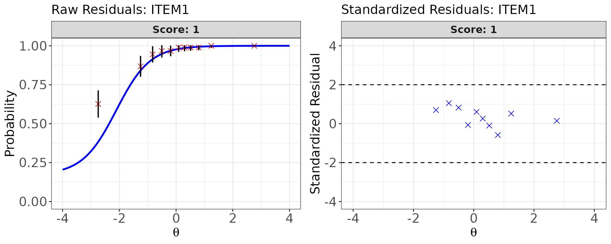
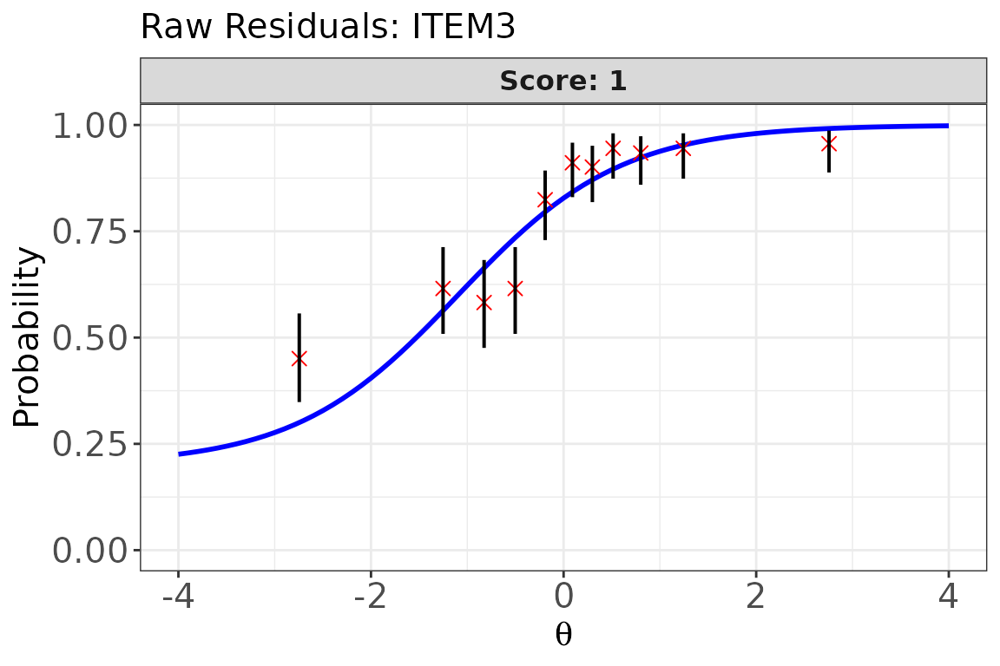
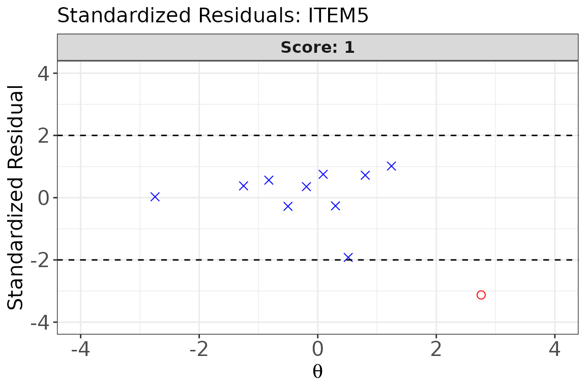
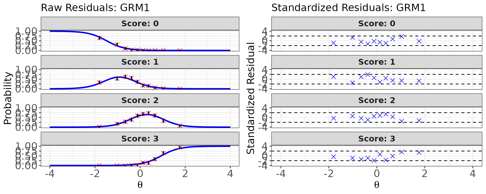

# Model-Data Fit Evaluation

## Overview

After item calibration, it is essential to verify that the chosen IRT
model adequately describes the observed item response data. A misfitting
item can lead to biased ability and item parameter estimates, which in
turn jeopardize the validity of test score interpretations and
downstream applications such as equating and CAT (Ames & Penfield,
2015).

**irtQ** provides two complementary sets of item-level fit tools:

| Function | Statistics | Conditioning variable |
|----|----|----|
| [`irtfit()`](https://hwangQ.github.io/irtQ/reference/irtfit.md) | $`\chi^2`$, $`G^2`$, infit, outfit | Estimated $`\hat{\theta}`$ (ability bins) |
| [`sx2_fit()`](https://hwangQ.github.io/irtQ/reference/sx2_fit.md) | $`S`$-$`X^2`$(Kang & Chen, 2008; Orlando & Thissen, 2000, 2003) | Observed summed score |

Both functions accept either an `est_irt` object (produced by
[`est_irt()`](https://hwangQ.github.io/irtQ/reference/est_irt.md)) or a
plain item metadata data frame as their first argument `x`, and both
support mixed-format tests containing dichotomous and polytomous items.

``` r

library(irtQ)
set.seed(2026)
```

------------------------------------------------------------------------

## Setup: Calibrated Data for All Examples

We define two test forms — a binary-only test and a mixed-format test —
and calibrate each so we have item parameters and ability estimates to
pass to the fit functions throughout this vignette.

### Binary test (20 items, 3PLM)

``` r

# True item parameters
meta_bin <- shape_df(
  par.drm = list(
    a = c(1.0, 1.2, 0.8, 1.4, 0.9, 1.1, 1.3, 0.7, 1.0, 1.2,
          0.9, 1.1, 1.4, 0.85, 1.0, 1.2, 0.8, 1.1, 1.3, 0.9),
    b = c(-2.0, -1.5, -1.0, -0.6, -0.2, 0.0, 0.4, 0.8, 1.1, 1.5,
          -1.3, -0.4,  0.5,  1.0,  1.8, -0.8, 0.2, 0.7, -1.1, 1.3),
    g = rep(0.15, 20)
  ),
  item.id = paste0("ITEM", 1:20),
  cats    = 2,
  model   = "3PLM"
)

# Simulate 1000 examinees from N(0, 1)
theta_bin <- rnorm(1000, mean = 0, sd = 1)
resp_bin  <- simdat(x = meta_bin, theta = theta_bin, D = 1.702)
```

``` r

# Calibrate item parameters
mod_bin <- est_irt(
  data       = resp_bin,
  D          = 1.702,
  model      = "3PLM",
  cats       = 2,
  item.id    = paste0("ITEM", 1:20),
  use.gprior = TRUE,
  gprior     = list(dist = "beta", params = c(4, 16)),
  EmpHist    = FALSE,
  verbose    = FALSE
)
meta_cal_bin <- mod_bin$par.est

# ML ability estimates (required by irtfit())
score_bin <- est_score(
  x      = meta_cal_bin,
  data   = resp_bin,
  D      = 1.702,
  method = "ML",
  range  = c(-5, 5)
)
```

### Mixed-format test (15 items 3PLM + 5 items GRM, 4 categories)

``` r

meta_mix <- shape_df(
  par.drm = list(
    a = c(1.0, 1.2, 0.9, 1.1, 0.8, 1.3, 1.0, 0.9, 1.1, 1.2,
          0.85, 1.1, 1.3, 0.9, 1.0),
    b = c(-1.5, -1.0, -0.5, -0.2, 0.2, 0.5, 0.8, 1.1, 1.4, -1.2,
          -0.4,  0.1,  0.6,  1.0, -0.8),
    g = rep(0.15, 15)
  ),
  par.prm = list(
    a = c(1.5, 1.2, 1.0, 1.3, 0.9),
    d = list(
      c(-1.5, -0.3,  0.9),
      c(-1.2,  0.0,  1.1),
      c(-0.9,  0.4,  1.4),
      c(-1.1, -0.1,  1.0),
      c(-1.3,  0.3,  1.2)
    )
  ),
  item.id = c(paste0("DRM", 1:15), paste0("GRM", 1:5)),
  cats    = c(rep(2, 15), rep(4, 5)),
  model   = c(rep("3PLM", 15), rep("GRM", 5))
)

theta_mix <- rnorm(1000, mean = 0, sd = 1)
resp_mix  <- simdat(x = meta_mix, theta = theta_mix, D = 1.702)
```

``` r

mod_mix <- est_irt(
  data       = resp_mix,
  D          = 1.702,
  model      = c(rep("3PLM", 15), rep("GRM", 5)),
  cats       = c(rep(2, 15), rep(4, 5)),
  item.id    = c(paste0("DRM", 1:15), paste0("GRM", 1:5)),
  use.gprior = TRUE,
  gprior     = list(dist = "beta", params = c(4, 16)),
  EmpHist    = FALSE,
  verbose    = FALSE
)
meta_cal_mix <- mod_mix$par.est

# EAP ability estimates
score_mix <- est_score(
  x          = meta_cal_mix,
  data       = resp_mix,
  D          = 1.702,
  method     = "EAP",
  norm.prior = c(0, 1),
  nquad      = 41
)
```

------------------------------------------------------------------------

## Part 1: Traditional Fit Statistics with `irtfit()`

### How `irtfit()` Works

[`irtfit()`](https://hwangQ.github.io/irtQ/reference/irtfit.md) computes
four classical item-level fit statistics by grouping examinees into
ability bins and comparing the *observed* response frequencies in each
bin with the *expected* frequencies predicted by the calibrated item
response function (IRF).

All statistics are built on the same underlying **individual-level
residual**:

``` math
r_{ni} = x_{ni} - P_{ni}(\hat{\theta})
```

where $`x_{ni}`$ is examinee $`n`$’s scored response to item $`i`$ and
$`P_{ni}(\hat{\theta})`$ is the IRF-predicted probability of that
response at the examinee’s estimated ability (Ames & Penfield, 2015).

The four statistics differ in how they aggregate these residuals:

**$`\chi^2`$ and $`G^2`$ — Group-based statistics**

> **Note.** The formulas below are presented for **dichotomous items**
> (scored 0/1) for clarity. The same group-based framework extends to
> polytomous items by replacing the binary response with
> category-specific observed and expected frequencies, but the
> dichotomous form is the standard reference in the literature (Ames &
> Penfield, 2015).

Examinees are first sorted into $`H`$ ability bins. Within each bin
$`h`$:

``` math
\chi^2 = \sum_{h=1}^{H} \frac{N_h (\bar{x}_h - \bar{P}_h)^2}{\bar{P}_h(1-\bar{P}_h)}, \qquad
G^2 = 2\sum_{h=1}^{H} \left[ r_h \ln\frac{r_h}{N_h \bar{P}_h} + (N_h - r_h)\ln\frac{N_h - r_h}{N_h(1-\bar{P}_h)} \right]
```

where $`N_h`$ is the number of examinees in bin $`h`$, $`r_h`$ is the
observed number of correct responses, $`\bar{x}_h`$ is the observed
proportion correct, and $`\bar{P}_h`$ is the model-predicted expected
proportion correct in that bin.

- $`\chi^2`$ follows Bock (1960) and Yen (1981). Its degrees of freedom
  equal the number of ability bins minus the number of item parameters,
  $`df = H - p`$(Ames & Penfield, 2015).
- $`G^2`$ follows McKinley & Mills (1985). Its degrees of freedom equal
  the number of ability bins, $`df = H`$(Ames & Penfield, 2015).

> **Extension to polytomous items:** For items with $`K`$ response
> categories, the degrees of freedom are extended to account for the
> multiple categories. The $`\chi^2`$ statistic has
> $`df = H \times (K - 1) - p`$, and the $`G^2`$ statistic has
> $`df = H \times (K - 1)`$, where $`H`$ is the final number of ability
> bins after any necessary cell collapsing.

> **Key difference between $`\chi^2`$ and $`G^2`$ df:** For the
> $`\chi^2`$ statistic, the number of estimated item parameters is
> subtracted from the df (e.g., for a 3PLM item with $`H = 11`$ bins,
> $`df = 11 - 3 = 8`$). For $`G^2`$, no such subtraction is made
> ($`df = H = 11`$). This means $`G^2`$ uses more degrees of freedom and
> tends to be more conservative.

**Infit and Outfit — Individual-level statistics**

Both infit and outfit treat *each examinee* as a separate bin (i.e.,
$`H = N`$) (Ames & Penfield, 2015; Wright & Panchapakesan, 1969):

``` math
\text{Outfit} = \frac{1}{N}\sum_{n=1}^{N} \frac{r_{ni}^2}{P_{ni}(1-P_{ni})}, \qquad
\text{Infit} = \frac{\sum_{n=1}^{N} r_{ni}^2}{\sum_{n=1}^{N} P_{ni}(1-P_{ni})}
```

The key difference is *weighting*:

- **Outfit** gives equal weight to each examinee. It is therefore more
  sensitive to unexpected responses at *extreme* ability levels (far
  from item difficulty), where $`P_{ni}(1-P_{ni})`$ is small and a
  single aberrant response inflates the statistic dramatically.
- **Infit** weights each residual by $`P_{ni}(1-P_{ni})`$ — the item
  information at that ability level. This down-weights extreme responses
  and makes infit more sensitive to misfit *near* the item difficulty,
  where most measurement information resides. For this reason, infit is
  generally preferred in practice.

> **Caution for non-Rasch models.** Infit and outfit were developed in
> the Rasch measurement tradition (Wright & Panchapakesan, 1969) and
> their expected distributions under non-Rasch models (2PLM, 3PLM, GRM,
> GPCM) are less well understood. Use them as supplementary diagnostics
> alongside $`\chi^2`$ / $`G^2`$ when fitting these models (Ames &
> Penfield, 2015).

### Ability Grouping: `group.method`, `n.width`, and `loc.theta`

Because $`\chi^2`$ and $`G^2`$ require binning examinees by ability, the
grouping choices materially affect the statistics:

| Argument | Option | Description |
|----|----|----|
| `group.method` | `"equal.width"` | Bins span equal-length *intervals* on the $`\theta`$ scale. Easier to interpret geometrically; used by Yen (1981). |
| `group.method` | `"equal.freq"` | Each bin contains approximately the same *number of examinees* (quantile-based). Preferred when the ability distribution is skewed. |
| `n.width` | integer | Number of bins $`H`$. Yen (1981) used $`H = 10`$; Bock (1960) allowed flexibility. Fewer bins = more examinees per bin but coarser resolution. |
| `loc.theta` | `"average"` | The within-bin *mean* $`\hat{\theta}`$ is used to compute expected probabilities $`\bar{P}_h`$. |
| `loc.theta` | `"middle"` | The *midpoint* of the bin’s $`\theta`$ interval is used. |

**Practical guidelines for bin specification:**

- Bins should be **wide enough** to contain sufficient examinees for
  stable expected frequencies (avoid sparse cells), yet **narrow
  enough** that within-bin ability is approximately homogeneous
  (Hambleton et al., 1991).
- After binning, cells with very small expected frequencies are
  automatically collapsed by
  [`irtfit()`](https://hwangQ.github.io/irtQ/reference/irtfit.md) before
  computing $`\chi^2`$ and $`G^2`$.
- `range.score` trims extreme ability estimates before grouping;
  examinees outside the range are excluded from the fit analysis.

### Key `irtfit()` Arguments

| Argument | Description |
|----|----|
| `x` | Item metadata data frame, or an `est_irt` / `est_item` object |
| `score` | Numeric vector of examinee ability estimates $`\hat{\theta}`$ |
| `data` | Response matrix (examinees × items) |
| `D` | Scaling constant — must match the value used in calibration |
| `group.method` | `"equal.width"` (default) or `"equal.freq"` |
| `n.width` | Number of ability bins (default `10`) |
| `loc.theta` | `"average"` (default) or `"middle"` |
| `range.score` | `c(lower, upper)` for trimming extreme $`\hat{\theta}`$ values. Default is `NULL`, which automatically uses the minimum and maximum of the observed `score` vector. |
| `alpha` | Significance level for flagging items (default `0.05`) |
| `overSR` | Standardized-residual threshold for flagging individual bins (default `2`) |

### Return value of `irtfit()`

[`irtfit()`](https://hwangQ.github.io/irtQ/reference/irtfit.md) returns
an object of class `irtfit` with the following components:

| Component | Description |
|----|----|
| `fit_stat` | Data frame with $`\chi^2`$, $`G^2`$, infit, outfit statistics and flags for all items |
| `contingency.fitstat` | Collapsed contingency tables used for $`\chi^2`$ and $`G^2`$ computation (one per item) |
| `contingency.plot` | Uncollapsed contingency tables used for residual plots |
| `individual.info` | Individual residuals and variances used for infit/outfit |
| `item_df` | Copy of the item metadata provided in `x` |

The `fit_stat` columns include (one row per item, plus an `id` column):

- `X2` / `df.X2` / `crit.val.X2` / `p.X2`: $`\chi^2`$ statistic, degrees
  of freedom, critical value, and p-value
- `G2` / `df.G2` / `crit.val.G2` / `p.G2`: $`G^2`$ statistic, degrees of
  freedom, critical value, and p-value
- `outfit` / `infit`: mean-square outfit and infit statistics
- `N`: number of examinees used (after `range.score` trimming)
- `overSR.prop`: proportion of ability bins (prior to cell collapsing)
  whose standardized residuals exceed `overSR`

------------------------------------------------------------------------

### Example 1: Binary test — equal-frequency bins

``` r

fit_bin1 <- irtfit(
  x            = meta_cal_bin,
  score        = score_bin$est.theta,
  data         = resp_bin,
  D            = 1.702,
  group.method = "equal.freq",   # ~equal number of examinees per bin
  n.width      = 11,             # 11 bins → df = 11 - 3 = 8 for 3PLM (χ²)
  loc.theta    = "middle",       # bin midpoint as representative θ
  range.score  = c(-4, 4),       # trim extreme ML estimates
  alpha        = 0.05,
  overSR       = 2
)

# Summary of fit statistics for all items
fit_bin1$fit_stat
#>        id     X2     G2 df.X2 df.G2 crit.val.X2 crit.val.G2  p.X2  p.G2 outfit
#> 1   ITEM1 25.479 24.993     5     8       11.07       15.51 0.000 0.002  0.746
#> 2   ITEM2 16.091 18.334     5     8       11.07       15.51 0.007 0.019  0.516
#> 3   ITEM3 30.170 29.339     7    10       14.07       18.31 0.000 0.001  1.057
#> 4   ITEM4  4.889  5.528     7    10       14.07       18.31 0.673 0.853  0.796
#> 5   ITEM5 16.301 12.244     8    11       15.51       19.68 0.038 0.346  0.971
#> 6   ITEM6 13.662 13.907     7    10       14.07       18.31 0.058 0.177  0.958
#> 7   ITEM7 11.865 12.294     7    10       14.07       18.31 0.105 0.266  0.896
#> 8   ITEM8 27.282 21.806     8    11       15.51       19.68 0.001 0.026  0.991
#> 9   ITEM9 32.635 26.585     8    11       15.51       19.68 0.000 0.005  0.979
#> 10 ITEM10 15.871 17.167     7    10       14.07       18.31 0.026 0.071  0.910
#> 11 ITEM11  8.912  8.603     7    10       14.07       18.31 0.259 0.570  0.829
#> 12 ITEM12 12.889 13.262     7    10       14.07       18.31 0.075 0.209  0.929
#> 13 ITEM13  7.895  8.218     7    10       14.07       18.31 0.342 0.608  0.867
#> 14 ITEM14 24.818 19.197     8    11       15.51       19.68 0.002 0.058  0.966
#> 15 ITEM15 59.262 44.537     8    11       15.51       19.68 0.000 0.000  0.961
#> 16 ITEM16  7.252  7.766     6     9       12.59       16.92 0.298 0.558  0.844
#> 17 ITEM17 15.654 12.845     8    11       15.51       19.68 0.048 0.304  0.986
#> 18 ITEM18 22.759 17.935     8    11       15.51       19.68 0.004 0.083  0.962
#> 19 ITEM19 10.314 10.664     6     9       12.59       16.92 0.112 0.299  0.899
#> 20 ITEM20 35.592 31.090     8    11       15.51       19.68 0.000 0.001  0.968
#>    infit    N overSR.prop
#> 1  0.780 1000       0.091
#> 2  0.872 1000       0.091
#> 3  0.989 1000       0.273
#> 4  0.925 1000       0.000
#> 5  0.988 1000       0.091
#> 6  0.968 1000       0.091
#> 7  0.939 1000       0.273
#> 8  0.992 1000       0.091
#> 9  0.982 1000       0.182
#> 10 0.941 1000       0.273
#> 11 0.966 1000       0.091
#> 12 0.969 1000       0.000
#> 13 0.924 1000       0.182
#> 14 0.981 1000       0.091
#> 15 0.971 1000       0.182
#> 16 0.903 1000       0.000
#> 17 0.991 1000       0.091
#> 18 0.976 1000       0.091
#> 19 0.915 1000       0.182
#> 20 0.973 1000       0.273
```

### Example 2: Binary test — equal-width bins

``` r

fit_bin2 <- irtfit(
  x            = meta_cal_bin,
  score        = score_bin$est.theta,
  data         = resp_bin,
  D            = 1.702,
  group.method = "equal.width",  # equal-width θ intervals (Yen, 1981 approach)
  n.width      = 10,
  loc.theta    = "average",      # within-bin mean θ
  range.score  = c(-4, 4),
  alpha        = 0.05,
  overSR       = 2
)

fit_bin2$fit_stat
#>        id     X2     G2 df.X2 df.G2 crit.val.X2 crit.val.G2  p.X2  p.G2 outfit
#> 1   ITEM1 10.267 13.945     3     6        7.81       12.59 0.016 0.030  0.746
#> 2   ITEM2 10.092 10.076     3     6        7.81       12.59 0.018 0.121  0.516
#> 3   ITEM3 22.693 21.331     5     8       11.07       15.51 0.000 0.006  1.057
#> 4   ITEM4  3.604  3.841     4     7        9.49       14.07 0.462 0.798  0.796
#> 5   ITEM5  5.367  5.610     5     8       11.07       15.51 0.373 0.691  0.971
#> 6   ITEM6  3.403  4.518     5     8       11.07       15.51 0.638 0.808  0.958
#> 7   ITEM7  8.268  7.418     5     8       11.07       15.51 0.142 0.492  0.896
#> 8   ITEM8  6.102  5.702     5     8       11.07       15.51 0.296 0.681  0.991
#> 9   ITEM9  5.181  4.852     5     8       11.07       15.51 0.394 0.773  0.979
#> 10 ITEM10 12.492 11.813     5     8       11.07       15.51 0.029 0.160  0.910
#> 11 ITEM11  2.633  2.459     4     7        9.49       14.07 0.621 0.930  0.829
#> 12 ITEM12  4.645  4.757     4     7        9.49       14.07 0.326 0.690  0.929
#> 13 ITEM13 10.566 10.841     5     8       11.07       15.51 0.061 0.211  0.867
#> 14 ITEM14  3.842  3.842     5     8       11.07       15.51 0.572 0.871  0.966
#> 15 ITEM15  2.971  4.275     5     8       11.07       15.51 0.705 0.832  0.961
#> 16 ITEM16  4.247  4.429     4     7        9.49       14.07 0.374 0.729  0.844
#> 17 ITEM17  4.462  4.443     5     8       11.07       15.51 0.485 0.815  0.986
#> 18 ITEM18  4.976  6.277     5     8       11.07       15.51 0.419 0.616  0.962
#> 19 ITEM19  4.384  4.183     4     7        9.49       14.07 0.356 0.758  0.899
#> 20 ITEM20  9.089  9.029     5     8       11.07       15.51 0.106 0.340  0.968
#>    infit    N overSR.prop
#> 1  0.780 1000         0.2
#> 2  0.872 1000         0.1
#> 3  0.989 1000         0.3
#> 4  0.925 1000         0.0
#> 5  0.988 1000         0.0
#> 6  0.968 1000         0.0
#> 7  0.939 1000         0.1
#> 8  0.992 1000         0.0
#> 9  0.982 1000         0.0
#> 10 0.941 1000         0.1
#> 11 0.966 1000         0.0
#> 12 0.969 1000         0.0
#> 13 0.924 1000         0.0
#> 14 0.981 1000         0.0
#> 15 0.971 1000         0.0
#> 16 0.903 1000         0.0
#> 17 0.991 1000         0.0
#> 18 0.976 1000         0.0
#> 19 0.915 1000         0.0
#> 20 0.973 1000         0.0
```

### Example 3: Inspect the contingency table for one item

The collapsed contingency table for a single item shows, for each
ability bin: the bin size (`total`), observed and expected frequencies
per response category (`obs.freq.*`, `exp.freq.*`), observed and
expected proportions (`obs.prop.*`, `exp.prop.*`), and the raw residual
(`raw.rsd.*` = observed proportion minus expected proportion). Note that
this table contains **raw residuals**, not standardized residuals, and
does not include a per-bin flag column. This is the table used to
compute $`\chi^2`$ and $`G^2`$ after collapsing bins with sparse
expected frequencies.

``` r

# Collapsed contingency table used for χ² and G² of Item 1
fit_bin1$contingency.fitstat[[1]]
#>   total obs.freq.0 obs.freq.1 exp.freq.0 exp.freq.1  obs.prop.0 obs.prop.1
#> 1    91         34         57  56.111045   34.88896 0.373626374  0.6263736
#> 2    91         12         79  14.437195   76.56281 0.131868132  0.8681319
#> 3    91          5         86   7.819649   83.18035 0.054945055  0.9450549
#> 4    91          3         88   4.751467   86.24853 0.032967033  0.9670330
#> 5    91          3         88   2.890269   88.10973 0.032967033  0.9670330
#> 6    90          1         89   1.802743   88.19726 0.011111111  0.9888889
#> 7    91          1         90   1.296210   89.70379 0.010989011  0.9890110
#> 8   364          2        362   1.760155  362.23985 0.005494505  0.9945055
#>   exp.prob.0 exp.prob.1     raw.rsd.0     raw.rsd.1
#> 1 0.61660489  0.3833951 -0.2429785120  0.2429785120
#> 2 0.15865049  0.8413495 -0.0267823573  0.0267823573
#> 3 0.08593021  0.9140698 -0.0309851511  0.0309851511
#> 4 0.05221392  0.9477861 -0.0192468848  0.0192468848
#> 5 0.03176120  0.9682388  0.0012058318 -0.0012058318
#> 6 0.02003048  0.9799695 -0.0089193721  0.0089193721
#> 7 0.01424406  0.9857559 -0.0032550510  0.0032550510
#> 8 0.00483559  0.9951644  0.0006589152 -0.0006589152
```

------------------------------------------------------------------------

## Part 2: Residual Diagnostic Plots with `plot.irtfit()`

[`plot()`](https://rdrr.io/r/graphics/plot.default.html) called on an
`irtfit` object produces residual-based graphical diagnostics for one
item at a time. Two complementary displays are available:

- **`type = "icc"`**: Observed proportion correct (with confidence
  interval) per ability bin overlaid on the model-predicted ICC.
  Vertical distances are the raw residuals; systematic patterns (e.g.,
  consistent over- or under-prediction across all bins) suggest model
  misfit.
- **`type = "sr"`**: Standardized residuals plotted against
  $`\hat{\theta}`$. Reference lines at $`\pm`$`overSR` mark the flagging
  threshold. Points outside these lines identify ability bins where the
  model fits poorly.
- **`type = "both"`**: Side-by-side display of both views.

These plots use the *uncollapsed* contingency tables stored in
`fit$contingency.plot`, so every original bin is visible even if
adjacent cells were merged during the statistical computation.

``` r

# Side-by-side: ICC overlay (raw residuals) + standardized residual plot
plot(
  x          = fit_bin1,
  item.loc   = 1,          # item index (row number in the metadata)
  type       = "both",
  ci.method  = "wald",     # confidence interval method for proportion-correct CI
  show.table = FALSE
)
```



``` r

# ICC overlay for Item 3 — Wilson score CI (recommended for proportions)
plot(
  x          = fit_bin1,
  item.loc   = 3,
  type       = "icc",
  ci.method  = "wilson",
  show.table = FALSE
)
```



``` r

# Standardized residual plot for Item 5
plot(
  x          = fit_bin1,
  item.loc   = 5,
  type       = "sr",
  show.table = FALSE
)
```



**Confidence interval methods** for the `ci.method` argument:

| Method | Description |
|----|----|
| `"wald"` | Normal-approximation (Wald) interval — simplest but can be unreliable for small $`N_h`$ |
| `"cp"` | Clopper–Pearson exact interval — conservative but exact |
| `"wilson"` | Wilson score interval — good coverage even for small $`N_h`$ |
| `"wilson.cr"` | Wilson interval with continuity correction |

------------------------------------------------------------------------

## Part 3: Traditional Fit for Mixed-Format Tests

[`irtfit()`](https://hwangQ.github.io/irtQ/reference/irtfit.md) handles
mixed-format tests transparently. Simply provide the mixed-format item
metadata and the ability estimates; the function computes the
appropriate statistics for each item according to its model type.

``` r

fit_mix <- irtfit(
  x            = meta_cal_mix,
  score        = score_mix$est.theta,
  data         = resp_mix,
  D            = 1.702,
  group.method = "equal.freq",
  n.width      = 10,
  loc.theta    = "middle",
  range.score  = c(-4, 4),
  alpha        = 0.05,
  overSR       = 2
)

fit_mix$fit_stat
#>       id     X2     G2 df.X2 df.G2 crit.val.X2 crit.val.G2  p.X2  p.G2 outfit
#> 1   DRM1  4.970  7.557     6     9       12.59       16.92 0.548 0.579  0.728
#> 2   DRM2  3.205  3.458     6     9       12.59       16.92 0.783 0.943  0.854
#> 3   DRM3  5.626  5.991     7    10       14.07       18.31 0.584 0.816  0.874
#> 4   DRM4  8.235  8.466     7    10       14.07       18.31 0.312 0.583  0.908
#> 5   DRM5  3.383  3.474     7    10       14.07       18.31 0.847 0.968  0.926
#> 6   DRM6  3.740  3.958     7    10       14.07       18.31 0.809 0.949  0.943
#> 7   DRM7  5.604  5.781     7    10       14.07       18.31 0.587 0.833  0.933
#> 8   DRM8  3.987  4.037     7    10       14.07       18.31 0.781 0.946  0.965
#> 9   DRM9 14.706 15.245     7    10       14.07       18.31 0.040 0.123  0.968
#> 10 DRM10  4.789  7.690     5     8       11.07       15.51 0.442 0.464  0.597
#> 11 DRM11  9.057  9.540     7    10       14.07       18.31 0.249 0.482  0.905
#> 12 DRM12  3.511  3.833     7    10       14.07       18.31 0.834 0.955  0.893
#> 13 DRM13  8.092  9.090     7    10       14.07       18.31 0.325 0.524  0.898
#> 14 DRM14  4.999  4.989     7    10       14.07       18.31 0.660 0.892  0.953
#> 15 DRM15  5.434  5.674     6     9       12.59       16.92 0.489 0.772  0.847
#> 16  GRM1 14.109 18.897    11    15       19.68       25.00 0.227 0.218  0.821
#> 17  GRM2 21.338 27.507    20    24       31.41       36.42 0.377 0.281  0.831
#> 18  GRM3 14.916 15.939    20    24       31.41       36.42 0.781 0.890  0.898
#> 19  GRM4 21.331 25.015    20    24       31.41       36.42 0.378 0.405  0.839
#> 20  GRM5 22.139 24.305    26    30       38.89       43.77 0.681 0.758  0.933
#>    infit    N overSR.prop
#> 1  0.971 1000       0.000
#> 2  0.934 1000       0.000
#> 3  0.960 1000       0.000
#> 4  0.942 1000       0.000
#> 5  0.962 1000       0.000
#> 6  0.949 1000       0.000
#> 7  0.959 1000       0.000
#> 8  0.973 1000       0.000
#> 9  0.973 1000       0.100
#> 10 0.937 1000       0.000
#> 11 0.959 1000       0.000
#> 12 0.950 1000       0.000
#> 13 0.943 1000       0.000
#> 14 0.969 1000       0.000
#> 15 0.933 1000       0.000
#> 16 0.853 1000       0.000
#> 17 0.876 1000       0.025
#> 18 0.920 1000       0.025
#> 19 0.869 1000       0.125
#> 20 0.942 1000       0.000
```

``` r

# Residual diagnostics for a GRM item (item 16 in the mixed form)
# For polytomous items, the ICC overlay shows the observed and expected
# *category* proportions rather than a single proportion-correct curve.
plot(
  x          = fit_mix,
  item.loc   = 16,
  type       = "both",
  ci.method  = "wald",
  show.table = FALSE
)
```



------------------------------------------------------------------------

## Part 4: $`S`$-$`X^2`$ Statistic with `sx2_fit()`

### How `sx2_fit()` Works

The $`S`$-$`X^2`$ statistic was proposed by Orlando & Thissen (2000) to
address two known weaknesses of the $`\chi^2`$ and $`G^2`$ statistics:
(1) the unclear distributional properties of statistics that condition
on model-dependent $`\hat{\theta}`$ values, and (2) the
sample-dependence introduced by arbitrary quantile-based bin boundaries.

Instead of conditioning on $`\hat{\theta}`$, $`S`$-$`X^2`$ conditions on
the **observed summed score** $`X_s = \sum_{i} u_i`$. Within each
summed-score group $`s`$, the expected proportion of correct responses
$`\hat{P}(X_i = 1 \mid X_s = s)`$ is computed using the **Lord–Wingersky
recursive algorithm** (Lord & Wingersky, 1984), which integrates the IRF
over the latent ability distribution without requiring individual
$`\hat{\theta}`$ estimates.

> **Note.** The formula below is presented for **dichotomous items**
> (scored 0/1). Kang & Chen (2008) extended $`S`$-$`X^2`$ to polytomous
> items; see the **Extension to polytomous items** paragraph below.

``` math
S\text{-}X^2 = \sum_{s} \frac{N_s \left(\bar{x}_s - \hat{P}_s\right)^2}{\hat{P}_s(1-\hat{P}_s)}
```

where $`N_s`$ is the number of examinees with summed score $`s`$,
$`\bar{x}_s`$ is the observed proportion correct on item $`i`$ among
those examinees, and $`\hat{P}_s`$ is the model-based expected
proportion.

Degrees of freedom equal the number of feasible summed-score values
(excluding 0 and the maximum, where responses to the item are
deterministic) minus the number of estimated item parameters:
$`df = (I - 1) - p`$(Ames & Penfield, 2015).

**Extension to polytomous items.** Kang & Chen (2008) generalized
$`S`$-$`X^2`$ to polytomous IRT models (GRM, GPCM). The generalization
uses the same summed-score conditioning logic but compares observed and
expected *category* frequencies rather than proportion-correct values.

**Cell collapsing strategy.** When expected cell frequencies are very
small, the $`\chi^2`$ approximation deteriorates. To address this:

- For *dichotomous* items: adjacent summed-score groups are merged until
  each expected cell frequency $`\geq`$`min.collapse` (Orlando &
  Thissen, 2000).
- For *polytomous* items: adjacent response *categories within* each
  summed-score group are merged instead, to avoid excessive score-group
  loss (Kang & Chen, 2008).

### Key `sx2_fit()` Arguments

| Argument | Description |
|----|----|
| `x` | Item metadata data frame, or an `est_irt` / `est_item` object |
| `data` | Response matrix (examinees × items). Missing values are replaced with 0 (incorrect). |
| `D` | Scaling constant — must match calibration |
| `alpha` | Significance level for flagging items (default `0.05`) |
| `min.collapse` | Minimum expected frequency per cell before collapsing (default `1`) |
| `norm.prior` | `c(mean, sd)` of the normal prior used in the Lord–Wingersky integration (default `c(0, 1)`) |
| `nquad` | Number of Gaussian quadrature points for integration (default `30`) |
| `pcm.loc` | Integer vector of item indices fitted as PCM (discrimination fixed to 1); default `NULL` |

### Return value of `sx2_fit()`

[`sx2_fit()`](https://hwangQ.github.io/irtQ/reference/sx2_fit.md)
returns a list with the following components:

| Component | Description |
|----|----|
| `fit_stat` | Data frame with columns `id`, `chisq` ($`S`$-$`X^2`$ statistic), `df`, `crit.val` (critical value at the specified `alpha`), and `p` (p-value) — one row per item |
| `item_df` | Copy of the item metadata provided in `x` |
| `exp_freq` | List of collapsed expected frequency tables (one per item) |
| `obs_freq` | List of collapsed observed frequency tables |
| `exp_prob` | List of collapsed expected probability tables |
| `obs_prop` | List of collapsed observed proportion tables |

------------------------------------------------------------------------

### Example 1: Binary test

``` r

fit_sx2_bin <- sx2_fit(
  x     = meta_cal_bin,
  data  = resp_bin,
  D     = 1.702,
  alpha = 0.05
)

# Fit statistics for all items
fit_sx2_bin$fit_stat
#>        id  chisq df crit.val     p
#> 1   ITEM1  7.529 10   18.307 0.675
#> 2   ITEM2  9.518  9   16.919 0.391
#> 3   ITEM3 22.945 13   22.362 0.042
#> 4   ITEM4 16.862 11   19.675 0.112
#> 5   ITEM5 16.373 13   22.362 0.230
#> 6   ITEM6 15.613 13   22.362 0.271
#> 7   ITEM7 16.494 13   22.362 0.223
#> 8   ITEM8  9.186 14   23.685 0.819
#> 9   ITEM9 21.144 14   23.685 0.098
#> 10 ITEM10 13.715 14   23.685 0.471
#> 11 ITEM11 12.367 11   19.675 0.337
#> 12 ITEM12  8.828 13   22.362 0.786
#> 13 ITEM13  7.155 13   22.362 0.894
#> 14 ITEM14 21.765 14   23.685 0.084
#> 15 ITEM15 19.839 14   23.685 0.135
#> 16 ITEM16 21.966 11   19.675 0.025
#> 17 ITEM17 17.892 14   23.685 0.212
#> 18 ITEM18 10.636 14   23.685 0.714
#> 19 ITEM19  6.603 10   18.307 0.762
#> 20 ITEM20  9.000 14   23.685 0.831
```

``` r

# Inspect collapsed observed vs. expected frequency table for Item 1
# Rows = summed-score bins; columns = item score categories (0 / 1)
cat("--- Expected frequencies (Item 1) ---\n")
#> --- Expected frequencies (Item 1) ---
fit_sx2_bin$exp_freq[[1]]
#>            score.0    score.1
#> score.1   3.039034   1.960966
#> score.3   5.482412   6.517588
#> score.4   9.701771  19.298229
#> score.5   8.122505  25.877495
#> score.6  10.867614  54.132386
#> score.7   5.891911  45.108089
#> score.8   4.917039  57.082961
#> score.9   4.237142  73.762858
#> score.10  2.454973  63.545027
#> score.11  1.983988  76.016012
#> score.12  1.787165 101.212835
#> score.13  1.096256  91.903744
#> score.19  1.286588 311.713412

cat("--- Observed frequencies (Item 1) ---\n")
#> --- Observed frequencies (Item 1) ---
fit_sx2_bin$obs_freq[[1]]
#>          score.0 score.1
#> score.1        2       3
#> score.3        7       5
#> score.4        7      22
#> score.5       11      23
#> score.6       10      55
#> score.7        7      44
#> score.8        2      60
#> score.9        5      73
#> score.10       3      63
#> score.11       2      76
#> score.12       3     100
#> score.13       1      92
#> score.19       1     312
```

### Example 2: Mixed-format test

For polytomous items, the Kang–Chen (2008) extension is applied
automatically when GRM or GPCM items are detected.

``` r

fit_sx2_mix <- sx2_fit(
  x     = meta_cal_mix,
  data  = resp_mix,
  D     = 1.702,
  alpha = 0.05
)

fit_sx2_mix$fit_stat
#>       id  chisq df crit.val     p
#> 1   DRM1  9.197 18   28.869 0.955
#> 2   DRM2 20.508 19   30.144 0.365
#> 3   DRM3 20.930 23   35.172 0.585
#> 4   DRM4 16.367 23   35.172 0.839
#> 5   DRM5 16.232 24   36.415 0.880
#> 6   DRM6 19.903 24   36.415 0.702
#> 7   DRM7 19.275 23   35.172 0.685
#> 8   DRM8 18.364 25   37.652 0.827
#> 9   DRM9 24.834 25   37.652 0.472
#> 10 DRM10 15.113 16   26.296 0.516
#> 11 DRM11 35.358 23   35.172 0.048
#> 12 DRM12 16.085 24   36.415 0.885
#> 13 DRM13 15.626 24   36.415 0.901
#> 14 DRM14 20.960 25   37.652 0.695
#> 15 DRM15 25.410 21   32.671 0.230
#> 16  GRM1 40.210 44   60.481 0.635
#> 17  GRM2 43.103 52   69.832 0.805
#> 18  GRM3 39.143 53   70.993 0.922
#> 19  GRM4 55.282 51   68.669 0.316
#> 20  GRM5 57.007 56   74.468 0.437
```

``` r

# Inspect observed proportions for GRM item 16 (polytomous)
# Rows = summed-score groups; columns = response categories (0, 1, 2, 3)
cat("--- Observed proportions for GRM item 1 (item 16) ---\n")
#> --- Observed proportions for GRM item 1 (item 16) ---
fit_sx2_mix$obs_prop[[16]]
#>          score.0   score.1    score.2    score.3
#>  [1,] 0.85185185 0.1481481         NA         NA
#>  [2,] 0.73684211 0.2631579         NA         NA
#>  [3,] 0.47619048 0.5238095         NA         NA
#>  [4,] 0.30769231 0.5641026 0.12820513         NA
#>  [5,] 0.38461538 0.5384615 0.07692308         NA
#>  [6,] 0.37931034 0.4482759 0.17241379         NA
#>  [7,] 0.33333333 0.4444444 0.22222222         NA
#>  [8,] 0.13888889 0.5277778 0.33333333         NA
#>  [9,] 0.07843137 0.7254902 0.19607843         NA
#> [10,] 0.09259259 0.4814815 0.42592593 0.00000000
#> [11,] 0.03030303 0.5757576 0.39393939         NA
#> [12,] 0.02173913 0.4565217 0.50000000 0.02173913
#> [13,] 0.05263158 0.4210526 0.47368421 0.05263158
#> [14,] 0.01851852 0.3148148 0.59259259 0.07407407
#> [15,] 0.22727273 0.6818182 0.09090909         NA
#> [16,] 0.15686275 0.7254902 0.11764706         NA
#> [17,] 0.20000000 0.6200000 0.18000000         NA
#> [18,] 0.16981132 0.6415094 0.18867925         NA
#> [19,] 0.15000000 0.5000000 0.35000000         NA
#> [20,] 0.07142857 0.6190476 0.30952381         NA
#> [21,] 0.02631579 0.6315789 0.34210526         NA
#> [22,] 0.00000000 0.3589744 0.64102564         NA
#> [23,] 0.28125000 0.7187500         NA         NA
#> [24,] 0.23333333 0.7666667         NA         NA
#> [25,] 0.08955224 0.9104478         NA         NA
```

------------------------------------------------------------------------

## Interpretation Guide

### $`\chi^2`$ and $`G^2`$

- Under correct model specification, these statistics follow an
  *approximate* $`\chi^2`$ distribution; items with `p.X2 < alpha` or
  `p.G2 < alpha` are flagged for misfit.
- $`\chi^2`$ has df = $`H - p`$ (number of bins minus number of item
  parameters); $`G^2`$ has df = $`H`$.
- **Sample-size sensitivity**: with large samples, even trivial
  deviations from the model produce significant $`p`$-values. With small
  samples, power is low. Interpret p-values alongside the `overSR.prop`
  column (proportion of bins with large standardized residuals) and the
  residual plots.
- **Practical guideline**: use `overSR.prop` as a supplementary
  indicator. An item with a marginally significant p-value but low
  `overSR.prop` may not warrant deletion; an item with high
  `overSR.prop` concentrated at a specific ability range signals a
  meaningful pattern worth investigating.

### Infit and Outfit

- Both statistics have an expected value of **1.0** under correct model
  specification; the interpretation is “mean squared residual relative
  to expectation.”
- Common decision rules (Ames & Penfield, 2015):
  - Values **\> 1.5** (sometimes \> 2.0): unacceptable *overfit* — the
    item is less predictable than the model expects (noise, guessing
    inconsistency).
  - Values **\< 0.5**: *underfit* — the item is more predictable than
    the model expects (overly narrow ICC, item dependency).
- **Infit vs. Outfit**: prefer infit for detecting misfit near the
  item’s difficulty; outfit is more sensitive to extreme-ability
  aberrant responses (e.g., very able examinees missing an easy item due
  to carelessness).
- **Non-Rasch caution**: with 2PLM, 3PLM, GRM, or GPCM items, the
  expected value and distribution of infit/outfit deviate from 1.0 more
  than for Rasch items. Treat these statistics as supplementary rather
  than primary evidence of fit for non-Rasch models.

### $`S`$-$`X^2`$

- An item with `p < alpha` is flagged for misfit (`p` is the column name
  in `fit_stat`).
- $`S`$-$`X^2`$ is generally more robust than $`\chi^2`$ and $`G^2`$ for
  detecting misfit because it avoids the noise introduced by
  model-dependent $`\hat{\theta}`$ estimates and uses more stable
  summed-score conditioning (Orlando & Thissen, 2000).
- For very long tests (large $`I`$), the number of summed-score groups
  grows and expected frequencies per group can become small; check the
  collapsed frequency tables (`exp_freq`) to confirm adequate cell
  sizes.

------------------------------------------------------------------------

## References

Ames, A. J., & Penfield, R. D. (2015). An NCME instructional module on
item-fit statistics for item response theory models. *Educational
Measurement: Issues and Practice*, *34*(3), 37–48.
<https://doi.org/10.1111/emip.12067>

Bock, R. D. (1960). *Methods and applications of optimal scaling* (No.
25). L.L. Thurstone Psychometric Laboratory, University of North
Carolina.

Hambleton, R. K., Swaminathan, H., & Rogers, H. J. (1991). *Fundamentals
of item response theory*. Sage.

Kang, T., & Chen, T. T. (2008). Performance of the generalized S-X2 item
fit index for polytomous IRT models. *Journal of Educational
Measurement*, *45*(4), 391–406.
<https://doi.org/10.1111/j.1745-3984.2008.00071.x>

Lord, F. M., & Wingersky, M. S. (1984). Comparison of IRT true-score and
equipercentile observed-score equatings. *Applied Psychological
Measurement*, *8*(4), 453–461.
<https://doi.org/10.1177/014662168400800409>

McKinley, R. L., & Mills, C. N. (1985). A comparison of several
goodness-of-fit statistics. *Applied Psychological Measurement*, *9*(1),
49–57. <https://doi.org/10.1177/014662168500900105>

Orlando, M., & Thissen, D. (2000). Likelihood-based item-fit indices for
dichotomous item response theory models. *Applied Psychological
Measurement*, *24*(1), 50–64.
<https://doi.org/10.1177/01466216000241003>

Orlando, M., & Thissen, D. (2003). Further investigation of the
performance of S-X2: An item fit index for use with dichotomous item
response theory models. *Applied Psychological Measurement*, *27*(4),
289–298. <https://doi.org/10.1177/0146621603027004004>

Wright, B. D., & Panchapakesan, N. (1969). A procedure for sample-free
item analysis. *Educational and Psychological Measurement*, *29*(1),
23–48. <https://doi.org/10.1177/001316446902900102>

Yen, W. M. (1981). Using simulation results to choose a latent trait
model. *Applied Psychological Measurement*, *5*(2), 245–262.
<https://doi.org/10.1177/014662168100500212>
