# Utility Functions

## Overview

Beyond the main analysis pipeline, **irtQ** includes a set of utility
functions for simulating item response data, computing information and
characteristic functions, supporting numerical integration over the
ability scale, and computing asymptotic standard errors of item
parameter estimates.

| Function | Purpose |
|----|----|
| [`simdat()`](https://hwangQ.github.io/irtQ/reference/simdat.md) | Simulate IRT item response data |
| [`drm()`](https://hwangQ.github.io/irtQ/reference/drm.md) | Compute correct-response probabilities for dichotomous items (1PLM / 2PLM / 3PLM) |
| [`prm()`](https://hwangQ.github.io/irtQ/reference/prm.md) | Compute category response probabilities for polytomous items (GRM / GPCM) |
| [`info()`](https://hwangQ.github.io/irtQ/reference/info.md) | Item and test information functions (IIF / TIF) |
| [`traceline()`](https://hwangQ.github.io/irtQ/reference/traceline.md) | Item and test characteristic curves (ICC / TCC) |
| [`lwrc()`](https://hwangQ.github.io/irtQ/reference/lwrc.md) | Lord–Wingersky recursion: conditional summed-score distributions |
| [`gen.weight()`](https://hwangQ.github.io/irtQ/reference/gen.weight.md) | Generate quadrature nodes and weights from a distribution |
| [`covirt()`](https://hwangQ.github.io/irtQ/reference/covirt.md) | Analytical asymptotic variance-covariance matrices of item parameter estimates |

``` r

library(irtQ)
set.seed(2026)
```

Throughout this vignette we reuse two item metadata objects defined
below.

``` r

# 15-item binary test (3PLM)
meta_bin <- shape_df(
  par.drm = list(
    a = c(1.0, 1.2, 0.8, 1.4, 0.9, 1.1, 1.3, 0.7, 1.0, 1.2,
          0.9, 1.1, 1.4, 0.85, 1.0),
    b = c(-2.0, -1.5, -1.0, -0.5, -0.1, 0.2, 0.6, 0.9, 1.2, 1.6,
          -0.8, -0.3,  0.5,  1.0, 1.8),
    g = rep(0.15, 15)
  ),
  item.id = paste0("I", 1:15),
  cats    = 2,
  model   = "3PLM"
)

# Mixed-format test: 5 dichotomous (3PLM) + 3 polytomous (GRM, 4 categories)
meta_mix <- shape_df(
  par.drm = list(
    a = c(1.0, 1.2, 0.9, 1.1, 0.8),
    b = c(-1.0, -0.3, 0.3, 0.8, 1.4),
    g = rep(0.15, 5)
  ),
  par.prm = list(
    a = c(1.5, 1.2, 1.0),
    d = list(
      c(-1.5, -0.2, 1.0),
      c(-1.2,  0.1, 1.3),
      c(-0.9,  0.4, 1.6)
    )
  ),
  item.id = c(paste0("DRM", 1:5), paste0("GRM", 1:3)),
  cats    = c(rep(2, 5), rep(4, 3)),
  model   = c(rep("3PLM", 5), rep("GRM", 3))
)

# Common theta grid used by info(), traceline(), and lwrc()
theta_grid <- seq(-4, 4, by = 0.1)
```

------------------------------------------------------------------------

## `simdat()` — Simulate Item Response Data

[`simdat()`](https://hwangQ.github.io/irtQ/reference/simdat.md)
generates item response matrices from known IRT parameters. It is the
primary tool for producing synthetic data for testing and demonstration.
It supports 1PLM, 2PLM, and 3PLM for dichotomous items and GRM and GPCM
for polytomous items, including mixed-format tests.

**Two usage modes:**

- **Via item metadata** (`x` argument): pass a
  [`shape_df()`](https://hwangQ.github.io/irtQ/reference/shape_df.md)
  data frame — the simplest and recommended approach.
- **Via raw parameter vectors** (`a.drm`, `b.drm`, `g.drm`, `a.prm`,
  `d.prm`, `cats`, `pr.model`): useful when the metadata object has not
  yet been created, or when parameters come directly from external
  sources.

### Mode 1: Via item metadata (`x` argument)

#### Binary test

``` r

# 500 examinees drawn from N(0, 1)
theta_bin <- rnorm(500, mean = 0, sd = 1)

# Simulate via item metadata (x argument)
resp_bin <- simdat(x = meta_bin, theta = theta_bin, D = 1.702)

dim(resp_bin)           # rows = examinees, columns = items
#> [1] 500  15
head(resp_bin[, 1:8])   # first 8 items, first 6 examinees
#>      [,1] [,2] [,3] [,4] [,5] [,6] [,7] [,8]
#> [1,]    1    1    0    1    1    1    0    0
#> [2,]    1    1    1    0    0    1    0    0
#> [3,]    1    1    1    1    1    0    0    0
#> [4,]    1    1    1    1    1    1    0    1
#> [5,]    1    1    0    1    1    0    0    0
#> [6,]    0    0    1    1    0    0    0    0
colMeans(resp_bin)      # item p-values (proportion correct)
#>  [1] 0.938 0.896 0.764 0.738 0.592 0.572 0.440 0.408 0.356 0.264 0.774 0.648
#> [13] 0.436 0.370 0.230
```

#### Mixed-format test

For a mixed-format test, polytomous responses are integers from `0` to
$`K_j - 1`$, where $`K_j`$ is the number of score categories for item
$`j`$.

``` r

theta_mix <- rnorm(400, mean = 0, sd = 1)
resp_mix  <- simdat(x = meta_mix, theta = theta_mix, D = 1.702)

dim(resp_mix)
#> [1] 400   8
head(resp_mix)    # dichotomous (0/1) and polytomous (0–3) responses
#>      [,1] [,2] [,3] [,4] [,5] [,6] [,7] [,8]
#> [1,]    0    1    1    1    1    3    2    3
#> [2,]    1    0    1    0    0    2    1    1
#> [3,]    1    1    0    0    0    1    1    1
#> [4,]    0    1    1    0    0    1    1    0
#> [5,]    1    1    1    0    0    2    1    3
#> [6,]    1    1    1    0    1    3    3    3
```

### Mode 2: Via raw parameter vectors (without `x`)

When a metadata data frame is not available, item parameters can be
passed directly via dedicated arguments. `cats` must always be specified
(2 per dichotomous item, $`K_j`$ per polytomous item), and `pr.model`
must be supplied for any polytomous items.

#### Binary-only test

For a purely dichotomous test, only `a.drm`, `b.drm`, `cats` (all 2),
and optionally `g.drm` are needed. Omitting `g.drm` corresponds to 1PLM
or 2PLM.

``` r

theta_raw <- rnorm(300, mean = 0, sd = 1)

# 2PLM: no guessing parameter (g.drm omitted)
resp_2pl <- simdat(
  theta = theta_raw,
  a.drm = c(0.9, 1.2, 1.5, 0.8, 1.1),
  b.drm = c(-1.5, -0.5, 0.0, 0.8, 1.5),
  cats  = rep(2, 5),   # all dichotomous
  D     = 1.702
)
dim(resp_2pl)
#> [1] 300   5
colMeans(resp_2pl)
#> [1] 0.8266667 0.6633333 0.5133333 0.3000000 0.1800000

# 3PLM: with guessing parameter
resp_3pl <- simdat(
  theta = theta_raw,
  a.drm = c(0.9, 1.2, 1.5, 0.8, 1.1),
  b.drm = c(-1.5, -0.5, 0.0, 0.8, 1.5),
  g.drm = rep(0.15, 5),
  cats  = rep(2, 5),
  D     = 1.702
)
colMeans(resp_3pl)   # p-values are slightly higher due to guessing
#> [1] 0.8900000 0.6800000 0.5633333 0.3766667 0.3000000
```

#### Mixed-format test

When mixing dichotomous and polytomous items, `cats` must encode the
correct category count for **all** items in order, and `pr.model` covers
**only** the polytomous items in the same order.

``` r

# Test structure (5 items): DRM1, DRM2, GRM (4 cats), DRM3, GPCM (3 cats)
resp_mix_raw <- simdat(
  theta    = theta_raw,
  a.drm    = c(1.0, 1.2, 0.9),         # slopes for the 3 DRM items
  b.drm    = c(-1.0, 0.0, 1.0),        # difficulties for the 3 DRM items
  g.drm    = rep(0.15, 3),
  a.prm    = c(1.4, 1.1),              # slopes for the 2 polytomous items
  d.prm    = list(
    c(-1.2, -0.1, 1.0),                # 3 threshold params → 4 categories (GRM)
    c(-0.8,  0.6)                      # 2 threshold params → 3 categories (GPCM)
  ),
  cats     = c(2, 2, 4, 2, 3),        # item order: DRM, DRM, GRM, DRM, GPCM
  pr.model = c("GRM", "GPCM"),         # models for polytomous items only
  D        = 1.702
)
dim(resp_mix_raw)
#> [1] 300   5
head(resp_mix_raw)   # columns 3 and 5 are polytomous (0–3 and 0–2)
#>      [,1] [,2] [,3] [,4] [,5]
#> [1,]    1    1    3    1    2
#> [2,]    1    1    2    1    2
#> [3,]    1    0    1    1    2
#> [4,]    1    1    1    0    1
#> [5,]    1    1    3    1    2
#> [6,]    1    0    1    0    1
```

### Key `simdat()` arguments

| Argument | Description |
|----|----|
| `x` | Item metadata from [`shape_df()`](https://hwangQ.github.io/irtQ/reference/shape_df.md) — use this when available |
| `theta` | Vector of true ability values |
| `D` | Scaling constant |
| `a.drm` | Discrimination parameters for dichotomous items (required when `x = NULL`) |
| `b.drm` | Difficulty parameters for dichotomous items (required when `x = NULL`) |
| `g.drm` | Guessing parameters; omit for 1PLM/2PLM, use `NA` for mixed 1/2/3PLM tests |
| `a.prm` | Discrimination parameters for polytomous items |
| `d.prm` | List of threshold parameter vectors, one element per polytomous item |
| `cats` | Number of score categories per item (2 for dichotomous); required when `x = NULL` |
| `pr.model` | IRT model per polytomous item: `"GRM"` or `"GPCM"` |

**Note on the `D` constant:** The scaling constant `D` is used to make
the logistic function closely approximate the normal ogive function. It
is crucial to use the exact same `D` value (commonly `1.702` or `1.0`)
that was utilized during the item parameter calibration phase to avoid
any scaling mismatch in the simulated responses or probability
computations.

------------------------------------------------------------------------

## `drm()` and `prm()` — Item Response Probability Functions

[`drm()`](https://hwangQ.github.io/irtQ/reference/drm.md) and
[`prm()`](https://hwangQ.github.io/irtQ/reference/prm.md) are the
low-level probability engines underlying
[`simdat()`](https://hwangQ.github.io/irtQ/reference/simdat.md),
[`traceline()`](https://hwangQ.github.io/irtQ/reference/traceline.md),
[`info()`](https://hwangQ.github.io/irtQ/reference/info.md), and the
internal estimation routines. They compute item response probabilities
directly from IRT parameters and are useful whenever you need category
probabilities at a specific set of theta values without constructing a
full item metadata frame.

### `drm()` — Dichotomous Response Model

[`drm()`](https://hwangQ.github.io/irtQ/reference/drm.md) computes
$`P(\theta)`$, the probability of a correct response, for one or more
dichotomous items under the 1PLM, 2PLM, or 3PLM:
``` math
P(\theta) = g + \frac{1 - g}{1 + \exp(-D \cdot a \cdot (\theta - b))},
```
where $`a`$ is discrimination, $`b`$ is difficulty, $`g`$ is the
guessing parameter (pseudo-chance level), and $`D`$ is the scaling
constant. Setting $`g = 0`$ gives the 2PLM; additionally fixing $`a`$ to
be equal across items gives the 1PLM.

The function returns a **matrix** with rows = theta values and columns =
items.

``` r

theta_pts <- c(-2, -1, 0, 1, 2)

# 2PLM (g omitted → defaults to 0): two items
P_2pl <- drm(
  theta = theta_pts,
  a     = c(1.0, 1.5),
  b     = c(-0.5, 0.5),
  D     = 1.702
)
P_2pl   # rows = theta, columns = items
#>           [,1]        [,2]
#> [1,] 0.0722252 0.001688036
#> [2,] 0.2992231 0.021258724
#> [3,] 0.7007769 0.218146590
#> [4,] 0.9277748 0.781853410
#> [5,] 0.9860055 0.978741276

# 3PLM: three items with guessing
P_3pl <- drm(
  theta = theta_pts,
  a     = c(0.9, 1.2, 1.5),
  b     = c(-1.0, 0.0, 1.0),
  g     = c(0.10, 0.15, 0.20),
  D     = 1.702
)
round(P_3pl, 4)
#>        [,1]   [,2]   [,3]
#> [1,] 0.2600 0.1641 0.2004
#> [2,] 0.5500 0.2476 0.2048
#> [3,] 0.8400 0.5750 0.2578
#> [4,] 0.9598 0.9024 0.6000
#> [5,] 0.9910 0.9859 0.9422
```

A useful check: for any 3PLM item, $`P(\theta = b) = (1 + g)/2`$.

``` r

# Verify: P at theta = b equals (1 + g) / 2
P_at_b <- drm(theta = 0.0, a = 1.2, b = 0.0, g = 0.15, D = 1.702)
cat("P(theta=b):", round(as.numeric(P_at_b), 6),
    "  Expected:", (1 + 0.15) / 2, "\n")
#> P(theta=b): 0.575   Expected: 0.575
```

### `prm()` — Polytomous Response Model

[`prm()`](https://hwangQ.github.io/irtQ/reference/prm.md) computes
category response probabilities for a **single** polytomous item under
the GRM or GPCM. It returns a **matrix** with rows = theta values and
columns = score categories (0, 1, …, $`K-1`$), and the rows always sum
to 1.

The `d` argument contains $`K - 1`$ threshold parameters for a
$`K`$-category item:

- **GRM**: `d` holds the $`K - 1`$ difficulty thresholds $`b_k`$ at
  which $`P(U \geq k \mid \theta) = 0.5`$. The categories are ordered so
  that higher theta values yield higher expected scores.
- **GPCM**: `d` holds the $`K - 1`$ threshold parameters expressed as
  the item location minus the step parameter for each category boundary.
  The first threshold is fixed at 0 internally, so provide $`K - 1`$
  values.

``` r

# GRM: 4-category item (d has K-1 = 3 thresholds)
P_grm <- prm(
  theta    = theta_pts,
  a        = 1.5,
  d        = c(-1.5, -0.2, 1.0),   # 3 thresholds → 4 categories
  D        = 1.702,
  pr.model = "GRM"
)
round(P_grm, 4)          # 5 rows (theta) × 4 columns (score categories)
#>        [,1]   [,2]   [,3]   [,4]
#> [1,] 0.7819 0.2081 0.0095 0.0005
#> [2,] 0.2181 0.6670 0.1088 0.0060
#> [3,] 0.0213 0.3538 0.5527 0.0722
#> [4,] 0.0017 0.0429 0.4554 0.5000
#> [5,] 0.0001 0.0035 0.0686 0.9278
rowSums(P_grm)           # should all equal 1
#> [1] 1 1 1 1 1
```

``` r

# GPCM: 4-category item (same parameter count as GRM)
P_gpcm <- prm(
  theta    = theta_pts,
  a        = 1.5,
  d        = c(-1.5, -0.2, 1.0),
  D        = 1.702,
  pr.model = "GPCM"
)
round(P_gpcm, 4)
#>        [,1]   [,2]   [,3]   [,4]
#> [1,] 0.7801 0.2177 0.0022 0.0000
#> [2,] 0.1979 0.7095 0.0920 0.0006
#> [3,] 0.0077 0.3549 0.5914 0.0460
#> [4,] 0.0000 0.0228 0.4886 0.4886
#> [5,] 0.0000 0.0003 0.0722 0.9275
rowSums(P_gpcm)          # should all equal 1
#> [1] 1 1 1 1 1
```

The GRM and GPCM use the same parameter names but produce different
probability profiles. The GRM is appropriate when the response
categories are ordered by increasing difficulty thresholds; the GPCM
allows more flexible step structures.

``` r

# Side-by-side at theta = 0
cat("GRM  category probs at theta=0:\n")
#> GRM  category probs at theta=0:
round(prm(0, a=1.5, d=c(-1.5,-0.2,1.0), D=1.702, pr.model="GRM"),  4)
#>        [,1]   [,2]   [,3]   [,4]
#> [1,] 0.0213 0.3538 0.5527 0.0722

cat("GPCM category probs at theta=0:\n")
#> GPCM category probs at theta=0:
round(prm(0, a=1.5, d=c(-1.5,-0.2,1.0), D=1.702, pr.model="GPCM"), 4)
#>        [,1]   [,2]   [,3]  [,4]
#> [1,] 0.0077 0.3549 0.5914 0.046
```

For the PCM (a special case of GPCM with equal discrimination across
items), set `a = 1`.

### Key `drm()` and `prm()` arguments

| Argument | [`drm()`](https://hwangQ.github.io/irtQ/reference/drm.md) | [`prm()`](https://hwangQ.github.io/irtQ/reference/prm.md) | Description |
|----|:--:|:--:|----|
| `theta` | ✓ | ✓ | Numeric vector of ability values |
| `a` | ✓ | ✓ | Discrimination (slope) parameter(s) |
| `b` | ✓ |  | Difficulty parameter(s) — dichotomous items only |
| `g` | ✓ |  | Guessing parameter(s); omit for 1PLM/2PLM (defaults to 0) |
| `d` |  | ✓ | Vector of $`K-1`$ threshold parameters — polytomous items only |
| `D` | ✓ | ✓ | Scaling constant (typically `1.702`) |
| `pr.model` |  | ✓ | `"GRM"` or `"GPCM"` |

------------------------------------------------------------------------

## `info()` — Item and Test Information Functions

[`info()`](https://hwangQ.github.io/irtQ/reference/info.md) computes the
item information function (IIF) and test information function (TIF) at
specified ability values. The TIF is the sum of all IIFs and is the
reciprocal of the squared conditional standard error of estimation:
$`\text{TIF}(\theta) = \sum_j \text{IIF}_j(\theta) = 1/\text{SE}^2(\theta)`$.

The function returns an object of class `"info"` with three components:

- `$iif`: matrix of item information values (rows = items, columns =
  theta points),
- `$tif`: numeric vector of TIF values at each theta point,
- `$theta`: the theta grid supplied by the user.

The [`plot()`](https://rdrr.io/r/graphics/plot.default.html) method
visualises IIFs, TIF, or the conditional standard error of estimation
(CSEE = $`1/\sqrt{\text{TIF}}`$).

``` r

info_val <- info(
  x     = meta_bin,
  theta = theta_grid,
  D     = 1.702,
  tif   = TRUE       # include TIF in output (default)
)

names(info_val)
#> [1] "iif"   "tif"   "theta"
head(info_val$tif)               # TIF at first few theta points
#> [1] 0.01818914 0.02441289 0.03260200 0.04329184 0.05712434 0.07485327
info_val$iif[1:5, 1:6]          # IIF: items 1–5, theta points 1–6
#>         theta.1      theta.2      theta.3      theta.4      theta.5
#> I1 1.390716e-02 1.868643e-02 2.493571e-02 3.301905e-02 4.334884e-02
#> I2 8.244131e-04 1.226185e-03 1.819214e-03 2.690947e-03 3.966036e-03
#> I3 2.586706e-03 3.331019e-03 4.278533e-03 5.479868e-03 6.996195e-03
#> I4 1.831244e-06 2.947625e-06 4.743874e-06 7.633293e-06 1.227966e-05
#> I5 8.418859e-05 1.139572e-04 1.541615e-04 2.084084e-04 2.815224e-04
#>         theta.6
#> I1 5.637295e-02
#> I2 5.820088e-03
#> I3 8.900581e-03
#> I4 1.974826e-05
#> I5 3.799404e-04
```

### Plot: Test Information Function (TIF)

``` r

plot(
  x         = info_val,
  item.loc  = NULL,              # NULL → plot the TIF
  main.text = "Test Information Function (15-item 3PLM)",
  xlab      = expression(theta),
  ylab      = "Information"
)
```

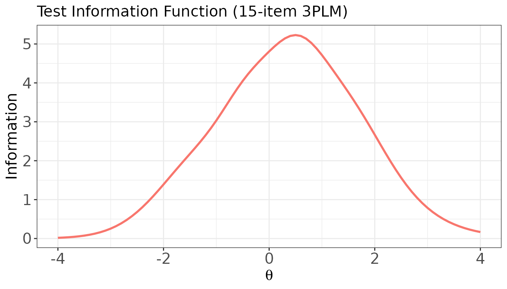

### Plot: Conditional Standard Error of Estimation (CSEE)

``` r

plot(
  x         = info_val,
  item.loc  = NULL,
  csee      = TRUE,              # plot SE(θ) = 1 / √TIF(θ)
  main.text = "Conditional Standard Error of Estimation",
  xlab      = expression(theta),
  ylab      = expression(SE(theta))
)
```

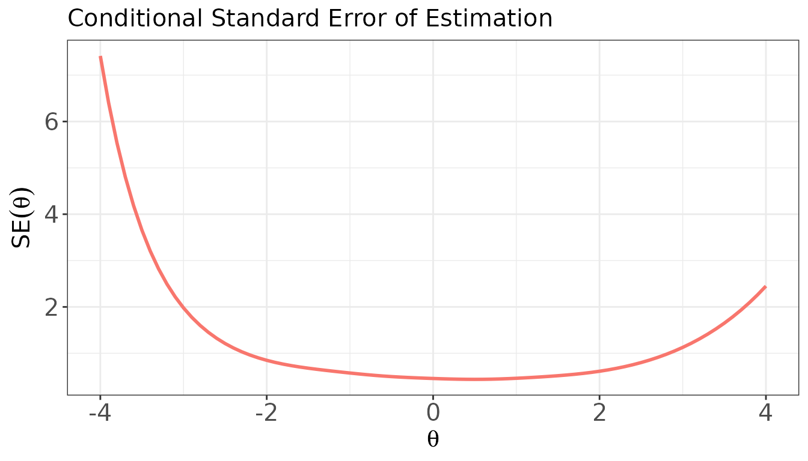

### Plot: IIF for a single item

``` r

plot(
  x         = info_val,
  item.loc  = 1,                 # item position (1-indexed)
  main.text = "IIF for Item 1 (3PLM)",
  xlab      = expression(theta),
  ylab      = "Information"
)
```

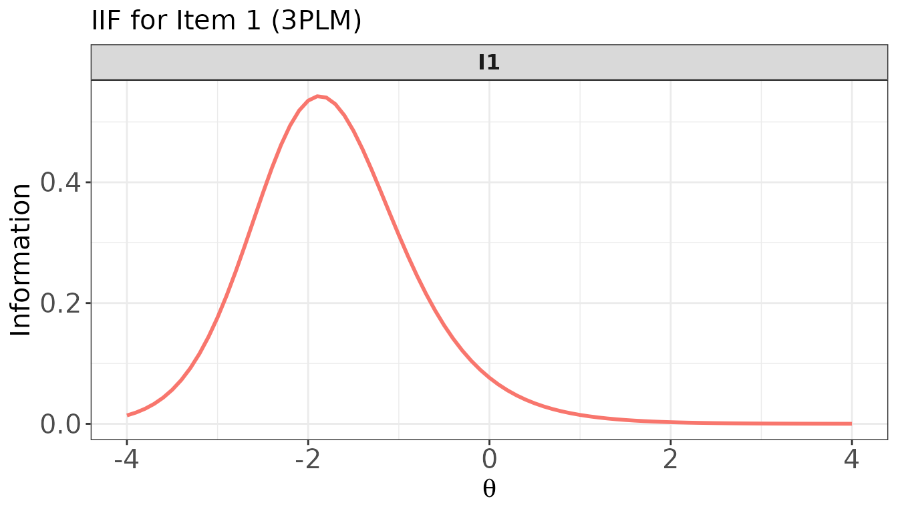

### Plot: IIFs for multiple items — overlaid and in panels

``` r

# Overlaid in one panel
plot(
  x         = info_val,
  item.loc  = 1:5,
  overlap   = TRUE,
  main.text = "IIFs for Items 1–5 (overlaid)"
)
```

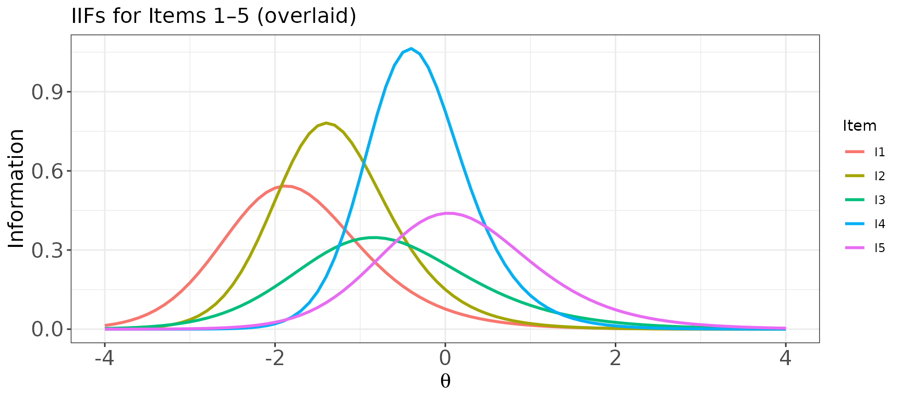

``` r

# One panel per item
plot(
  x          = info_val,
  item.loc   = 1:5,
  overlap    = FALSE,
  layout.col = 5,
  main.text  = "IIFs for Items 1–5 (separate panels)"
)
```

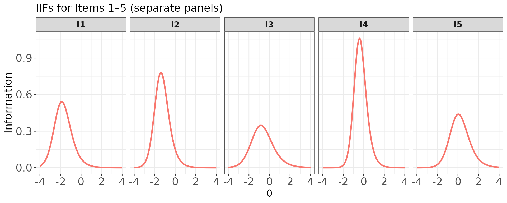

### Mixed-format test

[`info()`](https://hwangQ.github.io/irtQ/reference/info.md) handles
polytomous items transparently. The IIF for a polytomous item reflects
the information contributed by the full graded response structure, and
tends to be broader and higher than a comparable dichotomous item
because the multiple ordered categories each contribute information.

``` r

info_mix <- info(x = meta_mix, theta = theta_grid, D = 1.702, tif = TRUE)

# TIF for the mixed-format test
plot(
  x         = info_mix,
  item.loc  = NULL,
  main.text = "TIF: Mixed-Format Test (5 DRM + 3 GRM)"
)
```

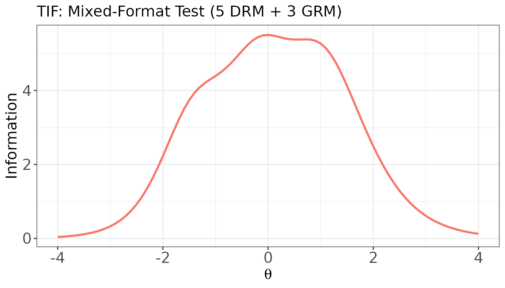

#### IIF for a single polytomous item

Items 6–8 in `meta_mix` are the three GRM items. Their IIFs tend to be
broader than those of dichotomous items.

``` r

# IIF for GRM item 1 (item 6 in meta_mix)
plot(
  x         = info_mix,
  item.loc  = 6,
  main.text = "IIF for GRM Item 1 (item 6)",
  xlab      = expression(theta),
  ylab      = "Information"
)
```

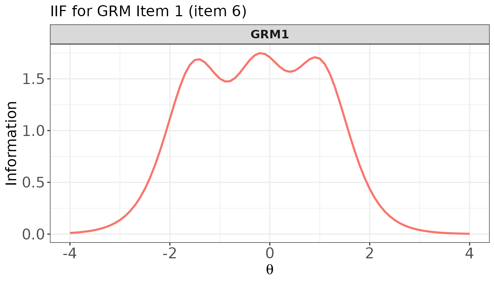

#### IIFs for multiple items — mixed dichotomous and polytomous

``` r

# Overlaid: compare DRM items vs. GRM items
plot(
  x         = info_mix,
  item.loc  = c(1, 3, 5, 6, 7, 8),   # 3 DRM + 3 GRM
  overlap   = TRUE,
  main.text = "IIFs: DRM Items (1,3,5) vs. GRM Items (6,7,8) — overlaid"
)
```

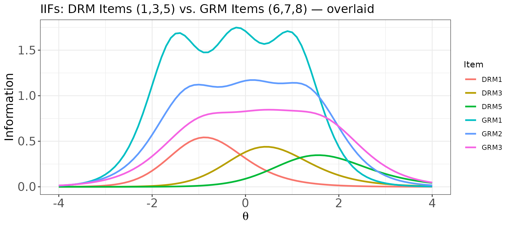

``` r

# Separate panels for the same set of items
plot(
  x          = info_mix,
  item.loc   = c(1, 3, 5, 6, 7, 8),
  overlap    = FALSE,
  layout.col = 3,
  main.text  = "IIFs: DRM Items (1,3,5) and GRM Items (6,7,8)"
)
```

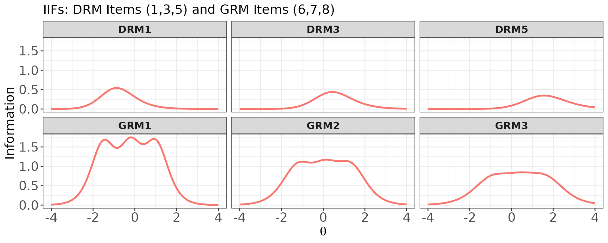

------------------------------------------------------------------------

## `traceline()` — Item and Test Characteristic Curves

[`traceline()`](https://hwangQ.github.io/irtQ/reference/traceline.md)
computes the item characteristic curve (ICC), test characteristic curve
(TCC), and category response probabilities for each item over a
specified ability grid.

The function returns an object of class `"traceline"` with four
components:

- `$prob.cats`: a named list of data frames, one per item, containing
  category response probabilities (columns `resp.0`, `resp.1`, …) at
  each theta value,
- `$icc`: matrix of expected item scores (rows = theta, columns =
  items),
- `$tcc`: numeric vector of expected total (summed) scores at each
  theta,
- `$theta`: the theta grid supplied by the user.

For dichotomous items, the ICC equals $`P(\theta)`$, the probability of
a correct response. For polytomous items, the ICC is the expected item
score $`\sum_k k \cdot P(U = k \mid \theta)`$.

The [`plot()`](https://rdrr.io/r/graphics/plot.default.html) method is
used for visualisation. Two key arguments control what is drawn:

- `item.loc`: which item(s) to plot; `NULL` plots the TCC for the whole
  test.
- `score.curve`: `FALSE` (default) draws category response probability
  curves; `TRUE` draws the expected item score curve (a single curve per
  item).

Note that when `score.curve = FALSE` and `overlap = FALSE`, only a
**single** item can be specified in `item.loc` (one panel per score
category). To plot multiple items simultaneously with
`score.curve = FALSE`, set `overlap = TRUE` (one panel per item,
categories overlaid within each panel).

``` r

trace_bin <- traceline(x = meta_bin, theta = theta_grid, D = 1.702)

names(trace_bin)
#> [1] "prob.cats" "icc"       "tcc"       "theta"
head(trace_bin$tcc)               # TCC: expected summed score at each theta
#> [1] 2.309632 2.319809 2.331709 2.345610 2.361831 2.380734
trace_bin$icc[1:6, 1:5]          # ICC: expected item scores, items 1–5
#>             I1        I2        I3        I4        I5
#> [1,] 0.1773451 0.1551202 0.1640658 0.1502029 0.1521569
#> [2,] 0.1822264 0.1562718 0.1660788 0.1502575 0.1525129
#> [3,] 0.1879388 0.1576802 0.1683734 0.1503268 0.1529274
#> [4,] 0.1946087 0.1594012 0.1709873 0.1504147 0.1534101
#> [5,] 0.2023755 0.1615026 0.1739623 0.1505262 0.1539719
#> [6,] 0.2113914 0.1640658 0.1773451 0.1506677 0.1546258
```

### Plot: Test Characteristic Curve (TCC)

``` r

plot(
  x         = trace_bin,
  item.loc  = NULL,              # NULL → plot TCC
  main.text = "Test Characteristic Curve (15-item 3PLM)",
  xlab      = expression(theta),
  ylab      = "Expected Total Score"
)
```

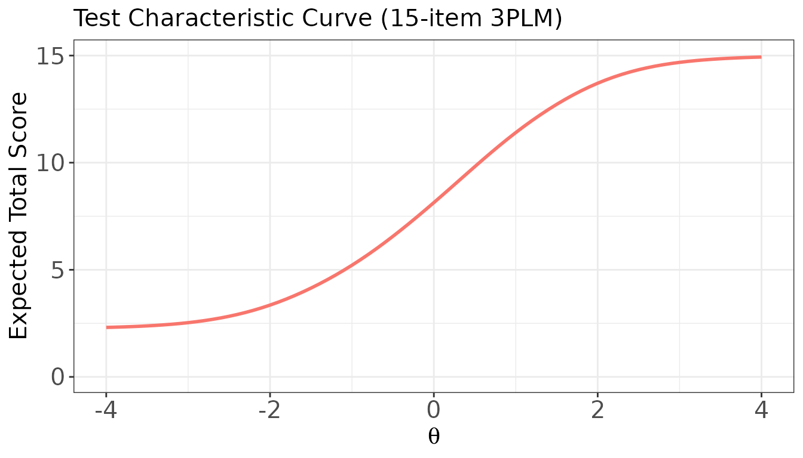

### Plot: ICCs for a dichotomous item

For a 3PLM item, `score.curve = FALSE` draws two panels — one for each
score category (0 = incorrect, 1 = correct); `score.curve = TRUE` shows
only $`P(\theta)`$ (the probability of a correct response) as a single
curve.

``` r

# score.curve = FALSE: separate panels for Score 0 and Score 1
plot(
  x           = trace_bin,
  item.loc    = 2,
  score.curve = FALSE,
  layout.col  = 2,
  main.text   = "ICCs for Item 2 (3PLM) — by category"
)
```

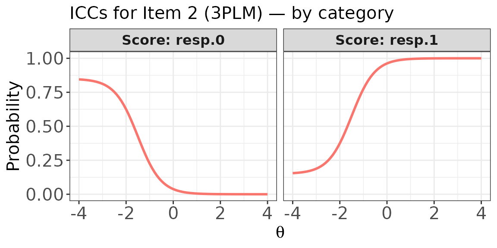

``` r

# score.curve = TRUE: single item score curve (= P(correct) for binary items)
plot(
  x           = trace_bin,
  item.loc    = 2,
  score.curve = TRUE,
  main.text   = "Item Score Curve: Item 2 (3PLM)",
  xlab        = expression(theta),
  ylab        = "P(Correct)"
)
```

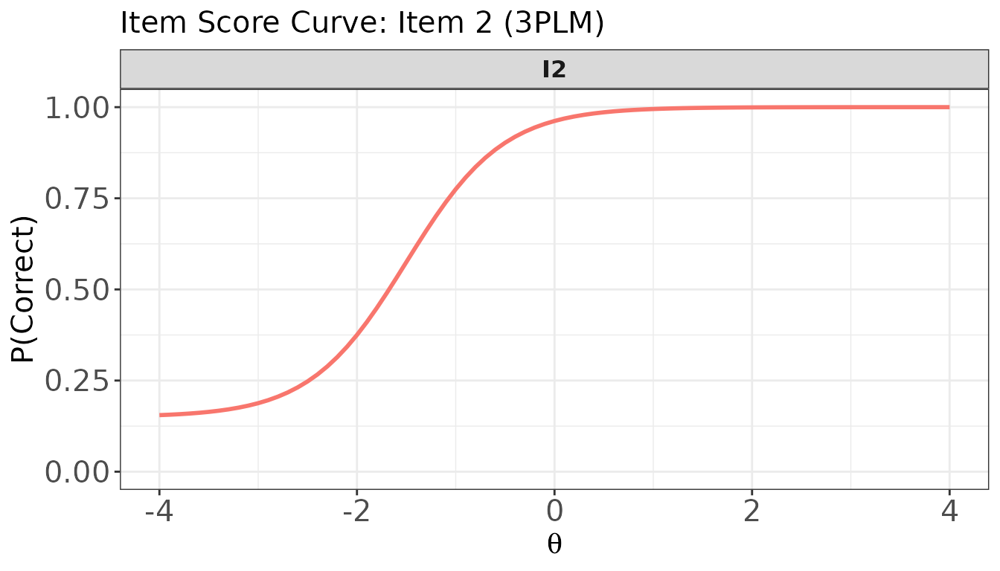

### Plot: Item score curves for multiple dichotomous items

``` r

# Overlaid in one panel: all five items in a single plot
plot(
  x           = trace_bin,
  item.loc    = 1:5,
  score.curve = TRUE,
  overlap     = TRUE,
  main.text   = "Item Score Curves: Items 1–5 (overlaid)"
)
```

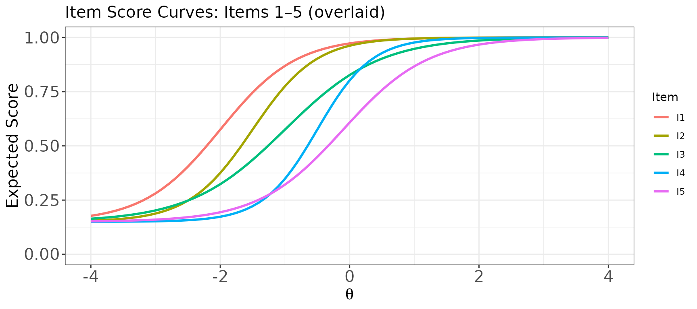

``` r

# One panel per item (separate panels)
plot(
  x           = trace_bin,
  item.loc    = 1:5,
  score.curve = TRUE,
  overlap     = FALSE,
  layout.col  = 5,
  main.text   = "Item Score Curves: Items 1–5 (separate panels)"
)
```

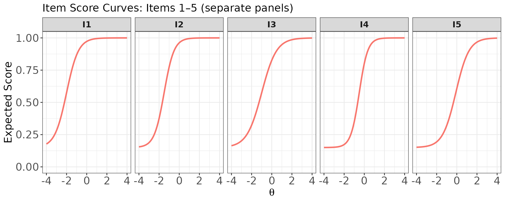

### Plot: Category response curves and expected score curve for a polytomous item

For a GRM item, `score.curve = FALSE` draws one curve per score category
(0, 1, 2, 3). Items 6–8 in `meta_mix` are the three GRM items.

``` r

trace_mix <- traceline(x = meta_mix, theta = theta_grid, D = 1.702)
```

``` r

# Category response curves for GRM item 1 (item 6 overall), separate panels
plot(
  x           = trace_mix,
  item.loc    = 6,
  score.curve = FALSE,
  overlap     = FALSE,
  layout.col  = 2,
  main.text   = "Category Response Curves: GRM Item 1 (4 categories)"
)
```

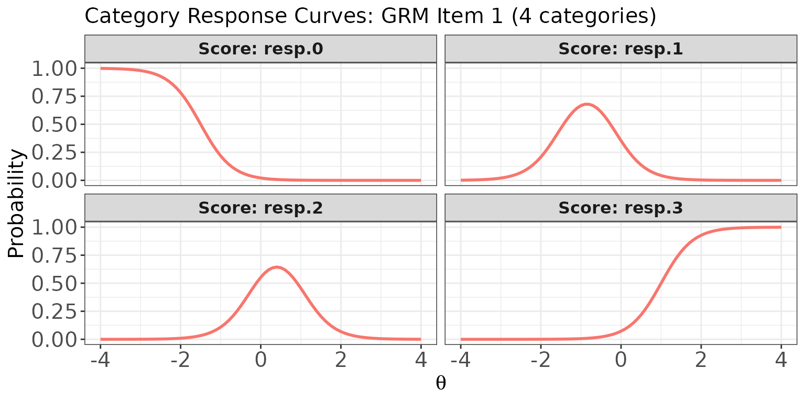

``` r

# Same curves overlaid in one panel
plot(
  x           = trace_mix,
  item.loc    = 6,
  score.curve = FALSE,
  overlap     = TRUE,
  main.text   = "Category Response Curves (Overlaid): GRM Item 1"
)
```

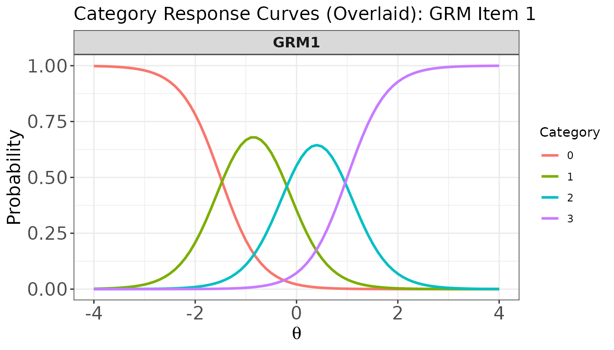

``` r

# Expected item score curve for GRM item 1
plot(
  x           = trace_mix,
  item.loc    = 6,
  score.curve = TRUE,
  main.text   = "Expected Item Score Curve: GRM Item 1",
  ylab.text   = "Expected Score"
)
```

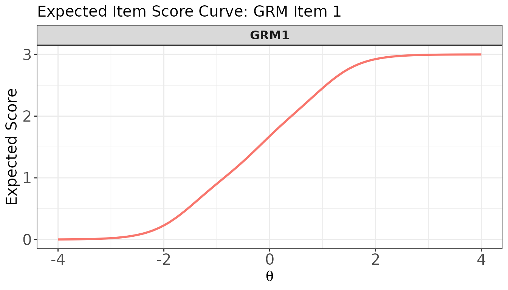

### Plot: Item score curves for multiple items — mixed dichotomous and polytomous

When `score.curve = TRUE`, items of any format can be plotted together
because all ICCs are expressed on the same expected-score metric.

``` r

# Overlaid: DRM items (1–3) and GRM items (6–8) in one panel
plot(
  x           = trace_mix,
  item.loc    = c(1, 2, 3, 6, 7, 8),
  score.curve = TRUE,
  overlap     = TRUE,
  main.text   = "Item Score Curves: DRM (1–3) and GRM (6–8) — overlaid"
)
```

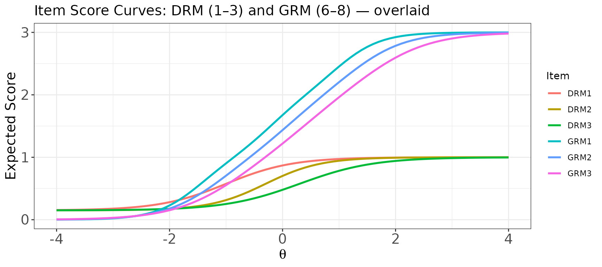

``` r

# One panel per item (separate panels)
plot(
  x           = trace_mix,
  item.loc    = c(1, 2, 3, 6, 7, 8),
  score.curve = TRUE,
  overlap     = FALSE,
  layout.col  = 3,
  main.text   = "Item Score Curves: DRM (1–3) and GRM (6–8)"
)
```

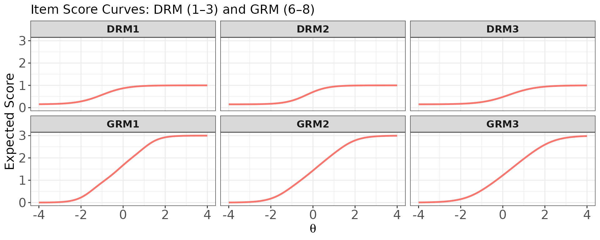

### Plot: Category response curves for multiple polytomous items (overlaid per item)

When `score.curve = FALSE` and `overlap = TRUE`, each item gets its own
panel and the category curves within that item are overlaid using
different colours.

``` r

# One panel per GRM item (6, 7, 8), with all category curves overlaid within each panel
plot(
  x           = trace_mix,
  item.loc    = 6:8,
  score.curve = FALSE,
  overlap     = TRUE,
  layout.col  = 3,
  main.text   = "Category Response Curves: GRM Items 1–3 (overlaid by category)"
)
```

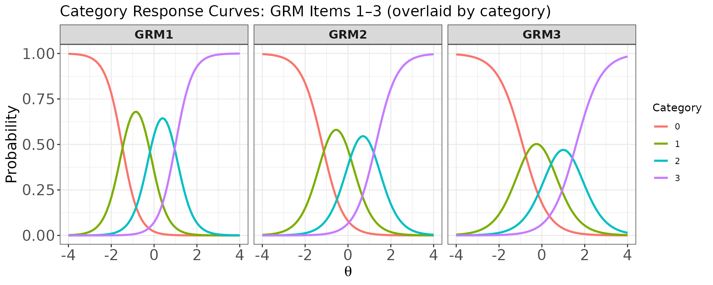

------------------------------------------------------------------------

## `lwrc()` — Lord–Wingersky Recursion

[`lwrc()`](https://hwangQ.github.io/irtQ/reference/lwrc.md) implements
the Lord–Wingersky recursive algorithm (Lord and Wingersky 1984; Kolen
and Brennan 2004), which computes the **conditional distribution of the
observed summed score given $`\theta`$**:
``` math
\Pr(X = s \mid \theta), \quad s = 0, 1, \ldots, \sum_j (K_j - 1).
```

This distribution is the foundation of IRT-based score equating and is
used internally by
[`sx2_fit()`](https://hwangQ.github.io/irtQ/reference/sx2_fit.md),
[`cac_lee()`](https://hwangQ.github.io/irtQ/reference/cac_lee.md), and
[`est_score()`](https://hwangQ.github.io/irtQ/reference/est_score.md)
(EAP summed-score method). For tests with polytomous items, the
algorithm generalizes straightforwardly to ordered response categories.

The function supports **two input modes**:

- **`x` argument** (item metadata): computes the conditional
  distribution at each specified `theta` value; returns a matrix with
  rows = summed scores ($`0, 1, \ldots, J`$) and columns = theta levels.
- **`prob` argument** (`x = NULL`): the user provides a category
  probability matrix already evaluated at a particular theta (or a
  single marginal weight), together with a `cats` vector; returns a
  **named vector** of summed-score probabilities. This is useful when
  category probabilities come from an external source or when computing
  the marginal distribution at a single fixed ability level.

### Mode 1: Using item metadata (`x` argument)

``` r

# Conditional summed-score distribution at three ability levels
lwrc_val <- lwrc(
  x     = meta_bin,
  theta = c(-1, 0, 1),
  D     = 1.702
)

dim(lwrc_val)           # (J+1) rows × length(theta) columns: 16 × 3
#> [1] 16  3
round(head(lwrc_val), 4)
#>         theta.1 theta.2 theta.3
#> score.0  0.0004  0.0000       0
#> score.1  0.0055  0.0000       0
#> score.2  0.0333  0.0001       0
#> score.3  0.1039  0.0012       0
#> score.4  0.1960  0.0087       0
#> score.5  0.2428  0.0377       0

# Verify: expected summed scores from lwrc() match the TCC from traceline()
score_axis <- 0:(nrow(lwrc_val) - 1)
colSums(lwrc_val * score_axis)
#>   theta.1   theta.2   theta.3 
#>  5.212989  8.137061 11.405212
```

``` r

# Cross-check with TCC from traceline()
tcc_check <- traceline(x = meta_bin, theta = c(-1, 0, 1), D = 1.702)$tcc
round(tcc_check, 6)
#> [1]  5.212989  8.137061 11.405212
```

The two results agree, confirming that the expected summed score derived
from [`lwrc()`](https://hwangQ.github.io/irtQ/reference/lwrc.md) matches
the TCC value at the same ability level.

### Mode 2: Using a category probability matrix (`x = NULL`)

When `x = NULL`, the user supplies `prob` (rows = items, columns = score
categories) and `cats`. **Importantly, the columns in the `prob` matrix
strictly correspond to the ordered score categories (i.e., column 1 is
for score 0, column 2 is for score 1, column 3 is for score 2, and so
forth).** Empty cells for items with fewer categories should be filled
with `0` or `NA`. This mode returns the **marginal** score distribution
for the single ability level at which the probabilities were computed.

``` r

## Example from Kolen & Brennan (2004, p. 183): 3 dichotomous items at a fixed theta
# Each row is one item; columns are P(score=0) and P(score=1)
probs_3items <- matrix(
  c(0.26, 0.74,   # item 1: P(0) = 0.26, P(1) = 0.74
    0.27, 0.73,   # item 2
    0.18, 0.82),  # item 3
  nrow = 3, ncol = 2, byrow = TRUE
)
cats_3items <- c(2, 2, 2)

score_dist <- lwrc(prob = probs_3items, cats = cats_3items)
score_dist       # P(X=0), P(X=1), P(X=2), P(X=3)
#>  score.0  score.1  score.2  score.3 
#> 0.012636 0.127692 0.416708 0.442964
sum(score_dist)  # should equal 1
#> [1] 1
```

``` r

## Mixed-format: 2 dichotomous + 1 four-category + 1 three-category item
p1 <- c(0.3, 0.7, NA,  NA)    # dichotomous: 2 categories (cols: 0, 1)
p2 <- c(0.4, 0.6, NA,  NA)    # dichotomous: 2 categories (cols: 0, 1)
p3 <- c(0.1, 0.3, 0.4, 0.2)   # polytomous:  4 categories (cols: 0, 1, 2, 3)
p4 <- c(0.5, 0.3, 0.2, NA)    # polytomous:  3 categories (cols: 0, 1, 2)

prob_mix <- rbind(p1, p2, p3, p4)
cats_mix  <- c(2, 2, 4, 3)

score_dist_mix <- lwrc(prob = prob_mix, cats = cats_mix)
score_dist_mix   # P(X=0) through P(X=7); max score = 1+1+3+2 = 7
#> score.0 score.1 score.2 score.3 score.4 score.5 score.6 score.7 
#>  0.0060  0.0446  0.1410  0.2518  0.2758  0.1868  0.0772  0.0168
sum(score_dist_mix)
#> [1] 1
```

------------------------------------------------------------------------

## `gen.weight()` — Quadrature Weights

[`gen.weight()`](https://hwangQ.github.io/irtQ/reference/gen.weight.md)
generates a two-column data frame of quadrature nodes and normalised
weights to be used in numerical integration over the ability scale. It
is used by
[`est_score()`](https://hwangQ.github.io/irtQ/reference/est_score.md)
(EAP),
[`sx2_fit()`](https://hwangQ.github.io/irtQ/reference/sx2_fit.md),
[`cac_lee()`](https://hwangQ.github.io/irtQ/reference/cac_lee.md),
[`cac_rud()`](https://hwangQ.github.io/irtQ/reference/cac_rud.md), and
[`covirt()`](https://hwangQ.github.io/irtQ/reference/covirt.md).

Three distribution options are available via the `dist` argument:

- `"norm"`: normal distribution. When `n` is given (no `theta`),
  Gaussian quadrature points and weights are computed via
  [`statmod::gauss.quad.prob()`](https://rdrr.io/pkg/statmod/man/gauss.quad.prob.html).
  When `theta` is given, weights are proportional to the normal density
  evaluated at each node.
- `"unif"`: uniform distribution — equally spaced nodes over $`[l, u]`$
  with equal weights.
- `"emp"`: empirical distribution — equal weights for user-supplied
  `theta` values.

The returned data frame always has columns named `theta` and `weight`,
and the weights always sum to 1.

``` r

# 41 Gaussian quadrature points from N(0, 1) — most common usage
w_norm <- gen.weight(n = 41, dist = "norm", mu = 0, sigma = 1)
head(w_norm)
#>        theta       weight
#> 1 -11.614937 2.257864e-30
#> 2 -10.647537 8.308559e-26
#> 3  -9.843433 2.746891e-22
#> 4  -9.123070 2.326384e-19
#> 5  -8.456099 7.655982e-17
#> 6  -7.826882 1.220335e-14
sum(w_norm$weight)      # always sums to 1
#> [1] 1

# Plot the quadrature approximation
plot(w_norm$weight ~ w_norm$theta,
     type = "h", lwd = 2,
     xlab = expression(theta), ylab = "Weight",
     main = "Gaussian Quadrature Approximation of N(0, 1) — 41 nodes")
```


``` r

# Normal weights on a user-defined evenly spaced grid
w_grid <- gen.weight(dist = "norm", mu = 0, sigma = 1,
                     theta = seq(-4, 4, by = 0.25))
nrow(w_grid)   # 33 nodes
#> [1] 33
sum(w_grid$weight)
#> [1] 1
```

``` r

# Uniform distribution: 21 equally spaced nodes on [-3, 3]
w_unif <- gen.weight(n = 21, dist = "unif", l = -3, u = 3)
head(w_unif)
#>   theta     weight
#> 1  -3.0 0.04761905
#> 2  -2.7 0.04761905
#> 3  -2.4 0.04761905
#> 4  -2.1 0.04761905
#> 5  -1.8 0.04761905
#> 6  -1.5 0.04761905
```

``` r

# Empirical distribution: equal weights for sample ability estimates
theta_sample <- rnorm(200)
w_emp <- gen.weight(dist = "emp", theta = theta_sample)
nrow(w_emp)              # one node per observation
#> [1] 200
sum(w_emp$weight)        # sums to 1
#> [1] 1
```

------------------------------------------------------------------------

## `covirt()` — Asymptotic Variance-Covariance Matrices of Item Parameters

[`covirt()`](https://hwangQ.github.io/irtQ/reference/covirt.md) computes
the analytical asymptotic variance-covariance matrices of item parameter
estimates using the formulas developed by Thissen and Wainer (1982) and
extended to polytomous IRT models by Li and Lissitz (2004). These
matrices provide the asymptotic standard errors (ASEs) of maximum
likelihood estimates **without requiring examinee response data** — only
the item parameters and the sample size used for calibration are needed.

The ASEs obtained analytically represent **lower bounds** of the true
standard errors (Thissen and Wainer 1982), so they are best used as
approximations when empirical standard errors from calibration software
are unavailable.

The function returns a named list with two components:

- `$cov`: a named list of variance-covariance matrices, one per item,
- `$se`: a named list of ASE vectors (square roots of diagonal elements
  of each covariance matrix).

**Notes on PCM items:** The item metadata uses `"GPCM"` to label both
the Generalized Partial Credit Model (GPCM) and the Partial Credit Model
(PCM). PCM items (where discrimination is fixed at 1) require special
handling for variance computation and must be identified via the
`pcm.loc` argument.

### Binary test

``` r

# Compute ASEs for the 15-item 3PLM test, assuming n = 1,000
cov_bin <- covirt(
  x          = meta_bin,
  D          = 1.702,
  nstd       = 1000,
  norm.prior = c(0, 1),
  nquad      = 41
)

# Variance-covariance matrix for item 1
cov_bin$cov[["I1"]]
#>            par.1      par.2      par.3
#> par.1 0.02493906 0.05851498 0.03474867
#> par.2 0.05851498 0.18920950 0.12973035
#> par.3 0.03474867 0.12973035 0.10032713

# ASEs for all items: each vector holds SE(a), SE(b), SE(c)
do.call(rbind, cov_bin$se)
#>         par.1      par.2      par.3
#> I1  0.1579210 0.43498218 0.31674458
#> I2  0.1558743 0.21622062 0.15517626
#> I3  0.1142373 0.29650137 0.14580863
#> I4  0.1468963 0.08788048 0.05281089
#> I5  0.1156423 0.14178645 0.06350700
#> I6  0.1298219 0.09011467 0.04115446
#> I7  0.1558146 0.06697283 0.02764344
#> I8  0.1274625 0.14698758 0.05139614
#> I9  0.1599796 0.09370920 0.02748933
#> I10 0.2191089 0.10119226 0.01961802
#> I11 0.1163729 0.21041422 0.10740235
#> I12 0.1250015 0.11241667 0.05768607
#> I13 0.1604652 0.06244608 0.02725742
#> I14 0.1382020 0.10850329 0.03687232
#> I15 0.2100965 0.13617792 0.02205996
```

### Item-specific sample sizes

When items were calibrated on different samples, pass a vector of sample
sizes:

``` r

# Example: items 1–5 calibrated on n=500, items 6–15 on n=2000
n_vec <- c(rep(500, 5), rep(2000, 10))
cov_bin2 <- covirt(x = meta_bin, D = 1.702, nstd = n_vec,
                   norm.prior = c(0, 1), nquad = 41)

# Compare SE(b) for item 1 (n=500) vs item 6 (n=2000)
cat("SE(b) for I1 (n=500):", cov_bin2$se[["I1"]][2], "\n")
#> SE(b) for I1 (n=500): 0.6151577
cat("SE(b) for I6 (n=2000):", cov_bin2$se[["I6"]][2], "\n")
#> SE(b) for I6 (n=2000): 0.06372069
```

### Mixed-format test

``` r

# GRM items in meta_mix: items 6–8 (DRM1–DRM5 come first)
cov_mix <- covirt(
  x          = meta_mix,
  D          = 1.702,
  nstd       = 1500,
  norm.prior = c(0, 1),
  nquad      = 41
)

# ASEs for a GRM item: SE(a), SE(d1), SE(d2), SE(d3)
cov_mix$se[["GRM1"]]
#>      par.1      par.2      par.3      par.4 
#> 0.04307804 0.03560601 0.02206548 0.02737165
```

------------------------------------------------------------------------

## Summary

| Function | Input | Key output | Used by |
|----|----|----|----|
| [`simdat()`](https://hwangQ.github.io/irtQ/reference/simdat.md) | Item metadata or raw params + θ | Response matrix | Testing, demos |
| [`drm()`](https://hwangQ.github.io/irtQ/reference/drm.md) | a, b, g, θ | P(correct) matrix (θ × items) | [`simdat()`](https://hwangQ.github.io/irtQ/reference/simdat.md), [`traceline()`](https://hwangQ.github.io/irtQ/reference/traceline.md), [`info()`](https://hwangQ.github.io/irtQ/reference/info.md), [`covirt()`](https://hwangQ.github.io/irtQ/reference/covirt.md) |
| [`prm()`](https://hwangQ.github.io/irtQ/reference/prm.md) | a, d, θ, model | Category prob. matrix (θ × cats) | [`simdat()`](https://hwangQ.github.io/irtQ/reference/simdat.md), [`traceline()`](https://hwangQ.github.io/irtQ/reference/traceline.md), [`info()`](https://hwangQ.github.io/irtQ/reference/info.md), [`covirt()`](https://hwangQ.github.io/irtQ/reference/covirt.md) |
| [`info()`](https://hwangQ.github.io/irtQ/reference/info.md) | Item metadata + θ grid | IIF matrix, TIF vector; [`plot()`](https://rdrr.io/r/graphics/plot.default.html) | [`est_score()`](https://hwangQ.github.io/irtQ/reference/est_score.md) |
| [`traceline()`](https://hwangQ.github.io/irtQ/reference/traceline.md) | Item metadata + θ grid | ICC matrix, TCC vector, category probs; [`plot()`](https://rdrr.io/r/graphics/plot.default.html) | Visualisation |
| [`lwrc()`](https://hwangQ.github.io/irtQ/reference/lwrc.md) | Item metadata + θ, or prob matrix | $`\Pr(X = s \mid \theta)`$ | [`cac_lee()`](https://hwangQ.github.io/irtQ/reference/cac_lee.md), [`sx2_fit()`](https://hwangQ.github.io/irtQ/reference/sx2_fit.md), [`est_score()`](https://hwangQ.github.io/irtQ/reference/est_score.md) |
| [`gen.weight()`](https://hwangQ.github.io/irtQ/reference/gen.weight.md) | Distribution spec | Node–weight data frame | [`cac_lee()`](https://hwangQ.github.io/irtQ/reference/cac_lee.md), [`cac_rud()`](https://hwangQ.github.io/irtQ/reference/cac_rud.md), [`est_score()`](https://hwangQ.github.io/irtQ/reference/est_score.md), [`covirt()`](https://hwangQ.github.io/irtQ/reference/covirt.md) |
| [`covirt()`](https://hwangQ.github.io/irtQ/reference/covirt.md) | Item metadata + sample size | Cov matrices, ASE vectors | SE approximation |

------------------------------------------------------------------------

## References

Kolen, Michael J., and Robert L. Brennan. 2004. *Test Equating, Scaling,
and Linking*. 2nd ed. Springer.

Li, Yuan H., and Robert W. Lissitz. 2004. “Applications of the
Analytically Derived Asymptotic Standard Errors of Item Response Theory
Item Parameter Estimates.” *Journal of Educational Measurement* 41 (2):
85–117. <https://doi.org/10.1111/j.1745-3984.2004.tb01109.x>.

Lord, Frederic M., and Marilyn S. Wingersky. 1984. “Comparison of IRT
True-Score and Equipercentile Observed-Score Equatings.” *Applied
Psychological Measurement* 8 (4): 453–61.
<https://doi.org/10.1177/014662168400800409>.

Thissen, David, and Howard Wainer. 1982. “Some Standard Errors in Item
Response Theory.” *Psychometrika* 47 (4): 397–412.
<https://doi.org/10.1007/BF02293705>.
