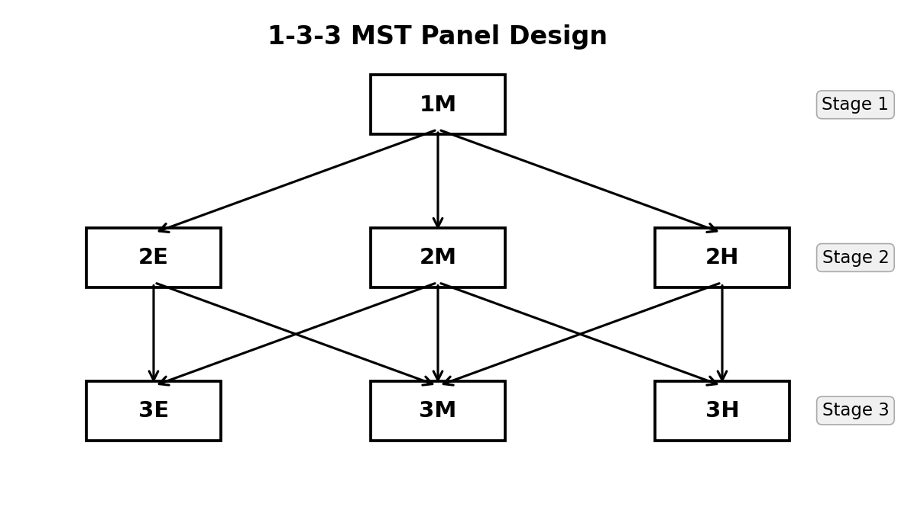
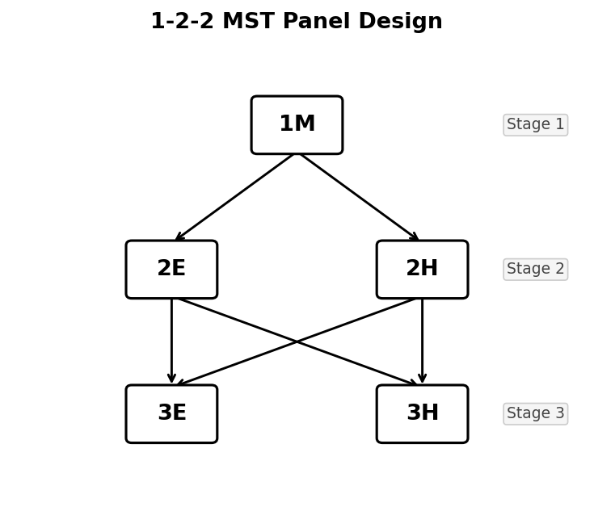

```{r setup, include=FALSE}
knitr::opts_chunk$set(
  collapse  = TRUE,
  comment   = "#>",
  message   = FALSE,
  warning   = FALSE,
  fig.align = "center",
  fig.width = 7,
  fig.height = 4
)
```

## What is Multistage Testing (MST)?

**Multistage Testing (MST)** is a computer-based adaptive testing design that
sits between fully adaptive Computerized Adaptive Testing (CAT) and traditional
linear fixed-form testing. In an MST, the test is divided into *stages*, each
containing one or more pre-assembled groups of items called *modules*. Routing
rules — based on performance on earlier stages — determine which module a test
taker receives at each subsequent stage.

### The Basic Structure

A typical MST panel is described by its *stage-module configuration*. For example,
a **1-3-3 panel** has:

- **Stage 1**: 1 routing module — everyone starts with the same items
- **Stage 2**: 3 modules of varying difficulty (e.g., easy, medium, hard)
- **Stage 3**: 3 modules of varying difficulty (e.g., easy, medium, hard)

The diagram below illustrates the flow of test takers through a 1-3-3 panel
(E = Easy, M = Medium, H = Hard):

```{r fig-133, echo=FALSE, out.width="65%", fig.cap="1-3-3 MST panel design. From Stage 1, all examinees begin at module 1M. After Stage 1, they are routed to one of three Stage 2 modules (2E, 2M, 2H) based on their estimated ability. After Stage 2, they are routed to one of three Stage 3 modules (3E, 3M, 3H)."}

```

A test taker's *pathway* through the MST is the sequence of modules they take,
such as 1M → 2E → 3E (for a low-ability examinee) or 1M → 2H → 3H (for a
high-ability examinee). In a 1-3-3 panel above, there are 7 such pathways.

### Advantages of MST Over Linear Tests and CAT

| Feature | Linear | CAT | MST |
|---------|--------|-----|-----|
| Adaptivity | None | Item-by-item | Stage-by-stage |
| Content review | Full review allowed | (Generally) Not allowed | Allowed within module |
| Item exposure control | Easy | Difficult | Moderate |
| Test assembly | Pre-assembled | On-the-fly | (Generally) Pre-assembled modules |
| Operational cost | Low | High | Moderate |

MST is especially popular in high-stakes certification and licensure exams because
it allows examinees to review and change answers within a module (like a paper
test) while still adapting the difficulty level to each examinee.

---

## The Challenge of Evaluating MST Panels

Before deploying an MST panel operationally, test developers need to evaluate its
**measurement quality**: how accurately and precisely does the panel estimate
examinee ability at each level of the latent trait $\theta$?

The two key evaluation metrics are:

- **Conditional Bias**: The average difference between the ability estimate
  $\hat{\theta}$ and the true ability $\theta$, evaluated at each $\theta$ level.
  Ideally, bias should be near zero across the full ability range.
- **Conditional Standard Error of Measurement (CSEM)**: The standard deviation
  of ability estimates at each $\theta$ level. Lower CSEM means more precise
  measurement.

### The Traditional Approach: Monte Carlo Simulation

The classical way to evaluate an MST panel is through large-scale simulation:

1. Fix a set of true ability levels $\theta_1, \theta_2, \ldots$
2. For each $\theta_k$, generate thousands of simulated response patterns
3. Route each simulated examinee through the panel using the cut scores
4. Estimate ability from each simulated response and compute the mean and
   variance of the estimates
5. Bias = mean($\hat\theta$) − $\theta_k$, CSEM = $\sqrt{\text{Var}(\hat\theta)}$

This approach is conceptually simple, but it has practical drawbacks:

- **Computationally expensive**: Millions of response patterns must be generated
  and scored
- **Stochastic**: Results fluctuate across simulation replications
- **Time-consuming**: Evaluating many panel designs or cut score configurations
  requires many separate simulation runs

### The Recursion-Based Analytical Approach

@lim_etal2021 proposed a fundamentally different approach: instead of simulating
individual examinees, the method **directly computes the exact probability
distribution of every possible observed score** at every stage and pathway using
a recursive algorithm.

The key insight is that the conditional distribution of the observed sum score
along any pathway can be built up stage by stage using the
**Lord–Wingersky recursion** [@lord_wingersky1984]. Given the conditional
score distribution of the modules visited so far, the joint distribution at
the next stage can be computed exactly — without any random sampling.

Here is the core logic of the recursion:

1. **Stage 1**: Compute $P(X_1 = x \mid \theta)$ for the routing module using
   the Lord–Wingersky recursion, where $X_1$ is the total score on Stage 1.

2. **Routing**: For each possible score $x$ on Stage 1, determine which Stage 2
   module a test taker would be routed to (using the cut scores). This converts
   the score distribution into a *pathway probability*.

3. **Stage 2**: For each Stage 2 pathway, compute the **joint distribution**
   $P(X_1 + X_2 = s \mid \theta, \text{path})$ by convolving the Stage 1
   score distribution with the conditional distribution of the assigned Stage 2
   module.

4. **Continue recursively** through all stages.

5. **Ability estimation**: Convert each possible final sum score to a $\hat\theta$
   estimate using the **inverse Test Characteristic Curve (TCC) method** — the
   method implied by IRT-based summed scoring.

   > **Note on linear interpolation (`intpol`)**: When items have non-zero guessing
   > parameters (e.g., 3PLM), the minimum *achievable* expected sum score exceeds
   > zero — meaning no valid $\hat\theta$ exists for very low observed scores (those
   > below the sum of guessing parameters). With `intpol = TRUE` (the default), the
   > inverse TCC method applies **linear interpolation** between the point
   > $(\theta_{\min},\, 0)$ and the lowest TCC-reachable score point, so that every
   > possible sum score receives a valid ability estimate rather than `NA`.

6. **Evaluate**: Compute the conditional mean and variance of $\hat\theta$ given
   the true $\theta$, and derive conditional bias and CSEM.

This method is:

- **Exact**: The probability distributions are computed analytically, not
  approximated by random sampling
- **Fast**: Computation takes seconds, not minutes or hours
- **Deterministic**: Results are reproducible without any simulation noise
- **Comprehensive**: Any panel design, cut score configuration, or ability grid
  can be evaluated in a single function call

The `reval_mst()` function in **irtQ** implements this recursion-based method.

---

## Input Data: The Three Building Blocks of an MST Panel

Running `reval_mst()` requires three structural inputs in addition to the item
metadata:

### 1. Item Bank (`x`)

A standard **irtQ** item metadata data frame (see `?shape_df` or the
*Getting Started* vignette). Each row describes one item in the item bank.
The columns are `id`, `cats`, `model`, `par.1`, `par.2`, etc.

### 2. Module Assignment Matrix (`module`)

A binary matrix with **rows = items** (same order as `x`) and
**columns = modules**. An entry of 1 in row $i$, column $m$ means item $i$
belongs to module $m$.

```
        M1  M2  M3  M4  M5  M6  M7
item 1 [  1   0   0   0   0   0   0 ]  ← item 1 is in module 1
item 2 [  1   0   0   0   0   0   0 ]
...
item 9 [  0   1   0   0   0   0   0 ]  ← item 9 is in module 2
...
```

Each item belongs to exactly one module, so each row has exactly one 1 and all
other entries are 0.

### 3. Route Map (`route_map`)

A binary **square matrix** of dimension (total modules × total modules).
An entry of 1 in row $i$, column $j$ means test takers can be routed from
module $i$ directly to module $j$.

For a 1-3-3 panel with 7 modules (M1–M7):

```
         M1 M2 M3 M4 M5 M6 M7
M1  ──→ [  0  1  1  1  0  0  0 ]   M1 routes to M2, M3, or M4
M2  ──→ [  0  0  0  0  1  1  0 ]   M2 routes to M5 or M6
M3  ──→ [  0  0  0  0  0  1  1 ]   M3 routes to M6 or M7
M4  ──→ [  0  0  0  0  0  1  1 ]   M4 routes to M6 or M7
M5  ──→ [  0  0  0  0  0  0  0 ]   terminal (Stage 3)
M6  ──→ [  0  0  0  0  0  0  0 ]   terminal
M7  ──→ [  0  0  0  0  0  0  0 ]   terminal
```

Stage 1 modules are identified automatically as those with all-zero *columns*
(no module routes *to* them). Terminal modules have all-zero *rows*.

### 4. Cut Scores (`cut_score`)

A list of numeric vectors — one element per routing stage transition. Each
vector contains the IRT $\theta$ cut points used to determine which next-stage
module a test taker receives.

For a 1-3-3 panel with 2 routing stages:

```r
cut_score = list(
  c(-0.5, 0.5),   # Stage 1 → Stage 2: θ̂ < -0.5 → M2 (easy)
                  #                    -0.5 ≤ θ̂ < 0.5 → M3 (medium)
                  #                    θ̂ ≥ 0.5 → M4 (hard)
  c(-0.6, 0.6)    # Stage 2 → Stage 3: θ̂ < -0.6 → easy module
                  #                    -0.6 ≤ θ̂ < 0.6 → medium module
                  #                    θ̂ ≥ 0.6 → hard module
)
```

Note: The routing decision uses **inverse TCC scoring** — the ability estimate
$\hat\theta$ derived from the observed sum score up to that stage. This is the
scoring method that `reval_mst()` uses internally.

---

## The `simMST` Dataset

**irtQ** includes `simMST`, a built-in dataset that packages all four inputs
described above. This dataset was used in the simulation study of @lim_etal2021
and represents a **1-3-3 MST panel** with the following characteristics:

- 7 modules across 3 stages
- 8 items per module (24 items total)
- All items follow the 3-parameter logistic model (3PLM)
- Item parameters calibrated to span a broad ability range

```{r load-pkg}
library(irtQ)

# Inspect the simMST dataset
str(simMST, max.level = 1)
```

```{r inspect-simMST}
# Item bank: standard irtQ metadata format
head(simMST$item_bank, 10)
```

```{r inspect-module}
# Module matrix: 56 items × 7 modules
dim(simMST$module)

# First 16 rows (items 1-16, first 2 modules)
simMST$module[1:16, ]
```

```{r inspect-route-map}
# Route map: 7 × 7 transition matrix
simMST$route_map
```

The `route_map` shows:

- Row 1 (Module 1, Stage 1): routes to columns 2, 3, 4 — the three Stage 2 modules
- Rows 2–4 (Modules 2–4, Stage 2): each routes to two or three Stage 3 modules
- Rows 5–7 (Modules 5–7, Stage 3): all zeros — terminal modules

```{r inspect-cut-score}
# Cut scores: 2 routing transitions for 3 stages
simMST$cut_score
```

```{r inspect-theta}
# Ability grid for evaluation
length(simMST$theta)
range(simMST$theta)
head(simMST$theta, 10)
```

---

## Example 1: Evaluating the simMST Panel

With all inputs in place, running `reval_mst()` is straightforward:

```{r eval-simMST, cache=FALSE}
# Extract components from simMST
x         <- simMST$item_bank
module    <- simMST$module
route_map <- simMST$route_map
cut_score <- simMST$cut_score
theta     <- simMST$theta

# Evaluate the 1-3-3 MST panel
eval_result <- reval_mst(
  x          = x,
  D          = 1.702,
  route_map  = route_map,
  module     = module,
  cut_score  = cut_score,
  theta      = theta,
  range.tcc  = c(-5, 5)
)
```

The function returns a named list with 7 components. The most important
is `eval.tb`, the evaluation summary table:

```{r print-eval-tb}
# Evaluation table: theta, mu, sigma2, bias, csem
print(eval_result$eval.tb)
```

Each row corresponds to one true ability level $\theta$. The columns are:

| Column | Meaning |
|--------|---------|
| `theta` | True ability level |
| `mu` | Conditional mean of ability estimates $E[\hat\theta \mid \theta]$ |
| `sigma2` | Conditional variance of ability estimates $\text{Var}[\hat\theta \mid \theta]$ |
| `bias` | Conditional bias = $\mu - \theta$ |
| `csem` | Conditional SEM = $\sqrt{\sigma^2}$ |

A well-designed panel will show:

- `bias` values close to zero across the full ability range
- `csem` values that are relatively small and stable (or slightly U-shaped,
  higher at the extremes where fewer items provide information)

---

## Example 2: Visualizing Bias and CSEM

Plotting the evaluation results provides an intuitive picture of the panel's
measurement quality.

```{r plot-bias-csem, fig.width=8, fig.height=4, fig.cap="Conditional bias (left) and CSEM (right) for the simMST 1-3-3 panel across the ability scale."}
eval_tb <- eval_result$eval.tb

# Side-by-side plots: bias (left) and CSEM (right)
par(mfrow = c(1, 2), mar = c(4.5, 4.5, 3, 1))

# Bias plot
plot(
  eval_tb$theta, eval_tb$bias,
  type = "b", pch = 16, col = "steelblue", lwd = 2,
  xlab = expression(theta),
  ylab = "Conditional Bias",
  main = "Conditional Bias",
  ylim = c(-0.3, 0.3)
)
abline(h = 0, col = "red", lty = 2, lwd = 1.5)
grid()

# CSEM plot
plot(
  eval_tb$theta, eval_tb$csem,
  type = "b", pch = 16, col = "darkorange", lwd = 2,
  xlab = expression(theta),
  ylab = "CSEM",
  main = "Conditional SEM (CSEM)",
  ylim = c(0, max(eval_tb$csem) * 1.2)
)
abline(h = mean(eval_tb$csem), col = "red", lty = 2, lwd = 1.5)
legend("topright", legend = "Mean CSEM", lty = 2, col = "red", lwd = 1.5)
grid()
par(mfrow = c(1, 1))
```

You can also create a combined `ggplot2` figure, as shown in the `reval_mst()`
help page:

```{r plot-ggplot2, fig.width=7, fig.height=4, fig.cap="Bias and CSEM plotted together using ggplot2."}
library(ggplot2)
library(tidyr)
library(dplyr)

eval_tb %>%
  dplyr::select(theta, bias, csem) %>%
  tidyr::pivot_longer(
    cols      = c(bias, csem),
    names_to  = "criterion",
    values_to = "value"
  ) %>%
  ggplot2::ggplot(aes(x = theta, y = value)) +
  ggplot2::geom_hline(yintercept = 0, linetype = "dashed", colour = "grey50") +
  ggplot2::geom_line(aes(colour = criterion, linetype = criterion), linewidth = 1.2) +
  ggplot2::geom_point(aes(shape = criterion), size = 2.5) +
  ggplot2::scale_colour_manual(values = c(bias = "steelblue", csem = "darkorange")) +
  ggplot2::scale_linetype_manual(values = c(bias = "solid", csem = "dashed")) +
  ggplot2::labs(
    x       = expression(theta),
    y       = NULL,
    title   = "1-3-3 MST Panel: Conditional Bias and CSEM",
    colour  = NULL,
    linetype = NULL,
    shape   = NULL
  ) +
  ggplot2::theme_bw() +
  ggplot2::theme(legend.key.width = unit(1.5, "cm"))
```

---

## Example 3: Exploring Other Output Components

Beyond `eval.tb`, `reval_mst()` returns intermediate objects that can help
diagnose how the panel operates.

### Panel Structure (`panel.info`)

```{r panel-info}
# Panel configuration: which modules belong to each stage
eval_result$panel.info$config

# All valid pathways through the panel
eval_result$panel.info$pathway

# Number of modules per stage
eval_result$panel.info$n.module

# Total number of stages
eval_result$panel.info$n.stage
```

### Items per Module (`item.by.mod`)

```{r items-by-mod}
# Item metadata for Module 1 (the routing module)
eval_result$item.by.mod$m.1
```

```{r items-by-mod2}
# Item metadata for Module 5 (Stage 3, first terminal module)
eval_result$item.by.mod$m.5
```

### Inverse-TCC Ability Estimates (`eq.theta`)

The `eq.theta` component contains the IRT $\theta$ estimates corresponding to
each possible observed sum score, computed via the inverse TCC method. These
are the score-to-$\theta$ mappings used for routing and final ability reporting.

```{r eq-theta}
# eq.theta[[stage]][[path]] gives a vector of theta estimates,
# one per possible observed sum score on that partial path

# Stage 1, Path 1 (routing module only — 8 items, scores 0-8)
cat("Theta estimates for Stage 1 (8 items, scores 0-8):\n")
round(eval_result$eq.theta$stage.1[, 1], 3)
```

```{r eq-theta2}
# Stage 3 has multiple columns — one per complete pathway
cat("Dimensions of eq.theta at Stage 3 (rows = possible scores, cols = pathways):\n")
dim(eval_result$eq.theta$stage.3)
```

The number of rows equals the number of possible sum scores (0 through maximum
score) for items along that pathway. Each column corresponds to one complete
pathway through the MST.

### Inspecting Test Information by Pathway

Comparing item information across pathways reveals why bias and CSEM vary with
ability level:

```{r pathway-info, fig.width=8, fig.height=4, fig.cap="Test information functions for two contrasting pathways in the 1-3-3 panel."}
# Retrieve item metadata for the easiest and hardest complete pathways
# (pathway 1 = low ability; last pathway = high ability)
n_paths <- nrow(eval_result$panel.info$pathway)

meta_low  <- eval_result$item.by.path$stage.3$path.1          # low-ability path
meta_high <- eval_result$item.by.path[[3]][[n_paths]]          # high-ability path

theta_grid <- seq(-4, 4, 0.1)

tif_low  <- info(x = meta_low,  theta = theta_grid, D = 1.702)$tif
tif_high <- info(x = meta_high, theta = theta_grid, D = 1.702)$tif

par(mfrow = c(1, 1), mar = c(4.5, 4.5, 3, 1))
plot(
  theta_grid, tif_low,
  type = "l", col = "steelblue", lwd = 2,
  xlab = expression(theta), ylab = "Test Information",
  main = "Test Information: Low-Ability vs. High-Ability Pathway",
  ylim = c(0, max(c(tif_low, tif_high)) * 1.1)
)
lines(theta_grid, tif_high, col = "darkorange", lwd = 2, lty = 2)
legend(
  "topright",
  legend  = c("Low-ability pathway (path 1)", "High-ability pathway (last path)"),
  col     = c("steelblue", "darkorange"),
  lty     = c(1, 2), lwd = 2
)
grid()
```

The low-ability pathway peaks at negative $\theta$ values, while the high-ability
pathway peaks at positive values — exactly what good MST design achieves.

---

## Example 4: Building a Custom MST Panel

To evaluate a panel design from scratch, you need to construct `x`, `module`,
`route_map`, and `cut_score` yourself. This example shows how to do this for
a **1-2-2 MST panel** with 5 modules and 6 items per module (30 items total).

### Design Overview

```{r fig-122, echo=FALSE, out.width="50%", fig.cap="1-2-2 MST panel design. From Stage 1, all examinees begin at module 1M. After Stage 1, they are routed to either 2E (easy) or 2H (hard). After Stage 2, they can be routed to either 3E or 3H regardless of which Stage 2 module they took."}

```

Routing:

- Stage 1 → Stage 2: $\hat\theta < 0$ → M2 (Easy), $\hat\theta \geq 0$ → M3 (Hard)
- Stage 2 → Stage 3: $\hat\theta < 0$ → M4 (Easy), $\hat\theta \geq 0$ → M5 (Hard)

This gives **4 pathways**: M1-M2-M4, M1-M2-M5, M1-M3-M4, M1-M3-M5.

### Step 1: Build the Item Bank

Items in easy modules have lower difficulty; items in hard modules have higher
difficulty. We use the 3PLM for all items.

```{r custom-item-bank}
# 6 items per module × 5 modules = 30 items total
n_per_mod <- 6

# Helper: create item metadata for one module
make_mod_items <- function(a_mean, b_vec, g_val, id_prefix) {
  shape_df(
    par.drm  = list(
      a = rep(a_mean, n_per_mod),
      b = b_vec,
      g = rep(g_val, n_per_mod)
    ),
    item.id  = paste0(id_prefix, 1:n_per_mod),
    cats     = 2,
    model    = "3PLM"
  )
}

# Module 1 (Routing, Stage 1): moderate difficulty
items_m1 <- make_mod_items(
  a_mean   = 1.2,
  b_vec    = c(-0.5, -0.2,  0.0,  0.2,  0.4,  0.6),
  g_val    = 0.15,
  id_prefix = "M1_I"
)

# Module 2 (Easy, Stage 2): lower difficulty
items_m2 <- make_mod_items(
  a_mean   = 1.1,
  b_vec    = c(-2.0, -1.6, -1.3, -1.0, -0.7, -0.4),
  g_val    = 0.15,
  id_prefix = "M2_I"
)

# Module 3 (Hard, Stage 2): higher difficulty
items_m3 <- make_mod_items(
  a_mean   = 1.3,
  b_vec    = c( 0.4,  0.6,  0.9,  1.2,  1.5,  1.8),
  g_val    = 0.15,
  id_prefix = "M3_I"
)

# Module 4 (Easy, Stage 3): lowest difficulty
items_m4 <- make_mod_items(
  a_mean   = 1.0,
  b_vec    = c(-2.5, -2.2, -1.9, -1.6, -1.3, -1.0),
  g_val    = 0.15,
  id_prefix = "M4_I"
)

# Module 5 (Hard, Stage 3): highest difficulty
items_m5 <- make_mod_items(
  a_mean   = 1.4,
  b_vec    = c( 0.8,  1.1,  1.4,  1.7,  2.0,  2.3),
  g_val    = 0.15,
  id_prefix = "M5_I"
)

# Combine into single item bank
item_bank_122 <- dplyr::bind_rows(items_m1, items_m2, items_m3, items_m4, items_m5)
cat("Item bank dimensions:", nrow(item_bank_122), "items ×", ncol(item_bank_122), "columns\n")
print(item_bank_122)
```

### Step 2: Build the Module Matrix

The `module` matrix has the same number of rows as `item_bank_122` and one
column per module. Each row has exactly one 1 — in the column for the module
that item belongs to.

```{r custom-module}
n_mods  <- 5
n_items <- nrow(item_bank_122)   # 30

module_122 <- matrix(0L, nrow = n_items, ncol = n_mods)
colnames(module_122) <- paste0("M", 1:n_mods)

# Items 1-6 → M1, items 7-12 → M2, ..., items 25-30 → M5
for (m in 1:n_mods) {
  idx <- ((m - 1) * n_per_mod + 1):(m * n_per_mod)
  module_122[idx, m] <- 1L
}

# Verify: each row sums to 1, each column sums to n_per_mod
cat("Row sums (all should be 1):\n"); print(table(rowSums(module_122)))
cat("Column sums (all should be", n_per_mod, "):\n"); print(colSums(module_122))
```

### Step 3: Build the Route Map

```{r custom-route-map}
route_map_122 <- matrix(0L, nrow = n_mods, ncol = n_mods)
rownames(route_map_122) <- colnames(route_map_122) <- paste0("M", 1:n_mods)

# Stage 1 → Stage 2
route_map_122[1, 2] <- 1L   # M1 → M2 (low ability)
route_map_122[1, 3] <- 1L   # M1 → M3 (high ability)

# Stage 2 → Stage 3 (both M2 and M3 can route to either M4 or M5)
route_map_122[2, 4] <- 1L   # M2 → M4
route_map_122[2, 5] <- 1L   # M2 → M5
route_map_122[3, 4] <- 1L   # M3 → M4
route_map_122[3, 5] <- 1L   # M3 → M5

print(route_map_122)
```

### Step 4: Define Cut Scores

```{r custom-cut-score}
# 1 cut point for each of the 2 routing transitions (2-way branching)
cut_score_122 <- list(
  c(0),    # Stage 1 → Stage 2: θ̂ < 0 → M2, θ̂ ≥ 0 → M3
  c(0)     # Stage 2 → Stage 3: θ̂ < 0 → M4, θ̂ ≥ 0 → M5
)
```

### Step 5: Evaluate the Custom Panel

```{r eval-custom, cache=FALSE}
# Evaluation grid: -3 to 3 in steps of 0.5 (coarser for speed)
theta_grid_122 <- seq(-3, 3, 0.5)

eval_122 <- reval_mst(
  x         = item_bank_122,
  D         = 1.702,
  route_map = route_map_122,
  module    = module_122,
  cut_score = cut_score_122,
  theta     = theta_grid_122,
  range.tcc = c(-5, 5)
)

# Evaluation table
print(eval_122$eval.tb)
```

```{r plot-custom, fig.width=8, fig.height=4, fig.cap="Conditional bias and CSEM for the custom 1-2-2 MST panel."}
eval_tb_122 <- eval_122$eval.tb

par(mfrow = c(1, 2), mar = c(4.5, 4.5, 3, 1))

plot(
  eval_tb_122$theta, eval_tb_122$bias,
  type = "b", pch = 16, col = "steelblue", lwd = 2,
  xlab = expression(theta), ylab = "Conditional Bias",
  main = "1-2-2 Panel: Conditional Bias",
  ylim = range(c(-0.4, 0.4, eval_tb_122$bias))
)
abline(h = 0, col = "red", lty = 2, lwd = 1.5)
grid()

plot(
  eval_tb_122$theta, eval_tb_122$csem,
  type = "b", pch = 16, col = "darkorange", lwd = 2,
  xlab = expression(theta), ylab = "CSEM",
  main = "1-2-2 Panel: CSEM",
  ylim = c(0, max(eval_tb_122$csem) * 1.2)
)
grid()

par(mfrow = c(1, 1))
```

### Step 6: Inspect the Panel Pathways

```{r custom-pathways}
# Confirmed pathways through the 1-2-2 panel
eval_122$panel.info$pathway
```

The 1-2-2 panel has 4 pathways — considerably fewer than the 1-3-3 panel's 6
pathways. The simpler branching structure is appropriate for smaller-scale
tests or when fewer stage-3 difficulty levels are needed.

---

## Example 5: Comparing Two Cut Score Configurations

Cut score placement directly affects measurement bias. Placing cuts too close
to the centre can cause mid-ability examinees to be routed sub-optimally.
Here we compare the original `c(-0.5, 0.5)` cut scores with a wider
configuration `c(-1.0, 1.0)` for the 1-3-3 panel.

```{r compare-cuts, cache=FALSE}
# Alternative cut scores: wider routing bands
cut_score_wide <- list(c(-1.0, 1.0), c(-1.0, 1.0))

eval_wide <- reval_mst(
  x         = x,
  D         = 1.702,
  route_map = route_map,
  module    = module,
  cut_score = cut_score_wide,
  theta     = theta,
  range.tcc = c(-5, 5)
)
```

```{r compare-cuts-plot, fig.width=8, fig.height=4, fig.cap="CSEM comparison: original vs. wider cut scores in the 1-3-3 panel."}
tb_orig <- eval_result$eval.tb
tb_wide <- eval_wide$eval.tb

par(mfrow = c(1, 2), mar = c(4.5, 4.5, 3, 1))

# Bias comparison
ylim_bias <- range(c(tb_orig$bias, tb_wide$bias, -0.4, 0.4))
plot(
  tb_orig$theta, tb_orig$bias,
  type = "b", pch = 16, col = "steelblue", lwd = 2,
  xlab = expression(theta), ylab = "Conditional Bias",
  main = "Bias Comparison", ylim = ylim_bias
)
lines(tb_wide$theta, tb_wide$bias,
      type = "b", pch = 17, col = "darkorange", lwd = 2, lty = 2)
abline(h = 0, col = "grey50", lty = 3)
legend("topright",
       legend = c("Original cuts (±0.5)", "Wider cuts (±1.0)"),
       col    = c("steelblue", "darkorange"),
       pch    = c(16, 17), lty = c(1, 2), lwd = 2, cex = 0.85)
grid()

# CSEM comparison
ylim_csem <- c(0, max(c(tb_orig$csem, tb_wide$csem)) * 1.2)
plot(
  tb_orig$theta, tb_orig$csem,
  type = "b", pch = 16, col = "steelblue", lwd = 2,
  xlab = expression(theta), ylab = "CSEM",
  main = "CSEM Comparison", ylim = ylim_csem
)
lines(tb_wide$theta, tb_wide$csem,
      type = "b", pch = 17, col = "darkorange", lwd = 2, lty = 2)
legend("topright",
       legend = c("Original cuts (±0.5)", "Wider cuts (±1.0)"),
       col    = c("steelblue", "darkorange"),
       pch    = c(16, 17), lty = c(1, 2), lwd = 2, cex = 0.85)
grid()

par(mfrow = c(1, 1))
```

Wide cuts concentrate test takers in the middle module of Stage 2 and 3 for
the most ability levels, which tends to reduce bias near the centre but may
increase CSEM at the ability extremes.

---

## Function Reference

### `reval_mst()` Arguments

| Argument | Type | Default | Description |
|----------|------|---------|-------------|
| `x` | data.frame | — | Item bank metadata (irtQ format) |
| `D` | numeric | 1 | Scaling constant (use 1.702 for normal-ogive approximation) |
| `route_map` | matrix | — | Binary square matrix of module transitions |
| `module` | matrix | — | Binary matrix mapping items to modules |
| `cut_score` | list | — | List of routing cut score vectors (one per stage transition) |
| `theta` | numeric | `seq(-5, 5, 1)` | Ability grid for evaluation |
| `intpol` | logical | TRUE | Linear interpolation for out-of-range TCC scores |
| `range.tcc` | numeric(2) | `c(-7, 7)` | Ability range for inverse TCC scoring |
| `tol` | numeric | 1e-4 | Convergence tolerance for bisection in inverse TCC |

### `reval_mst()` Return Value

| Component | Description |
|-----------|-------------|
| `panel.info` | Panel structure: `$config`, `$pathway`, `$n.module`, `$n.stage` |
| `item.by.mod` | List of item metadata data frames, one per module |
| `item.by.path` | List of cumulative item metadata per stage and pathway |
| `eq.theta` | Inverse-TCC $\theta$ estimates for each possible score, by stage and pathway |
| `cdist.by.mod` | Conditional score distributions per module, indexed by $\theta$ |
| `jdist.by.path` | Joint conditional score distributions, indexed by $\theta$ and stage |
| `eval.tb` | Evaluation table: `theta`, `mu`, `sigma2`, `bias`, `csem` |

---

## Summary

The `reval_mst()` function implements the analytical recursion-based method of
@lim_etal2021, which replaces large-scale Monte Carlo simulation with an exact,
fast, and reproducible computation of MST panel measurement quality. The
workflow is:

1. Prepare item bank metadata (`x`) in the standard irtQ format
2. Construct the `module` matrix mapping items to modules
3. Construct the `route_map` transition matrix
4. Specify routing `cut_score` thresholds
5. Call `reval_mst()` and inspect `eval.tb` for conditional bias and CSEM
6. Visualize the results to identify ability regions with high bias or poor precision

Use `reval_mst()` iteratively to compare different panel designs, item sets, or
cut score configurations — each comparison is completed in seconds.

---

## References
